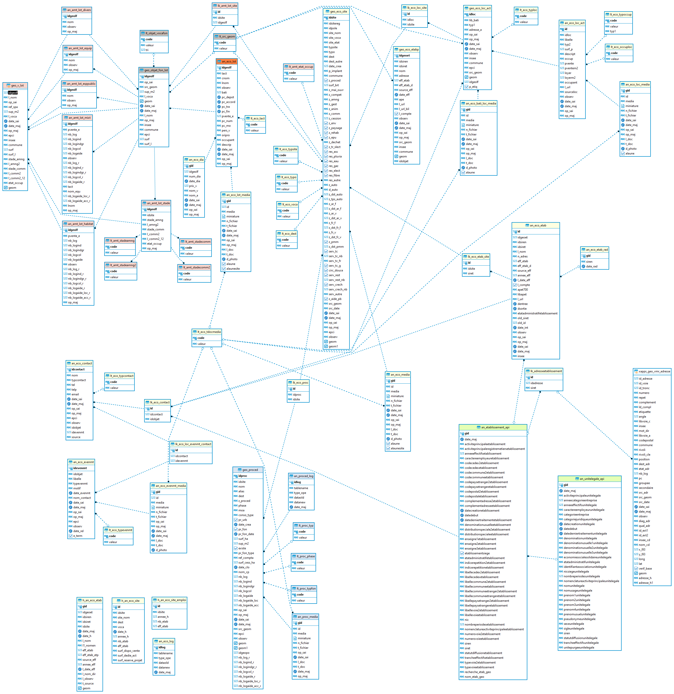

# Documentation d'administration de la base de données "Activité Economique" #

## Principes
  * **généralité** :

En 2015, lors de la mise en oeuvre de l'IDG locale GeoCompiegnois, une réflexion globale sur la base de données et les données métiers se sont engagées au sein du pôle aménagement, urbanisme et grand projet. Il s'est avéré dans  ce diagnostic que les données utilisées dans ce pôle et le service développement économique avaient des ramifications communes. En effet l'Agglomération de la Région de Compiègne maîtrise le foncier dans ces zones d'aménagements, les viabilise afin de procéder à la commercialisation de lots à vocation multiple (économique, habitat, équipement, ...). De la procédure d'aménagement en passant par l'acquisition puis la cession des terrains, cette chaîne de "production" nous a incité à développer le concept d'urbanisation des données sur cette thématique. Autour de ce concept gravite des données purement métiers (suivi de l'activité économique des entreprises, suivi de l'offre des locaux commerciaux ou des commerces de centre-ville, ...) qui ont été rattachées à cette base de données urbanisées. 

Le contexte d'urbanisation répond à cette double particularité :
   - les données sont partagées pour répondre aux besoins de gestions et d'analyses dont la particularité est de toujours intégrer les
problématiques de plusieurs métiers,
   - un même objet géographique "virtuel", la plupart du temps, participe à plusieurs métiers.

De ce fait un objet géographique est partagé par plusieurs services et les attributs métiers propres à chacun sont gérés dans une classe indépendante. Des vues métiers sont ainsi réalisées reprenant la géométrie de l'objet partagé. Cette organisation permet de modifier un seul objet pour tout le monde et évite ainsi les doublons d'informations.

En 2022, un nouveau cadre de mutualisation a réorienté les choix initiaux en terme d'urbanisation. Certaines données resteront dans le domaine de l'urbanisation et le partage entre services. Mais des choix fonctionnels impactants certaines informations ont remis en cause ce mode de gestion pour certaines d'entre elles (les sites et les procédures d'aménagements). 

 
 * **résumé fonctionnel** :

Pour rappel des grands principes :

* le service information géographique assure le maintient du référentiel aménagement (procédure, site, lot à commercialiser, ...) et économique (établissements),
* les services des collectivités assure la mise à jour des informations métiers liées aux procédures et à la programmation des secteurs d'aménagement,
* les services des collectivités peuvent créer, modifier ou supprimer les lots à vocation économique dans ces métiers de commercialisation de terrains pour les entreprises. Ils assurent la mise à jour de ces propres attributs de lots mais ils maintiennent également à jour les informations liées aux entreprises,
* le service foncier (uniquement de l'ARC) assure quant à lui la mise à jour des données d'acquisitions et de cessions de terrains. A cet effet il peut saisir les objets correspondant à ces activités.
* les services des collectivités gèrent la connaissance des bâtiments d'activités selon leurs besoins propres.

## Schéma fonctionnel

(en refonte)

## Modèle relationel simplifié

## Dépendances

Cette base de donnnées est interdépendante du fait d'une partie urbanisée. Les données de l'activité économique sont liées en partie à des données d'aménagements opérationnels, de foncier, ou de ressources externes comme les données de la base SIRENE de l'Insee.

## Classes d'objets urbanisé ou partagé

L'ensemble des classes d'objets de gestion sont stockés dans le schéma `r_objet`.

`[r_objet].[geo_objet_fon_lot]` : table géographique partagé des lots commercialisés
   
|Nom attribut | Définition | Type | Valeurs par défaut |
|:---|:---|:---|:---|
|idgeolf|Identifiant unique de l'objet|integer|nextval('r_objet.idgeo_seq'::regclass)|
|op_sai|Opérateur de saisir d'objet à l'ARC|character varying(80)| |
|src_geom|Référentiel spatial de saisie|character varying(2)|'00'::character varying|
|sup_m2|Surface totale de l'objet en m²|double precision| |
|l_voca|Vocation du foncier|character varying(2)|'00'::character varying|
|geom|Champ contenant la géométrie|USER-DEFINED| |
|date_sai|Date de saisie de l'objet|timestamp without time zone| |
|date_maj|Date de mise à jour|timestamp without time zone| |
|l_nom|Nom de lot donné au moment du plan d'aménagement (ex : lot 1)|character varying(80)| |
|op_maj|Opérateur de mise à jour|character varying(80)| |
|insee|Code insee de la commune|character varying(5)| |
|commune|Libellé de la commune|character varying(80)| |
|epci|Autorité compétente|character varying(10)| |
|surf|Surface occupée du lot en m² (surface saisie par l'utilisateur si différente de la surface SIG)|integer| |
|surf_l|Surface littérale occupée du lot en m² (surface saisie par l'utilisateur si différente de la surface SIG)|character varying(15)| |

Particularité(s) à noter :
* Une clé primaire existe sur le champ `idgeolf` l'attribution automatique de la référence unique s'effectue via les vues de gestion. 
* Une clé étrangère existe sur la table de valeur `src_geom` (lien vers la liste de valeurs des référentiels de saisie `lt_src_geom`)
* Une clé étrangère existe sur la table de valeur `l_voca` (lien vers la liste de valeurs de la vocation foncière du lot `lt_objet_vocafon`)

* 12 triggers :
  * `t_t0_secu_geom_epci` : trigger permettant de sécuriser la saisie des lots entre EPCI
  * `t_t1_etab_insert_date_sai` : trigger permettant d'automatiser la date de mise de saisie des données
  * `t_t2_foncier_insert_date_maj` : trigger permettant d'automatiser la date de mise à jour des données
  * `t_t3_foncier_insert_surf` : trigger permettant d'intégrer la surface du lot à la modification de la géométrie à la saisie
  * `t_t4_foncier_l_nom` : trigger permettant d'initilaiser le nom du lot en vrai null si rien saisie ou suppression du nom
  * `t_t5_insee_commune` : trigger permettant d'intégrer le code insee et le nom de la commune
  * `t_t6_insert_update_objet_fon_surf_l` : trigger permettant de modifier la surface du lot à la mise à jour sur la geom ou l'attribut surf
  * `t_t7_insert_objet_fon` : trigger permettant d'intégrer l'objet dans la classe des cessions et d'associer le lot à un site
  * `t_t9_autorite_competente` : trigger permettant de rechercher et d'intégrer l'autorité compétente à l'objet (permet de gérer la sécurité des données entre EPCI)
  * `t_t11_delete_objet_fon` : trigger permettant de gérer la suppression d'un lot (si possible) dans les associations d'objets
  * `t_t12_refresh_view` : trigger permettant de rafraichir les vues matérialisées intégrant les objets lots
  * `t_t100_log` : trigger permettant de générer un log dans la classe d'objets correspondantes pour le suivie de toutes manipulations sur cette classe d'objets

---

### Liste de valeurs

`[r_objet].[lt_src_geom]` : Liste des valeurs permettant de décrire les référentiels utilisés pour la saisie des objets

|Nom attribut | Définition | Type  | Valeurs par défaut |
|:---|:---|:---|:---|    
|code|Code de la valeur du référentiel|character varying(2)| |
|valeur|Libellé du référentiel|character varying(254)| |

Particularité(s) à noter :
* Une clé primaire existe sur le champ code 

Valeurs possibles :

|Code|Valeur|
|:---|:---|
|10|Cadastre|
|11|PCI vecteur|
|12|BD Parcellaire|
|13|RPCU|
|20|Ortho-images|
|21|Orthophotoplan IGN|
|22|Orthophotoplan partenaire|
|23|Orthophotoplan local|
|30|Filaire voirie|
|31|Route BDTopo|
|32|Route OSM|
|40|Cartes|
|41|Scan25|
|50|Lever|
|51|Plan topographique|
|52|PCRS|
|53|Trace GPS|
|60|Geocodage|
|71|Plan masse vectoriel|
|72|Plan masse redessiné|
|80|Thématique|
|81|Document d'urbanisme|
|82|Occupation du Sol|
|83|Thèmes BDTopo|
|99|Autre|
|00|Non renseigné|
|70|Plan masse|
|61|Base Adresse Locale|
|54|Coordonnées X,Y|

---
`[r_objet].[lt_objet_vocafon]` : Liste des valeurs permettant de décrire les vocations foncières des lots

|Nom attribut | Définition | Type  | Valeurs par défaut |
|:---|:---|:---|:---|    
|code|Code de la vocation|character varying(2)| |
|valeur|Libellé de la vocation|character varying(25)| |

Particularité(s) à noter :
* Une clé primaire existe sur le champ code 

Valeurs possibles :

|Code|Valeur|
|:---|:---|
|00|Non renseigné|
|10|Equipement public|
|20|Lot Economique|
|30|Lot Habitat|
|40|Lot divers|
|50|Lot espace public|
|60|Lot Mixte|

## Classes d'objets de l'activité économique

L'ensemble des classes d'objets de gestion sont stockés dans le schéma `m_activite_eco`.

### Classes d'objets avec une primitive graphique :
  
`[m_activite_eco].[geo_eco_site]` : table géographique contenant la délimitation des sites d'activités
   
|Nom attribut | Définition | Type | Valeurs par défaut |
|:---|:---|:---|:---|
|idsite|Identifiant interne non signifiant des site d'activités|character varying(5)|('S'::text || nextval('m_activite_eco.geo_eco_site_seq'::regclass))|
|idsitereg|Identifiant régional des site d'activités|character varying(7)| |
|idpole|Identifiant interne non signifiant du pôle d'appartenance|character varying(7)| |
|site_nom|Libellé du site|character varying(80)| |
|site_voca|Code de la vocation simplifiée de la zone (ZI, ZA, Zone commerciale, ...)|character varying(2)|'00'::character varying|
|site_etat|Code de l'état du site (existant, création, déclassé, ...)|character varying(2)|'00'::character varying|
|typsite|Code des différents type de sites (ZAE, autre site d'activités hors ZAE, autre site, ...)|character varying(2)|'00'::character varying|
|typo|Code de la typologie du site (site mononfonctionnel, ...)|character varying(2)|'00'::character varying|
|dest|Code de la destination initiale du site (défini dans les documents d'urbanisme)|character varying(2)|'00'::character varying|
|dest_autre|Autres destinations ou précisions sur la destination|character varying(254)| |
|date_crea|Année de création du site|integer| |
|p_implant|Première implantation des entreprises sur le site (année ou date)|character varying(10)| |
|commune|Libellé des communes d'assises du site d'activités|character varying(255)| |
|z_proced|Le site est-il issu d'une procédure d'aménagement|boolean|false|
|surf_brt|Surface totale du site|double precision| |
|z_mai_ouvr|Nom du maître d'ouvrage|character varying(80)| |
|z_compet|Nom de la collectivité ayant dans ses compétences le développement de la zone|character varying(80)| |
|z_amng|Nom de l'aménageur de la zone|character varying(80)| |
|z_gest|Nom du gestionnaire de la zone|character varying(80)| |
|z_anim|Nom de l'animateur de la zone|character varying(80)| |
|z_comm|Structure de contact pour la commercialisation|character varying(80)| |
|z_cession|Conditions de cession en HT (euro/m²)|double precision| |
|z_env|Démarche environnementale engagée sur le site|boolean|false|
|z_paysage|Démarche paysagère engagée sur le site|boolean|false|
|z_rehab|Procédure de réhabilitaion du site en cours ou à venir ou réalisé|boolean|false|
|z_epu|Présence d'un traitement de l'eau d'épuration|boolean|false|
|z_dechet|Libellé du gestionnaire des déchets si différents de la collectivité|character varying(80)| |
|z_tr_slect|Présence d'un tri sélectif sur le site|boolean|false|
|res_ass|Présence d'un réseau d'assainissement|boolean|false|
|res_pluvia|Présence d'un réseau d'eau pluviale|boolean|false|
|res_eau|Présence d'un réseau d'eau potable|boolean|false|
|res_gaz|Présence d'un réseau de gaz|boolean|false|
|res_elect|Présence d'un réseau électrique|boolean|false|
|res_fibre|Présence de la fibre optique|boolean|false|
|res_autre|Autres services liés au réseau|character varying(1000)| |
|z_auto|Libellé de l'autoroute la plus proche|character varying(10)| |
|d_auto|Libellé du diffuseur autoroutier le plus proche|character varying(100)| |
|z_dst_auto|Distance en km du diffuseur autoroutier par la route|integer| |
|z_tps_auto|Temps d'accès en minutes du diffuseur autoroutier par la route|integer| |
|z_ar_f|Nom de l'aéroport fret le plus proche|character varying(80)| |
|z_dst_ar_f|Distance en km de l'aéroport de fret par la route|integer| |
|z_ar_v|Nom de l'aéroport de voyageurs le plus proche|character varying(80)| |
|z_dst_ar_v|Distance en km de l'aéroport de voyageurs par la route|integer| |
|z_fr_f|Gare de fret la plus proche|character varying(80)| |
|z_dst_fr_f|Distance en km de la gare de fret la plus proche par la route|integer| |
|z_fr_v|Gare de voyageurs la plus proche|character varying(80)| |
|z_dst_fr_v|Distance en km de la gare de voyageurs la plus proche par la route|integer| |
|z_pmm|Présence d'une plate-forme multimodale|boolean|false|
|z_dst_pmm|Distance en km de la plate-forme multimodale la plus proche par la route|integer| |
|serv_tc|Présence de transport en commun desservant le site|boolean|false|
|serv_tc_nb|Nombre de lignes desservant le site|integer| |
|serv_tc_fr|Fréquence moyenne des lignes desservant le site|character varying(80)| |
|serv_tc_g|Gratuité des transports en commun|boolean|false|
|circ_douce|Présence de circulation douce accédant au site (pistes cyclables)|boolean|false|
|serv_rest|Présence de restaurants ou à proximité immédiate|boolean|false|
|serv_rest_nb|Nombre de points de restauration sur le site ou à proximité|integer| |
|serv_crech|Présence de crèches ou à proximité immédiate|boolean|false|
|serv_crech_nb|Nombre de crèche sur le site ou à proximité|integer| |
|serv_autre|Libellé des autres services disponibles sur le site|character varying(1000)| |
|z_aide_pb|Aides publiques bénéficiaires au site|boolean|false|
|src_geom|Code du référentiel de saisie des objets sites|character varying(2)|'00'::character varying|
|src_date|Date du référentiel de saisie des objets sites|character varying(4)|'0000'::bpchar|
|date_sai|Date de saisie des données attributaires|timestamp without time zone| |
|date_maj|Date de mise à jour des données attributaires|timestamp without time zone| |
|op_sai|Libellé de la personne ayant saisie l'objet initialisament|character varying(80)| |
|op_maj|Opérateur de mise à jour|character varying(80)| |
|epci|Autorité compétente|character varying(10)| |
|observ|Observations diverses|character varying(1000)| |
|geom|Géométrie des objets sites|USER-DEFINED| |
|geom1|Géométrie des objets sites avec un buffer négatif de 0,5m|USER-DEFINED| |

Particularité(s) à noter :
* Une clé primaire existe sur le champ `idsite` l'attribution automatique de la référence unique s'effectue via une séquence. 
* Une clé étrangère existe sur la table de valeur `site_etat` (lien vers la liste de valeurs de l'état du site `lt_eco_etat`)
* Une clé étrangère existe sur la table de valeur `dest` (lien vers la liste de valeurs de la destination du site `lt_eco_dest`)
* Une clé étrangère existe sur la table de valeur `typo` (lien vers la liste de valeurs de la typologie du site `lt_eco_typo`)
* Une clé étrangère existe sur la table de valeur `typsite` (lien vers la liste de valeurs du type de site `lt_eco_typsite`)
* Une clé étrangère existe sur la table de valeur `site_voca` (lien vers la liste de valeurs de la vocation du site `lt_eco_voca`)
* Une clé étrangère existe sur la table de valeur `src_geom` (lien vers la liste de valeurs des référentiels de saisie `lt_src_geom`)

---

`[m_activite_eco].[geo_eco_etabp]` : table géographique contenant l'ensemble des établissements spécifiques saisis (hors SIRENE)
   
|Nom attribut | Définition | Type | Valeurs par défaut |
|:---|:---|:---|:---|
|idgeoet|Identifiant géographique unique|integer|nextval('r_objet.idgeo_seq'::regclass)|
|idsiren|Numéro SIRENE de l'établissement (si connu)|character varying(9)| |
|idsiret|Numéro SIRET de l'établissement (si connu)|character varying(14)| |
|nom|Libellé du nom de l'établissement spécifique|character varying(255)| |
|adresse|Adresse de l'établissement|character varying(255)| |
|eff_etab|Effectif total de l'établissement|integer| |
|eff_etab_d|Précision (en détail) du nombre de CDD, CDI, intérim, ....|character varying(200)| |
|source_eff|Source de l'effectif de l'établissement|character varying(50)| |
|date_eff|Date de l'effectif|date| |
|ape|Code APE de l'établissement (Naf de niveau 1)|character varying(2)|'00'::character varying|
|l_url|Lien du site internet de l'entreprise|character varying(500)| |
|l_url_bil|Lien vers le bilan en ligne de l'entreprise|character varying(500)| |
|l_compte|Prise en compte de l'établissement pour le calcul des statistiques (nombre d'établissements et effectifs) dans les informations de synthèse.
Par défaut TRUE et laisse le choix à l'administrateur de la donnée de modifier cette valeur.|boolean|true|
|observ|Commentaires|character varying(255)| |
|date_sai|Date de saisie par le producteur|timestamp without time zone| |
|date_maj|Date de mise à jour|timestamp without time zone| |
|op_sai|Libellé de l'opérateur de Saisie|character varying(80)| |
|op_maj|Opérateur de mise à  jour|character varying(80)| |
|src_geom|Référentiel spatial utilisé pour la saisie|character varying(2)|'20'::character varying|
|insee|Code Insee de la commune|character varying(5)| |
|commune|Libellé de la commune|character varying(80)| |
|geom|Champ contenant la géométrie des objets|USER-DEFINED| |
|idobjet|Reconstruction de l'identifiant objet via un trigger pour l''association des contacts dans les relations n--m dans GEO|character varying(15)| |

Particularité(s) à noter :
* Une clé primaire existe sur le champ `idgeoet` l'attribution automatique de la référence unique s'effectue via un trigger. 
* Une clé étrangère existe sur la table de valeur `src_geom` (lien vers la liste de valeurs des référentiels de saisies `lt_src_geom`)
* Une clé étrangère existe sur la table de valeur `ape` (lien vers la liste de valeurs des naf niveau 1 `s_sirene.naf_n1`)

* 9 triggers :
  * `t_t1_geo_eco_etabp_date_sai` : trigger permettant d'insérer la date de saisie
  * `t_t2_geo_eco_etabp_date_maj` : trigger permettant d'insérer la date de mise à jour
  * `t_t3_geo_eco_etabp_insee_commune` : trigger permettant de saisir le code insee et le nom de la commune
  * `t_t4_secu_geom_sb_epci` : trigger permettant de sécuriser la saisie entre les EPCI
  * `t_t5_geo_eco_etabp_idobjet` : trigger permettant de gérer l'écriture de l'identifianr idobjet spécifique à cette classe
  * `t_t6_geo_eco_etabp_null` : trigger permettant de gérer la mise à jour de certaines attributs en vrai null
  * `t_t7_geo_eco_etabp_site` : trigger permettant d'associer l'établissment spécifique à un ou plusieurs sites
  * `t_t8_refresh_view`: trigger permettant de rafraichier les vues matérialisées faisant référence à cette classe d'objets
  * `t_t100_log` : trigger permettant d'intégrer toutes les opérations dans la table des logs

---

`[m_activite_eco].[geo_eco_loc_act]` : table géographique contenant l'ensemble des bâtiments d'activité
   
|Nom attribut | Définition | Type | Valeurs par défaut |
|:---|:---|:---|:---|
|idloc|Identifiant unique de l'objet|character varying(15)|('BA'::text || nextval('m_activite_eco.geo_eco_loc_act_seq'::regclass))|
|lib_bati|Libellé du bâtiment|character varying(150)| |
|typ1|Typologie de local|character varying(2)|'00'::character varying|
|adresse_a|Adresse libre si inexistante dans la BAL (adresse non conforme, lieux-dit, ...)|character varying(100)| |
|op_sai|Opérateur de saisie d'objet à l'ARC|character varying(80)| |
|op_maj|Opérateur de mise à jour|character varying(80)| |
|date_sai|Date de saisie de l'objet|timestamp without time zone| |
|date_maj|Date de mise à jour|timestamp without time zone| |
|observ|Observations diverses|character varying(1000)| |
|insee|Code Insee de la commune d'assise du local|character varying(5)| |
|commune|Libellé de la commune d'assise du local|character varying(100)| |
|epci|Autorité compétente|character varying(10)| |
|src_geom|Référentiel spatial de saisie|character varying(2)|'00'::character varying|
|geom|Champ contenant la géométrie|USER-DEFINED| |
|idgeolf|Identifiant du lot foncier si présent|integer| |
|p_etiq|Priorisation de l'affichage du nom du bâtiment sur la carte Plan de situation dans GEO|boolean|true|

Particularité(s) à noter :
* Une clé primaire existe sur le champ `idloc` l'attribution automatique de la référence unique s'effectue via une séquence. 
* Une clé étrangère existe sur la table de valeur `src_geom` (lien vers la liste de valeurs des référentiels de saisies `lt_src_geom`)
* Une clé étrangère existe sur la table de valeur `typ1` (lien vers la liste de valeurs du type de local `lt_eco_typloc`)

* 12 triggers :
  * `t_t1_date_sai` : trigger permettant d'insérer la date de saisie
  * `t_t2_date_maj` : trigger permettant d'insérer la date de mise à jour
  * `t_t3_geo_eco_loc_act_insert_update` : trigger permettant
  * `t_t4_insert_update_idgeolf` : trigger permettant 
  * `t_t5_secu_geom_sb_epci` : trigger permettant 
  * `t_t6_geo_eco_loc_act_delete` : trigger permettant 
  * `t_t7_geo_eco_loc_act_insee_commune` : trigger permettant 
  * `t_t8_autorite_competente`: trigger permettant
  * `t_t9_before_modif_loc`: trigger permettant
  * `t_t10_after_insert_loc`: trigger permettant
  * `t_t11_refresh_view`: trigger permettant
  * `t_t100_log` : trigger permettant d'intégrer toutes les opérations dans la table des logs

---

### Liste de valeurs

### Classes d'objets attributaire :

---

`[m_activite_eco].[an_eco_pole]` : table alphanumérique contenant la dénomination des pôles d'activités (unité géographique régionale)
   
|Nom attribut | Définition | Type | Valeurs par défaut |
|:---|:---|:---|:---|

Table en cours de refonte

---

`[m_activite_eco].[an_eco_contact]` : table alphanumérique contenant l'ensemble des contacts
   
|Nom attribut | Définition | Type | Valeurs par défaut |
|:---|:---|:---|:---|
|idcontact|Identifiant unique non signifiant du contact|integer|nextval('m_activite_eco.an_eco_contact_seq'::regclass)|
|nom|Libellé du contact (nom, prénom ou nom de l'entreprise)|character varying(100)| |
|typcontact|Type de contact|character varying(2)| |
|tel|Téléphone du contact|character varying(14)| |
|telp|Téléphone portable dui contact|character varying(14)| |
|email|Email du contact|character varying(100)| |
|date_sai|Date de saisie des données attributaires|timestamp without time zone| |
|date_maj|Date de mise à jour des données attributaires|timestamp without time zone| |
|op_sai|Libellé de la personne ayant saisie l'objet initialisament|character varying(80)| |
|epci|Autorité compétente|character varying(10)| |
|observ|Observations diverses|character varying(1000)| |
|idobjet|Clé temporaire pour la relation direct dans GEO en attendant la correction sur les relations N..M|character varying(15)| |
|idevenmt|Identifiant unique non signifiant de l''évènement (en attente résolution pb relation N..M dans Geo|integer| |

Particularité(s) à noter :
* Une clé primaire existe sur le champ `idcontact` l'attribution automatique de la référence unique s'effectue via une séquence. 
* Une clé étrangère existe sur la table de valeur `typcontact` (lien vers la liste de valeurs du type de contact `lt_eco_typcontact`)
 
---

`[m_activite_eco].[an_eco_dia]` : table alphanumérique contenant l'ensemble des informations des DIA liés à un lot économique
   
|Nom attribut | Définition | Type | Valeurs par défaut |
|:---|:---|:---|:---|
|gid|Identifiant unique interne|integer|nextval('m_activite_eco.an_eco_dia_seq'::regclass)|
|idgeolf|Identifiant unique de l'entité géographique lot|integer| |
|num_dia|Numéro de la DIA|character varying(25)| |
|date_dia|Date de la dernière DIA|timestamp without time zone| |
|prix_v|Prix de vente en euros|double precision| |
|nom_v|Nom du vendeur|character varying(80)| |
|nom_a|Nom de l'acquéreur (seconde main)|character varying(80)| |
|date_maj|Date de mise à jour des données attributaires|timestamp without time zone| |
|op_sai|Libellé de la personne ayant saisie l'objet initialisament|character varying(80)| |

---

`[m_activite_eco].[an_eco_etab]` : table alphanumérique contenant l'ensemble des informations métiers des établissements
   
|Nom attribut | Définition | Type | Valeurs par défaut |
|:---|:---|:---|:---|
|id|Identifiant unique interne|integer|nextval('m_activite_eco.an_eco_etab_seq'::regclass)|
|idgeoet|Identifiant unique géographique|integer| |
|idsiren|Numéro SIRENE de l'établissement|character varying(9)| |
|idsiret|Numéro SIRET de l'établissement|character varying(14)| |
|l_nom|Libellé du nom de l'établissement spécifique si différent du nom SIRENE (nom usuel du service économie)|character varying(255)| |
|n_adres|Libellé de la nouvelle adresse si l'établissement a déménagé|character varying(255)| |
|eff_ent|Effectif total du groupe|integer| |
|eff_etab|Effectif total de l'établissement|integer| |
|eff_etab_d|Précision (en détail) du nombre de CDD, CDI, intérim, ....|character varying(200)| |
|source_eff|Source de l'effectif de l'établissement|character varying(50)| |
|annee_eff|Année de l'effectif (issu de SIRENE)|integer| |
|l_date_eff|Date de l'effectif saisie par l'ARC|date| |
|l_compte|Prise en compte de l'établissement pour le calcul des statistiques (nombre d'établissements et effectifs) dans les informations de synthèse.
Par défaut TRUE et laisse le choix à l'administrateur de la donnée de modifier cette valeur.|boolean|true|
|apet700|Code d'activité de l'établissement (issu de SIRENE et mis à jour lors de la mise à jour de SIRENE)|character varying(255)| |
|libapet|Libellé de l'activité de l'établissement (issu de SIRENE et mis à jour lors de la mise à jour de SIRENE)|character varying(255)| |
|l_url|Lien du site internet de l'entreprise|character varying(500)| |
|l_url_bil|Lien vers le bilan en ligne de l'entreprise|character varying(500)| |
|dentree|Date d'entrée dans le fichier SIRENE|timestamp without time zone| |
|dsortie|Date de sortie du fichier SIRENE|timestamp without time zone| |
|etatadministratifetablissement|Etat administratif de l'établissement dans le fichier SIEREN (attribut déjà présent dans SIRENE mais dupliqué ici pour le filtrage dans GEO, améliore les performances sans passer par une vue)|character varying(1)| |
|old_siret|Attribut de gestion servant uniquement temporairement à la récupération des contacts d'un ancien établissement qui aurait disparu pour les remettre dans le nouveau. Cet attribut est vidé parès mise à jour|character varying(14)| |
|old_id|Attribut de gestion servant uniquement temporairement à la récupération des contacts d'un établissement spécifique non présent dans SIRENE mais apparu par la suite. Cet attribut est vidé parès mise à jour|integer| |
|date_int|Date renseignée par GéoPicardie lors de l'intégration du fichier dans la base (correspond aux dernières données reçues)|date| |
|observ|Commentaires|character varying(255)| |
|op_sai|Libellé de l'opérateur de Saisie|character varying(80)| |
|date_sai|Date de saisie des données attributaires|timestamp without time zone| |
|date_maj|Date de mise à jour des données attributaires|timestamp without time zone| |
|insee|Code Insee de la commune (provenance SIRENE, mise à jour après intégration par trimestre dans le FME d'intégration API))|character varying(10)| |

Particularité(s) à noter :
* Une clé primaire existe sur le champ `id` l'attribution automatique de la référence unique s'effectue via une séquence. 
* Cette classe d'objet est alimenté automatiquement à l'insertion d'un nouvel établissement SIRENE via un process FME

* 2 triggers :
  * `t_t1_an_sa_etab_date_maj` : trigger permettant d'automatiser la date de mise à jour des données
  * `t_t1_l_nom_null` : trigger permettant de gérer les attributs à NULL et non vide issu de GEO
  * `t_t4_an_sa_etab_oldsiret` : trigger permettant l'appariemment des données de la table des établissements spécifiques ou la récupération d'un ancien disparu
  * `t_t5_an_sa_etab_lcompte_local` : trigger permettant de rafraichir des vues matérialisés
 
---

`[m_activite_eco].[an_eco_etab_rad]` : table alphanumérique contenant l'ensemble des établissements radiés
   
|Nom attribut | Définition | Type | Valeurs par défaut |
|:---|:---|:---|:---|
|gid|Identifiant unique interne|integer|nextval('m_activite_eco.an_eco_etab_rad_seq'::regclass)|
|siren|Identifiant SIRNE de l'unité légale|character varying(9)| |
|date_rad|Date de la radiation|timestamp without time zone| |

Particularité(s) à noter :
* Une clé primaire existe sur le champ `gid` l'attribution automatique de la référence unique s'effectue via une séquence. 
* Cette classe d'objet est alimenté automatiquement à la mise à jour des établissements SIRENE via un process FME insérant les données des radiations téléchargés sur l'OpenData

---

`[m_activite_eco].[an_eco_evenmt]` : table alphanumérique contenant l'ensemble des évènements suivis
   
|Nom attribut | Définition | Type | Valeurs par défaut |
|:---|:---|:---|:---|
|idevenmt|Identifiant unique non signifiant du contact|integer|nextval('m_activite_eco.an_eco_evenmt_seq'::regclass)|
|idobjet|Identifiant de l'objet lié|character varying(10)| |
|libelle|Libellé de l'évènement|character varying(254)| |
|typevenmt|Type d'évènement|character varying(2)| |
|date_evenmt|Date de l'évènement|timestamp without time zone| |
|nom_contact|Nom du contact|character varying(100)| |
|date_sai|Date de saisie des données attributaires|timestamp without time zone| |
|date_maj|Date de mise à jour des données attributaires|timestamp without time zone| |
|op_sai|Libellé de la personne ayant saisie l'objet initialisament|character varying(80)| |
|epci|Autorité compétente|character varying(10)| |
|observ|Observations diverses|character varying(1000)| |
|date_rel|Date d'une relance éventuelle à prévoir|timestamp without time zone| |

Particularité(s) à noter :
* Une clé primaire existe sur le champ `idevenmt` l'attribution automatique de la référence unique s'effectue via une séquence. 
* Une clé étrangère existe sur la table de valeur `typevenmt` (lien vers la liste de valeurs du type d'évènement `lt_eco_typevenmt`)

`[m_activite_eco].[an_eco_evenmt_media]` : table alphanumérique contenant l'ensemble des médias rattachés aux évènements
   
|Nom attribut | Définition | Type | Valeurs par défaut |
|:---|:---|:---|:---|
|gid|Compteur (identifiant interne)|integer|nextval('m_activite_eco.an_eco_evenmt_media_seq'::regclass)|
|id|Identifiant interne non signifiant de l'objet saisi|integer| |
|media|Champ Média de GEO|text| |
|miniature|Champ miniature de GEO|bytea| |
|n_fichier|Nom du fichier|text| |
|t_fichier|Type de média dans GEO|text| |
|op_sai|Opérateur de saisie (par défaut login de connexion à GEO)|character varying(20)| |
|date_sai|Date de la saisie du document|timestamp without time zone| |
|l_doc|Titre du document ou légère description|character varying(100)| |
|t_doc|Type de documents|character varying(2)|'00'::character varying|
|d_photo|Date de la prise de vue|timestamp without time zone| |

Particularité(s) à noter :
* Une clé primaire existe sur le champ `gid` l'attribution automatique de la référence unique s'effectue via une séquence. 
* Une clé étrangère existe sur la table de valeur `t_doc` (lien vers la liste de valeurs du type de médias `lt_eco_tdocmedia`)

---

`[m_activite_eco].[an_eco_lot]` : table alphanumérique contenant l'ensemble des informations métiers des lots commercialisés
   
|Nom attribut | Définition | Type | Valeurs par défaut |
|:---|:---|:---|:---|
|idgeolf|Identifiant unique de l'entité géographique lot|integer| |
|tact|Type d'activité présent sur le lot|character varying(2)|'00'::character varying|
|cnom|Nom de code de l'acquéreur|character varying(20)| |
|lnom|Nom de l'acquéreur|character varying(80)| |
|eff_dep|Effectif de départ prévu par l'implantation de l'établissement lors de l'octroi de la convention de subvention|integer| |
|eff_n5|Effectif prévu de l'établissement à n+5 par la convention d'octroi de subvention|integer| |
|conv|Accord ou non d'une convention d'octroi de subvention|boolean| |
|datefin_conv|Date de fin de la convention d'octroi de subvention, liée à l'effectif n+5|date| |
|observ|Observations diverses|character varying(255)| |
|bati|Surface de bâtiments projetée en m²|integer| |
|pc_depot|Date de dépôt du permis de construire|timestamp without time zone| |
|pc_accord|Date d'obtention du permis de construire|timestamp without time zone| |
|pc_tra|Date de commencement des travaux du permis de construire|timestamp without time zone| |
|pc_fin|Date de fin des travaux du permis de construire|timestamp without time zone| |
|pvente_e|Prix de vente (ou cession) envisagé du lot en HT (€/m²) par le service économique|numeric| |
|pc_num|N° du permis de construire|character varying(50)| |
|pc_mo|Nom du mapitre d'oeuvre (architecte) du PC|character varying(100)| |
|pers_v|Année de la perspective de vente ou de cession|character varying(10)| |
|oripro|Information sur l'origine du projet. 3 valeurs possibles ENDOGENE ou EXOGENE ou non renseignée (pas de listes de valeurs créées, cette liste est paramétrée dans GEO)|character varying(15)| |
|occupant|Libellé de l'occupant du terrain après cession|character varying(100)| |
|descrip|Descriptif du bâtiment construit sur le lot|character varying(1000)| |

Particularité(s) à noter :
* Une clé primaire existe sur le champ `idgeolf` l'attribution automatique de la référence unique s'effectue via la vue de gestion. 
* Une clé étrangère existe sur la table de valeur `tact` (lien vers la liste de valeurs du type d'activité `lt_eco_tact`)

---

`[m_activite_eco].[an_eco_media]` : table alphanumérique contenant l'ensemble des médias des objets exclusivement économique
   
|Nom attribut | Définition | Type | Valeurs par défaut |
|:---|:---|:---|:---|
|gid|Compteur (identifiant interne)|integer|nextval('m_activite_eco.an_eco_media_seq'::regclass)|
|id|Identifiant interne non signifiant de l'objet saisi|text| |
|media|Champ Média de GEO|text| |
|miniature|Champ miniature de GEO|bytea| |
|n_fichier|Nom du fichier|text| |
|t_fichier|Type de média dans GEO|text| |
|op_sai|Opérateur de saisie (par défaut login de connexion à GEO)|character varying(20)| |
|date_sai|Date de la saisie du document|timestamp without time zone| |
|l_doc|Titre du document ou légère description|character varying(100)| |
|t_doc|Type de document |character varying(2)| |
|d_photo|Date de la prise de vue|timestamp without time zone| |
|alaune|Média poussé à la une de l'annonce immobilière|boolean|false|
|alaunesite|Média poussé à la une de la fiche de présentation du site|boolean|false|

Particularité(s) à noter :
* Une clé primaire existe sur le champ `gid` l'attribution automatique de la référence unique s'effectue via uine séquence. 
* Une clé étrangère existe sur la table de valeur `t_doc` (lien vers la liste de valeurs du type de médias `lt_eco_tdocmedia`)

---

`[m_activite_eco].[an_eco_lot_media]` : table alphanumérique contenant l'ensemble des médias des objets lots fonciers
   
|Nom attribut | Définition | Type | Valeurs par défaut |
|:---|:---|:---|:---|
|gid|Compteur (identifiant interne)|integer|nextval('m_activite_eco.an_eco_media_seq'::regclass)|
|id|Identifiant interne non signifiant de l'objet saisi|integer| |
|media|Champ Média de GEO|text| |
|miniature|Champ miniature de GEO|bytea| |
|n_fichier|Nom du fichier|text| |
|t_fichier|Type de média dans GEO|text| |
|op_sai|Opérateur de saisie (par défaut login de connexion à GEO)|character varying(20)| |
|date_sai|Date de la saisie du document|timestamp without time zone| |
|l_doc|Titre du document ou légère description|character varying(100)| |
|t_doc|Type de documents|character varying(2)|'00'::character varying|
|d_photo|Date de la prise de vue|timestamp without time zone| |
|alaune|Média poussé à la une de l'annonce immobilière|boolean|false|
|alaunesite|Média poussé à la une de la fiche de présentation du site|boolean|false|

Particularité(s) à noter :
* Une clé primaire existe sur le champ `gid` l'attribution automatique de la référence unique s'effectue via uine séquence. 
* Une clé étrangère existe sur la table de valeur `t_doc` (lien vers la liste de valeurs du type de médias `lt_eco_tdocmedia`)

---

`[m_activite_eco].[an_fon_cession_horsarc_media]` : table alphanumérique contenant l'ensemble des médias des cessions liés aux objets lots fonciers (hors ARC)
   
|Nom attribut | Définition | Type | Valeurs par défaut |
|:---|:---|:---|:---|
|gid|Identifiant unique non signifiant|integer|nextval('m_foncier.an_fon_cession_horsarc_media_seq'::regclass)|
|id|Identifiant de cession ou d'acquisition|integer| |
|media|Champ Média de GEO|text| |
|miniature|Champ miniature de GEO|bytea| |
|n_fichier|Nom du fichier|text| |
|t_fichier|Type de média dans GEO|text| |
|op_sai|Libellé de l'opérateur ayant intégrer le document|character varying(100)| |
|date_sai|Date d'intégration du document|timestamp without time zone| |
|l_type|Code du type de document de cessions ou d'acquisitions|character varying(2)| |
|l_prec|Précision sur le document|character varying(254)| |

Particularité(s) à noter :
* Une clé primaire existe sur le champ `gid` l'attribution automatique de la référence unique s'effectue via uine séquence. 
* Une clé étrangère existe sur la table de valeur `l_type` (lien vers la liste de valeurs du type de médias `lt_ces_doc`)

---

`[m_activite_eco].[an_eco_loc_act]` : table alphanumérique contenant les données descriptive du local
   
|Nom attribut | Définition | Type | Valeurs par défaut |
|:---|:---|:---|:---|
|id|Identifiant non signifiant interne du local|integer|nextval('m_activite_eco.an_eco_loc_act_seq'::regclass)|
|idloc|Identifiant unique du local|character varying(10)| |
|libelle|Nom usuel du local|character varying(150)| |
|typ2|Typologie d'occupation du local|character varying(2)| |
|surf_p|Surface de plancher|integer| |
|descript|Elément descriptif du local|character varying(5000)| |
|occup|Type d'occupation du local|character varying(2)|'00'::character varying|
|pvente|Prix de vente en € du local|integer| |
|pventem2|Prix de vente au m² en € du local|double precision| |
|loyer|Loyer mensuel en € du local|integer| |
|loyerm2|Loyer mensuel au m² en € du local|double precision| |
|occupant|Libellé de l'occupant si établissement non lié|character varying(80)| |
|l_url|Lien URL vers une référence externe|character varying(254)| |
|sourceloc|Source des informations du local|character varying(254)| |
|observ|Observations diverses|character varying(1000)| |
|date_sai|Date de saisie du local|timestamp without time zone| |
|date_maj|Date de mise à jour du local|timestamp without time zone| |

---

`[m_activite_eco].[h_an_eco_etab]` : table géographique contenant l'historique (ou état) des établissements par an

Particularité(s) à noter :
* cette classe d'objet est alimenté 1 fois par an par un traitement FME 
 
---

`[m_activite_eco].[h_an_eco_site]` : table géographique contenant l'historique (ou état) des sites par an

Particularité(s) à noter :
* cette classe d'objet est alimenté 1 fois par an par un traitement FME 

---

`[m_activite_eco].[lk_adresseetablissement]` : table alphanumérique de relation entre les adresses et les établissements
   
|Nom attribut | Définition | Type | Valeurs par défaut |
|:---|:---|:---|:---|
|idadresse|Identifiant unique de l'adresse|bigint| |
|siret|N° SIRET de l'établissement|character varying(14)| |
|id|Identifiant unique non siggnifiant|integer|nextval('m_activite_eco.lk_adresseetablissement_seq'::regclass)|

Particularité(s) à noter :
* Une clé primaire existe sur le champ `id` l'attribution automatique de la référence unique s'effectue via une séquence. 

* 4 triggers :
  * `t_t1_lk_adresseetablissement_siret_update` : trigger permettant de modifier l'appariemment des adresses à la mise jour de celle-ci à l'établissement
  * `t_t2_lk_adresseetablissement_idsite` : trigger à revoir
  * `t_t3_lk_adresseetablissement_idsite_delete` : trigger permettant de supprimer un appariemment
  * `t_t4_lk_etablissementlocal` : trigger permettant de rafraichir une vue matérialisée d'exploitation
 
---

`[m_activite_eco].[lk_eco_bati_loc]` : table alphanumérique de relation entre les bâtiments et les adresses
   
|Nom attribut | Définition | Type | Valeurs par défaut |
|:---|:---|:---|:---|
|id|Identifiant unique non signifiant de la relation|integer|nextval('m_activite_eco.lk_eco_bati_loc_seq'::regclass)|
|idbati|Identifiant unique non signifiant de l'objet bâti d'activité|character varying(5)| |
|idloc|Identifiant unique non signifiant de l'objet local d'activité|character varying(5)| |

Particularité(s) à noter :
* Une clé primaire existe sur le champ `id` l'attribution automatique de la référence unique s'effectue via une séquence. 

* x triggers : à venir
 
 
---

`[m_activite_eco].[lk_eco_bati_site]` : table alphanumérique de relation entre les bâtiments et les sites
   
|Nom attribut | Définition | Type | Valeurs par défaut |
|:---|:---|:---|:---|
|id|Identifiant unique non signifiant de la relation|integer|nextval('m_activite_eco.lk_eco_bati_site_seq'::regclass)|
|idbati|Identifiant unique non signifiant de l'objet bâti|character varying(5)| |
|idsite|Identifiant unique non signifiant de l'objet site|character varying(5)| |

Particularité(s) à noter :
* Une clé primaire existe sur le champ `id` l'attribution automatique de la référence unique s'effectue via une séquence. 

* x triggers : à venir
 
 
---

`[m_activite_eco].[lk_eco_contact]` : table alphanumérique de relation entre les objets éconimoques et les contacts
   
|Nom attribut | Définition | Type | Valeurs par défaut |
|:---|:---|:---|:---|
|id|Identifiant unique non signifiant|integer|nextval('m_activite_eco.lk_eco_contact_seq'::regclass)|
|idcontact|Identifiant unique non signifiant du contact|integer| |
|idobjet|Identifiant unique non signifiant de l'objet en référence|integer| |

Particularité(s) à noter :
* Une clé primaire existe sur le champ `id` l'attribution automatique de la référence unique s'effectue via une séquence. 

* x triggers : à venir
 
 
---

`[m_activite_eco].[lk_eco_loc_etab]` : table alphanumérique de relation entre les locaux d'activité et les établissements
   
|Nom attribut | Définition | Type | Valeurs par défaut |
|:---|:---|:---|:---|
|id|Identifiant unique non signifiant de la relation|integer|nextval('m_activite_eco.lk_eco_loc_etab_seq'::regclass)|
|idloc|Identifiant unique non signifiant de l'objet local|character varying(5)| |
|siren|Identifiant unique non signifiant de l'établissement|character varying(5)| |

Particularité(s) à noter :
* Une clé primaire existe sur le champ `id` l'attribution automatique de la référence unique s'effectue via une séquence. 

* x triggers : à venir
 
 
---

`[m_activite_eco].[lk_eco_proc]` : table alphanumérique de relation entre les sites et les procédures d'aménagement
   
|Nom attribut | Définition | Type | Valeurs par défaut |
|:---|:---|:---|:---|
|id|Identifiant unique non signifiant|integer|nextval('m_activite_eco.lk_eco_proc_seq'::regclass)|
|idproc|Identifiant unique non signifiant de l'objet procédure|character varying(5)| |
|idsite|Identifiant unique non signifiant de l'objet site|character varying(5)| |

Particularité(s) à noter :
* Une clé primaire existe sur le champ `id` l'attribution automatique de la référence unique s'effectue via une séquence. 

* x triggers : à venir
 
 
---

`[m_activite_eco].[lk_eco_bati_adr]` : table alphanumérique de relation entre les bâtiments et les adresses   
|Nom attribut | Définition | Type | Valeurs par défaut |
|:---|:---|:---|:---|
|id|Identifiant unique non signifiant de la relation|integer|nextval('m_activite_eco.lk_eco_bati_adr_seq'::regclass)|
|idbati|Identifiant unique non signifiant de l'objet bâtiment|character varying(5)| |
|idadresse|Identifiant unique de l'adresse|bigint| |

Particularité(s) à noter :
* Une clé primaire existe sur le champ `id` l'attribution automatique de la référence unique s'effectue via une séquence. 

* x triggers : à venir
 
 
---

---

`[m_activite_eco].[lk_eco_loc_adr]` : table alphanumérique de relation entre les locaux d'activités et les adresses   
|Nom attribut | Définition | Type | Valeurs par défaut |
|:---|:---|:---|:---|
|id|Identifiant unique non signifiant de la relation|integer|nextval('m_activite_eco.lk_eco_loc_adr_seq'::regclass)|
|idloc|Identifiant unique non signifiant de l'objet local|character varying(5)| |
|idadresse|Identifiant unique de l'adresse|bigint| |

Particularité(s) à noter :
* Une clé primaire existe sur le champ `id` l'attribution automatique de la référence unique s'effectue via une séquence. 

* x triggers : à venir
 
 ---

### classes d'objets applicatives métiers sont classés dans le schéma x_apps :

(à venir)

### classes d'objets applicatives grands publics sont classés dans le schéma x_apps_public :

(à venir)

### classes d'objets opendata sont classés dans le schéma x_opendata :

(à venir)

### Liste de valeurs

`[m_activite_eco].[lt_eco_dest]` : Liste des valeurs permettant de décrire la valeur de destination des sites et poles d'activité

|Nom attribut | Définition | Type  | Valeurs par défaut |
|:---|:---|:---|:---|    
|code|Code de la destination principale du site ou du Pôle|character varying(2)| |
|valeur|Libellé de la destination principale du site ou du Pôle|character varying(30)| |

Particularité(s) à noter :
* Une clé primaire existe sur le champ code 

Valeurs possibles :

|Code|Valeur|
|:---|:---|
|00|Non renseigné|
|10|Artisanat|
|20|Industrie ou R&D|
|30|Tertiaire|
|40|Transport et logistique|
|50|Commerce|
|60|Agriculture|
|70|Service/Négoce|

---

`[m_activite_eco].[lt_eco_etat]` : Liste des valeurs permettant de décrire la valeur d'état du site d'activité

|Nom attribut | Définition | Type  | Valeurs par défaut |
|:---|:---|:---|:---|    
|code|Code de la typologie de la situation du site au regard de l'aménagement|character varying(2)| |
|valeur|Code de la typologie de la situation du site au regard de l'aménagement|character varying(25)| |

Particularité(s) à noter :
* Une clé primaire existe sur le champ code 

Valeurs possibles :

|Code|Valeur|
|:---|:---|
|00|Non renseigné|
|10|Existant|
|20|Extension|
|30|Création|
|40|Déclassé|
|50|Projet de déclassement|

---

`[m_activite_eco].[lt_eco_occuploc]` : Liste des valeurs permettant de décrire la valeur de l'état d'occupation d'un local

|Nom attribut | Définition | Type  | Valeurs par défaut |
|:---|:---|:---|:---|    
|code|Code du type d'occupation d'un local|character varying(2)| |
|valeur|Libellé du type d'occupation d'un local|character varying(100)| |

Particularité(s) à noter :
* Une clé primaire existe sur le champ code 

Valeurs possibles :

|Code|Valeur|
|:---|:---|
|00|Non renseigné|
|10|Disponible à la vente (vacant)|
|11|Disponible à la vente (occupé)|
|20|Disponible à la location (vacant)|
|21|Disponible à la location (occupé)|
|30|Disponible à la vente ou à la location (vacant)|
|31|Disponible à la vente ou à la location (occupé)|
|40|Occupé|

---

`[m_activite_eco].[lt_eco_tact]` : Liste des valeurs permettant de décrire la valeur de l'activité du projet d'implantation sur les lots (spécifique à l'ARC)

|Nom attribut | Définition | Type  | Valeurs par défaut |
|:---|:---|:---|:---|    
|code|Code de l'activité du projet d'implantation sur les lots (spécifique à l'ARC)|character varying(2)| |
|valeur|Libellé de l'activité du projet d'implantation sur les lots (spécifique à l'ARC)|character varying(30)| |

Particularité(s) à noter :
* Une clé primaire existe sur le champ code 

Valeurs possibles :

|Code|Valeur|
|:---|:---|
|00|Non renseigné|
|10|Artisanat|
|20|Commerce|
|30|Industrie|
|40|R & D|
|50|Service/Négoce|
|60|Tertiaire|
|99|Autre|

---

`[m_activite_eco].[lt_eco_tdocmedia]` : Liste des valeurs permettant de décrire la valeur des types de médias

|Nom attribut | Définition | Type  | Valeurs par défaut |
|:---|:---|:---|:---|    
|code|Code du type de média|character varying(2)| |
|valeur|Libellé du type de média|character varying(100)| |

Particularité(s) à noter :
* Une clé primaire existe sur le champ code 

Valeurs possibles :

|Code|Valeur|
|:---|:---|
|00|Non renseigné|
|10|Photographie|
|20|Carte, Plan|
|30|Présentation|
|40|Fiche commerciale|
|50|Compte rendu|
|60|Actes administratifs divers|
|61|Délibération|
|62|Règlement|
|63|Acte de vente|
|99|Autre document|

---

`[m_activite_eco].[lt_eco_typcontact]` : Liste des valeurs permettant de décrire la valeur des types de contact

|Nom attribut | Définition | Type  | Valeurs par défaut |
|:---|:---|:---|:---|    
|code|Code du type de contact|character varying(2)| |
|valeur|Libellé du type de contact|character varying(30)| |

Particularité(s) à noter :
* Une clé primaire existe sur le champ code 

Valeurs possibles :

|Code|Valeur|
|:---|:---|
|00|Non renseigné|
|10|Entreprise (standard)|
|11|Directeur - Responsable|
|12|Assistante|
|13|DRH|
|20|Propriétaire|
|30|Commercialisateur|

---

`[m_activite_eco].[lt_eco_typevenmt]` : Liste des valeurs permettant de décrire la valeur des types d'évènement

|Nom attribut | Définition | Type  | Valeurs par défaut |
|:---|:---|:---|:---|    
|code|Code du type d'évènement|character varying(2)| |
|valeur|Libellé du type d'évènement|character varying(30)| |

Particularité(s) à noter :
* Une clé primaire existe sur le champ code 

Valeurs possibles :

|Code|Valeur|
|:---|:---|
|00|Non renseigné|
|10|Contact (générique)|
|11|Contact téléphonique|
|12|Contact email|
|20|Réunion|
|30|Forum, salon|
|40|Séminaire|

---

`[m_activite_eco].[lt_eco_typloc]` : Liste des valeurs permettant de décrire la valeur des types de locaux d'activité

|Nom attribut | Définition | Type  | Valeurs par défaut |
|:---|:---|:---|:---|    
|code|Code du type de local|character varying(2)| |
|valeur|Libellé du type de local|character varying(50)| |

Particularité(s) à noter :
* Une clé primaire existe sur le champ code 

Valeurs possibles :

|Code|Valeur|
|:---|:---|
|00|Non renseigné|
|10|Terrain vierge|
|20|Terrain en activité (non bâti)|
|21|Terrain avec bâtiment léger en activité|
|22|Parking|
|23|Surface de dépôt ou de stockage|
|30|Bureau|
|40|Commerce|
|50|Activité|

---

`[m_activite_eco].[lt_eco_typo]` : Liste des valeurs permettant de décrire la valeur des typologies des sites

|Nom attribut | Définition | Type  | Valeurs par défaut |
|:---|:---|:---|:---|    
|code|Code de la typologie GéoPicardie du site|character varying(2)| |
|valeur|Libellé de la typologie GéoPicardie du site|character varying(40)| |

Particularité(s) à noter :
* Une clé primaire existe sur le champ code 

Valeurs possibles :

|Code|Valeur|
|:---|:---|
|00|Non renseigné|
|10|Site monofonctionnel|
|20|Site plurifonctionnel en périphérie|
|30|Site plurifonctionnel en centre-ville|
|40|Etablissement isolé|

---

`[m_activite_eco].[lt_eco_typsite]` : Liste des valeurs permettant de décrire la valeur des types de sites

|Nom attribut | Définition | Type  | Valeurs par défaut |
|:---|:---|:---|:---|    
|code|Code du type de site|character varying(2)| |
|valeur|Libellé du type de site|character varying(100)| |

Particularité(s) à noter :
* Une clé primaire existe sur le champ code 

Valeurs possibles :

|Code|Valeur|
|:---|:---|
|00|Non renseigné|
|10|ZAE|
|20|Autre site d'activité identifié (hors ZAE)|
|30|Autre secteur (non exclusivement économique)|

---

`[m_activite_eco].[lt_eco_typsite]` : Liste des valeurs permettant de décrire la valeur de vocation simplifiée de la zone

|Nom attribut | Définition | Type  | Valeurs par défaut |
|:---|:---|:---|:---|    
|code|Code de la vocation du site|character varying(2)| |
|valeur|Libellé de la vocation du site|character varying(25)| |

Particularité(s) à noter :
* Une clé primaire existe sur le champ code 

Valeurs possibles :

|Code|Valeur|
|:---|:---|
|00|Non renseigné|
|10|ZI - zone industrielle|
|20|ZA - zone artisanale|
|30|ZC - zone commerciale|
|40|ZM - zone mixte|

---

## Classes d'objets des procédures d'aménagements

L'ensemble des classes d'objets de gestion sont stockés dans le schéma `m_amenagement` ,et celles applicatives dans les schémas x_apps (pour les applications pro) ou x_apps_public (pour les applications grands publiques).

### Classes d'objets de gestion :
  
`[m_amenagement].[an_amt_esppu]` : table alphanumérique sur les emprises des espaces publiques contenus dans les sites opérationnels. Les objets virtuels de référence sont gérés dans le schéma `r_objet`. Cette classe d'objets n'est plus suivie.
   
|Nom attribut | Définition | Type | Valeurs par défaut |
|:---|:---|:---|:---|
|idgeopu|Identifiant unique géographique de référence de l'objet virtuel|integer| |
|idpole|Identifiant unique du pole|character varying(7)| |
|date_int|Date d'intégration par GéoPicardie dans la base (permet de connaître la dernière donnée intégrée)|date| |
|op_sai|Libellé de la personne ayant saisie la mise à jour|character varying(80)| |
|org_sai|Organisme de saisie dont dépend l'opérateur de saisie|character varying(80)| |
|vocaep|Code de valeurs des vocations des espaces publics|character varying(2)|'00'::character varying|
|date_sai|Date de saisie des données attributaires|timestamp without time zone| |
|date_maj|Date de mises à jour des données attributaires|timestamp without time zone| |

Particularité(s) à noter :
* Une clé primaire existe sur le champ `idgeopu` l'attribution automatique de la référence unique s'effectue via la vue de gestion avec l'identifiant de l'objet urbanisé. 
* Une clé étrangère existe sur la table de valeur `vocaep` (lien vers la liste de valeurs de l'état du site `lt_amt_empesp_pu`)

  
---

`[m_amenagement].[an_amt_lot_divers]` : table alphanumérique sur les lots divers constituant le site d'activité ou la procédure d'aménagement.  Les objets virtuels de référence sont gérés dans le schéma `r_objet`. 
   
|Nom attribut | Définition | Type | Valeurs par défaut |
|:---|:---|:---|:---|
|idgeolf|Identifiant unique géographique de référence de l'objet virtuel|integer| |
|op_sai|Libellé de la personne ayant saisie la mise à jour|character varying(80)| |
|org_sai|Organisme de saisie dont dépend l'opérateur de saisie|character varying(80)| |
|l_nom|Libellé|character varying(100)| |
|surf|Surface du lot divers en m²|double precision| |
|date_sai|Date de saisie des données attributaires|timestamp without time zone| |
|date_maj|Date de mise à jour des données attributaires|timestamp without time zone| |
|l_phase|Phase opérationnelle éventuelle|character varying(10)| |

Particularité(s) à noter :
* Une clé primaire existe sur le champ `idgeolf` l'attribution automatique de la référence unique s'effectue via la vue de gestion avec l'identifiant de l'objet urbanisé. 
  
---

`[m_amenagement].[an_amt_lot_equ]` : table alphanumérique sur les emprises des lots à vocation équipement constituant le site d'activité ou la procédure d'aménagement. Les objets virtuels de référence sont gérés dans le schéma `r_objet`. 
   
|Nom attribut | Définition | Type | Valeurs par défaut |
|:---|:---|:---|:---|
|idgeolf|Identifiant unique géographique de référence de l'objet virtuel|integer| |
|op_sai|Libellé de la personne ayant saisie la mise à jour|character varying(80)| |
|org_sai|Organisme de saisie dont dépend l'opérateur de saisie|character varying(80)| |
|l_nom|Libellé de l'équipement|character varying(100)| |
|surf|Surface du lot équipement en m²|double precision| |
|date_sai|Date de saisie des données attributaires|timestamp without time zone| |
|date_maj|Date de mise à jour des données attributaires|timestamp without time zone| |
|l_phase|Phase opérationnelle éventuelle|character varying(10)| |
|l_surf_l|Surface littérale parcellaire occupée du lot|character varying(15)| |

Particularité(s) à noter :
* Une clé primaire existe sur le champ `idgeolf` l'attribution automatique de la référence unique s'effectue via la vue de gestion avec l'identifiant de l'objet urbanisé. 
  
---

`[m_amenagement].[an_amt_lot_hab]` : table alphanumérique sur les emprises des lots à vocation d'habitat contenus dans les sites opérationnels. Les objets virtuels de référence sont gérés dans le schéma `r_objet`. 
   
|Nom attribut | Définition | Type | Valeurs par défaut |
|:---|:---|:---|:---|
|idgeolf|Identifiant unique de l'entité géographique lot|integer| |
|surf|Surface parcellaire occupée du lot|integer| |
|l_surf_l|Surface littérale parcellaire occupée du lot|character varying(15)| |
|op_sai|Libellé de l'opérateur de saisie|character varying(80)| |
|org_sai|Libellé de l'organisme de saisie|character varying(80)| |
|l_pvente|Prix de vente du lot en HT (€/m²)|double precision| |
|l_pvente_l|Prix littéral de vente du lot en HT (ex:50€/m²)|character varying(15)| |
|nb_log|Nombre total de logements|integer| |
|nb_logind|Nombre de logements individuels|integer| |
|nb_logindgr|Nombre de logements individuels groupés|integer| |
|nb_logcol|Nombre de logements collectifs|integer| |
|nb_logaide|Dont nombre de logements aidés|integer| |
|l_observ|Observations diverses|character varying(255)| |
|date_sai|Date de saisie des données attributaires|timestamp without time zone| |
|date_maj|Date de mise à jour des données attributaires|timestamp without time zone| |
|l_phase|Information facultative sur l'appartenance du lot à un éventuel phasage de l'opération|character varying(20)| |
|nb_log_r|Nombre de logements total réalisé|integer|0|
|nb_logind_r|Nombre de logements individuels réalisé|integer|0|
|nb_logindgr_r|Nombre de logements individuels groupés réalisé|integer|0|
|nb_logcol_r|Nombre de logements collectifs réalisé|integer|0|
|nb_logaide_r|Nombre de logements aidés réalisé|integer|0|
|l_pvente_lot|Prix de vente du lot (ht)|integer| |
|nb_logaide_loc_r|Nombre de logements aidés en location réalisé|integer| |
|nb_logaide_acc_r|Nombre de logements aidés en accession réalisé|integer| |

Particularité(s) à noter :
* Une clé primaire existe sur le champ `idgeolf` l'attribution automatique de la référence unique s'effectue via la vue de gestion avec l'identifiant de l'objet urbanisé. 

  
---

`[m_amenagement].[an_amt_lot_mixte]` : table alphanumérique sur les emprises des lots à vocation mixte contenus dans les sites opérationnels. Les objets virtuels de référence sont gérés dans le schéma `r_objet`. 
   
|Nom attribut | Définition | Type | Valeurs par défaut |
|:---|:---|:---|:---|
|idgeolf|Identifiant unique de l'entité géographique lot|integer| |
|surf|Surface parcellaire occupée du lot|integer| |
|l_surf_l|Surface littérale parcellaire occupée du lot|character varying(15)| |
|op_sai|Libellé de l'opérateur de saisie|character varying(80)| |
|org_sai|Libellé de l'organisme de saisie|character varying(80)| |
|l_pvente|Prix de vente du lot en HT (€/m²)|double precision| |
|l_pvente_l|Prix littéral de vente du lot en HT (ex:50€/m²)|character varying(15)| |
|nb_log|Nombre total de logements|integer|0|
|nb_logind|Nombre de logements individuels|integer|0|
|nb_logindgr|Nombre de logements individuels groupés|integer|0|
|nb_logcol|Nombre de logements collectifs|integer|0|
|nb_logaide|Dont nombre de logements aidés|integer|0|
|l_observ|Observations diverses|character varying(255)| |
|date_sai|Date de saisie des données attributaires|timestamp without time zone| |
|date_maj|Date de mise à jour des données attributaires|timestamp without time zone| |
|l_phase|Information facultative sur l'appartenance du lot à un éventuel phasage de l'opération|character varying(20)| |
|nb_log_r|Nombre de logements total réalisé|integer|0|
|nb_logind_r|Nombre de logements individuels réalisé|integer|0|
|nb_logindgr_r|Nombre de logements individuels groupés réalisé|integer|0|
|nb_logcol_r|Nombre de logements collectifs réalisé|integer|0|
|nb_logaide_r|Nombre de logements aidés réalisé|integer|0|
|l_pvente_lot|Prix de vente du lot (ht)|integer| |
|l_tact|Type d'activité présent sur le lot|character varying(2)|'00'::character varying|
|l_tact_99|Précision de l'activité du lot (si Autre sélectionné dans l_tact)|character varying(80)| |
|l_nom_equ|Libellé des équipements prévus sur le lot|character varying(100)| |
|nb_logaide_loc_r|Nombre de logements aidés en location réalisé|integer| |
|nb_logaide_acc_r|Nombre de logements aidés en accession réalisé|integer| |
|l_lnom|Nom(s) du ou des acquéreurs du lot ou d'une partie des bâtiments|character varying(250)| |

Particularité(s) à noter :
* Une clé primaire existe sur le champ `idgeolf` l'attribution automatique de la référence unique s'effectue via la vue de gestion avec l'identifiant de l'objet urbanisé. 

  
---

`[m_amenagement].[an_amt_lot_stade]` : table alphanumérique sur les données de la classe stade d''aménagement et de commercialisation. Les objets virtuels de référence sont gérés dans le schéma `r_objet`. 
   
|Nom attribut | Définition | Type | Valeurs par défaut |
|:---|:---|:---|:---|
|idgeolf|Identifiant unique de l'entité géographique lot|integer| |
|stade_amng|Code du stade d'aménagement du foncier|character varying(2)|'00'::character varying|
|l_amng2|Code du stade d'aménagement du foncier spécifique à l'ARC|character varying(2)|'00'::character varying|
|stade_comm|Code du stade de commercialisation du foncier|character varying(2)|'00'::character varying|
|l_comm2|Code du stade de commercialisation du foncier spécifique à l'ARC|character varying(2)|'00'::character varying|
|l_comm2_12|Spécification de la contrainte du lot en vente (code 12 du champ l_comm2)|character varying(80)| |
|etat_occup|Code de l'état d'occupation du foncier|character varying(2)|'00'::character varying|

Particularité(s) à noter :
* Une clé primaire existe sur le champ `idgeolf` l'attribution automatique de la référence unique s'effectue via la vue de gestion avec l'identifiant de l'objet urbanisé. 
* Une clé étrangère existe sur la table de valeur `stade_comm` (lien vers la liste de valeurs de l'état du site `lt_amt_stadecomm`)
* Une clé étrangère existe sur la table de valeur `etat_occup` (lien vers la liste de valeurs de l'état du site `lt_eco_etat`)
* Une clé étrangère existe sur la table de valeur `l_amng2` (lien vers la liste de valeurs de l'état du site `lt_amt_stadeamng2`)
* Une clé étrangère existe sur la table de valeur `l_comm2` (lien vers la liste de valeurs de l'état du site `lt_amt_stadecomm2`)
* Une clé étrangère existe sur la table de valeur `lt_amt_stadeamng` (lien vers la liste de valeurs de l'état du site `stade_amng`)

  
---

`[m_amenagement].[lk_amt_lot_site]` : table alphanumérique sur les relations d'appartenance d'un lot à un site
   
|Nom attribut | Définition | Type | Valeurs par défaut |
|:---|:---|:---|:---|
|id|Identifiant unique non signifiant de la relation|integer|nextval('m_amenagement.lk_amt_lot_site_seq'::regclass)|
|idsite|Identifiant unique non signifiant de l'objet site|character varying(5)| |
|idgeolf|Identifiant unique non signifiant de l'objet lot|integer| |

Particularité(s) à noter :
* Une clé primaire existe sur le champ `id` l'attribution automatique de la référence unique s'effectue via une séquence. 
  

---

`[m_amenagement].[an_amt_site_equ]` : Information alphanumérique sur les Sites à vocation équipement. Les objets virtuels de référence sont gérés dans le schéma r_objet 
   
|Nom attribut | Définition | Type | Valeurs par défaut |
|:---|:---|:---|:---|

Particularité(s) à noter :
* ...

---

`[m_amenagement].[an_amt_site_habitat]` : Information alphanumérique sur les Sites à vocation habitat. Les objets virtuels de référence sont gérés dans le schéma r_objet
   
|Nom attribut | Définition | Type | Valeurs par défaut |
|:---|:---|:---|:---|

---

`[m_amenagement].[an_amt_site_mixte]` : Information alphanumérique sur les Sites d''activités mixte (habitat/Activité). Les objets virtuels de référence sont gérés dans le schéma r_objet';
   
|Nom attribut | Définition | Type | Valeurs par défaut |
|:---|:---|:---|:---|

Particularité(s) à noter :
* ...

### classes d'objets applicatives métiers sont classés dans le schéma x_apps :

(à venir)

### classes d'objets applicatives grands publics sont classés dans le schéma x_apps_public :

(à venir)

### classes d'objets opendata sont classés dans le schéma x_opendata :

(à venir)

### Liste de valeurs

`[m_amenagement].[lt_amt_empesp_pu]` : Liste des valeurs permettant de décrire la valeur de la vocation des espaces publics

|Nom attribut | Définition | Type  | Valeurs par défaut |
|:---|:---|:---|:---|    
|code|Code de la vocation de l'espace public|character varying(2)| |
|valeur|Libellé de la vocation de l'espace public|character varying(35)| |

Particularité(s) à noter :
* Une clé primaire existe sur le champ code 

Valeurs possibles :

|Code|Valeur|
|:---|:---|
|00|Non renseigné|
|11|Route|
|12|Trottoir brut|
|13|Trottoir paysagé|
|14|Stationnement|
|15|Terre plein central ou giratoire|
|16|Voie réservée|
|17|Esplanade|
|21|Chemin|
|22|Circulation douce|
|31|Bassin d'orage|
|32|Equipement réseau|
|33|Equipement public|
|41|Espace vert|
|42|Bois|
|50|Bâtiment public|
|99|Autre|

---

`[m_amenagement].[lt_amt_stadeamng]` : Liste des valeurs permettant de décrire la valeur du stade d'aménagement

|Nom attribut | Définition | Type  | Valeurs par défaut |
|:---|:---|:---|:---|    
|code|Code du stade d'aménagement du lot|character varying(2)| |
|valeur|Libellé du stade d'aménagement du lot|character varying(15)| |

Particularité(s) à noter :
* Une clé primaire existe sur le champ code 

Valeurs possibles :

|Code|Valeur|
|:---|:---|
|00|Non renseigné|
|10|Aucun|
|20|Non acquis|
|30|Acquis|
|40|Viabilisé|

---

`[m_amenagement].[lt_amt_stadeamng2]` : Liste des valeurs permettant de décrire la valeur du stade d'aménagement spécifique ARC

|Nom attribut | Définition | Type  | Valeurs par défaut |
|:---|:---|:---|:---|    
|code|Code du stade d'aménagement du lot spécifique ARC|character varying(2)| |
|valeur|Libellé du stade d'aménagement du lot spécifique ARC|character varying(15)| |

Particularité(s) à noter :
* Une clé primaire existe sur le champ code 

Valeurs possibles :

|Code|Valeur|
|:---|:---|
|00|Non renseigné|
|10|Disponible (aménagé ou aménageable rapidement)|
|20|Indisponible (terrain non acheté)|
|30|Indisponible (terrain non aménagé)|

---

`[m_amenagement].[lt_amt_stadecomm]` : Liste des valeurs permettant de décrire la valeur du stade de commercialisation

|Nom attribut | Définition | Type  | Valeurs par défaut |
|:---|:---|:---|:---|    
|code|Code du stade de commercialisation|character varying(2)| |
|valeur|Libellé du stade de commercialisation|character varying(20)| |

Particularité(s) à noter :
* Une clé primaire existe sur le champ code 

Valeurs possibles :

|Code|Valeur|
|:---|:---|
|00|Non renseigné|
|10|Aucun|
|20|Commercialisable|

---

`[m_amenagement].[lt_amt_stadecomm2]` : Liste des valeurs permettant de décrire la valeur du stade de commercialisation spécifique ARC

|Nom attribut | Définition | Type  | Valeurs par défaut |
|:---|:---|:---|:---|    
|code|Code du stade de commercialisation spécifique à l'ARC|character varying(2)| |
|valeur|Libellé du stade de commercialisation spécifique à l'ARC|character varying(80)| |

Particularité(s) à noter :
* Une clé primaire existe sur le champ code 

Valeurs possibles :

|Code|Valeur|
|:---|:---|
|00|Non renseigné|
|11|En vente|
|12|En vente (avec contrainte)|
|20|Vendu|
|31|Réservé (par une délibération du Conseil d'Agglomération)|
|32|Réservé (option)|
|99|Non commercialisé par un acteur public|

---

## Classes d'objets de l'urbanisme réglementaire

L'ensemble des classes d'objets de gestion sont stockés dans le schéma `m_urbanisme_reg` ,et celles applicatives dans les schémas x_apps (pour les applications pro) ou x_apps_public (pour les applications grands publiques).

### Classes d'objets de gestion :
  
`[m_urbanisme_reg].[an_proc_media]` : table alphanumérique gérant les documents intégrés pour la gestion des procédures d'aménagement
   
|Nom attribut | Définition | Type | Valeurs par défaut |
|:---|:---|:---|:---|
|gid|Compteur (identifiant interne)|integer|nextval('m_urbanisme_reg.an_proc_media_seq'::regclass)|
|id|Identifiant interne non signifiant de l'objet saisi|text| |
|media|Champ Média de GEO|text| |
|miniature|Champ miniature de GEO|bytea| |
|n_fichier|Nom du fichier|text| |
|t_fichier|Type de média dans GEO|text| |
|op_sai|Opérateur de saisie (par défaut login de connexion à GEO)|character varying(20)| |
|date_sai|Date de la saisie du document|timestamp without time zone| |
|l_doc|Titre du document ou légère description|character varying(100)| |

Particularité(s) à noter :
* Une clé primaire existe sur le champ `gid` l'attribution automatique de la référence unique s'effectue via une séquence
* Une clé étrangère existe sur la table de valeur `t_doc` (lien vers la liste de valeurs de l'état du site `lt_eco_tdocmedia`)

  
---

`[m_urbanisme_reg].[geo_proced]` : table des objets contenant les données des procédures d''aménagement
   
|Nom attribut | Définition | Type | Valeurs par défaut |
|:---|:---|:---|:---|
|idproc|Identifiant non signifiant de la procédure|character varying(5)|('PR'::text || nextval('m_urbanisme_reg.geo_proc_seq'::regclass))|
|nom|Libellé de l'opération|character varying(255)| |
|alias|Alias du nom de l'opération|character varying(255)| |
|dest|Code de la destination du Site (issu de la liste des valeurs du modèle CNIG sur les PLU)|character varying(2)|'00'::character varying|
|z_proced|Code de la procédure d'aménagement|character varying(2)|'00'::character varying|
|phase|Phase de l'opération|character varying(2)| |
|moa|Maitrise d'ouvrage de l'opération|character varying(80)| |
|conso_type|Type de consommation foncière|character varying(2)| |
|pr_urb|Procédure d'urbanisme|boolean|false|
|date_crea|Date de création de la ZAC|date| |
|pr_fon|Procédure foncière|boolean|false|
|pr_fon_date|Date de la procédure foncière|date| |
|surf_ha|Superficie totale programmée de l'opération en ha|double precision| |
|existe|Existance du site|boolean|true|
|pr_fon_type|Procédure foncière engagée|character varying(2)| |
|ref_compta|Référence comptable du projet|character varying(5)| |
|surf_cess_ha|Surface cessible programmée en ha|numeric| |
|date_clo|Date de cloture de l'opération|timestamp without time zone| |
|nom_cp|Nom du chef de projet suivant la procédure|character varying(80)| |
|op_sai|Libellé de la personne ayant saisie l'objet|character varying(80)| |
|date_sai|Date de saisie des données attributaires|timestamp without time zone| |
|date_maj|Date de mise à jour des données attributaires|timestamp without time zone| |
|epci|Autorité compétente|character varying(10)| |
|observ|Observations diverses|character varying(1000)| |
|geom|Géométrie des objets|USER-DEFINED| |

Particularité(s) à noter :
* Une clé primaire existe sur le champ `idproc` l'attribution automatique de la référence unique s'effectue via une séquence
* Une clé étrangère existe sur la table de valeur `conso_type` (lien vers la liste de valeurs de l'état du site `lt_proc_typconso`)
* Une clé étrangère existe sur la table de valeur `phase` (lien vers la liste de valeurs de l'état du site `lt_proc_phase`)
* Une clé étrangère existe sur la table de valeur `pr_fon_type` (lien vers la liste de valeurs de l'état du site `lt_proc_typfon`)
* Une clé étrangère existe sur la table de valeur `z_proced` (lien vers la liste de valeurs de l'état du site `lt_proc_typ`)
  
  
---

### classes d'objets applicatives métiers sont classés dans le schéma x_apps :

(à venir)

### classes d'objets applicatives grands publics sont classés dans le schéma x_apps_public :

(à venir)

### classes d'objets opendata sont classés dans le schéma x_opendata :

(à venir)

### Liste de valeurs

`[m_urbanisme_reg].[lt_proc_phase]` : Liste de valeurs des phases opérationnelles

|Nom attribut | Définition | Type  | Valeurs par défaut |
|:---|:---|:---|:---|    
|code|Code de la phase de l'opération|character varying(2)| |
|valeur|Libellé de la phase de l'opération|character varying(50)| |

Particularité(s) à noter :
* Une clé primaire existe sur le champ code 

Valeurs possibles :

|Code|Valeur|
|:---|:---|
|00|Non renseigné|
|10|Etude de faisabilité|
|20|Acquisitions engagées - étude préopérationnelle|
|30|Opérationnelle|
|40|Achevée|

---

`[m_urbanisme_reg].[lt_proc_typ]` : Liste de valeurs des types de procédure

|Nom attribut | Définition | Type  | Valeurs par défaut |
|:---|:---|:---|:---|    
|code|Code de la procédure|character varying(2)| |
|valeur|Libellé de la procédure|character varying(20)| |

Particularité(s) à noter :
* Une clé primaire existe sur le champ code 

Valeurs possibles :

|Code|Valeur|
|:---|:---|
|00|Non renseigné|
|10|ZAC|
|21|Lotissement PA|
|22|Lotissement DP|
|30|PC valant division|
|40|AFU|

---

`[m_urbanisme_reg].[lt_proc_typconso]` : Liste de valeurs des types de consommations foncières

|Nom attribut | Définition | Type  | Valeurs par défaut |
|:---|:---|:---|:---|    
|code|Code du type de consommation de surface|character varying(2)| |
|valeur|Libellé du type de consommation de surface|character varying(50)| |

Particularité(s) à noter :
* Une clé primaire existe sur le champ code 

Valeurs possibles :

|Code|Valeur|
|:---|:---|
|00|Non renseigné|
|10|Renouvellement|
|20|Extension|
|30|Mixte|

---

`[m_urbanisme_reg].[lt_proc_typfon]` : Liste de valeurs des procédures foncières

|Nom attribut | Définition | Type  | Valeurs par défaut |
|:---|:---|:---|:---|    
|code|Code de la procédure foncière|character varying(2)| |
|valeur|Libellé de la procédure foncière|character varying(50)| |

Particularité(s) à noter :
* Une clé primaire existe sur le champ code 

Valeurs possibles :

|Code|Valeur|
|:---|:---|
|00|Non renseigné|
|10|DUP|
|20|Convention EPFLO|
|30|Acquisitions amiables|
|40|Opérateur privé|

## Classes d'objets du foncier

L'ensemble des classes d'objets de gestion sont stockés dans le schéma `m_foncier`, et celles applicatives dans les schémas x_apps (pour les applications pro) ou x_apps_public (pour les applications grands publiques).

### Classes d'objets de gestion :
  
`[m_foncier].[an_cession]` : Table alphanumérique contenant les données des cessions de lots
   
|Nom attribut | Définition | Type | Valeurs par défaut |
|:---|:---|:---|:---|
|idces|Identifiant du dossier de cession ou n° de dossier|character varying(6)|nextval('m_foncier.ces_seq'::regclass)|
|l_rel|Type de relation avec les lots|character varying(2)|'10'::character varying|
|l_compo|Composition de la cession : si true (coché) la cession ne correspond pas au lot vendu par le service économie (cf le commentaire pour plus de précision)|boolean|false|
|l_etat|Code de l'état du dossier de cession|character varying(2)|'00'::character varying|
|l_orga|Code du nom de l'organisme|character varying(50)|'00'::character varying|
|d_delib_1|Date de la délibération de l'organisme cédant 1 ou de décision du président en cas de droit de préemption|date| |
|d_delib_2|Date de la délibération de l'organisme cédant 2|date| |
|d_delib_3|Date de la délibération de l'organisme cédant 3|date| |
|insee|Code insee de la commune|character varying(5)| |
|l_date_i|Date d'ouverture du dossier dans le SIG|date| |
|l_voca|Code de la vocation de la cession|character varying(2)|'00'::character varying|
|l_acque|Nom de l'acquéreur|character varying(80)| |
|l_parcelle_i|Numéro(s) de(s) parcelle(s) initiale(s) concernée(s) par le périmètre|character varying(500)| |
|l_parcelle_f|Numéro(s) de(s) nouvelle(s) parcelle(s) concernée(s) par le périmètre|character varying(500)| |
|d_esti_1|Date d'estimation des domaines 1|date| |
|d_esti_2|Date d'estimation des domaines 2|date| |
|d_esti_3|Date d'estimation des domaines 3|date| |
|l_esti_ht|Montant total de(s) estimation(s) des domaines|double precision| |
|l_surf|Superficie cadastrée du périmètre de cession en m²|integer| |
|l_condi|Code de conditions de cession|character varying(2)|'00'::character varying|
|l_type|Code du type d'acte de cession|character varying(2)|'00'::character varying|
|d_prome|Date de la promesse de vente|date| |
|d_acte|Date de l'acte|date| |
|l_notaire|Code du nom de l'étude notariale|character varying(2)|'00'::character varying|
|l_notaire_a|Nom de l'étude notariale si pas dans la liste des études notariales du champ l_notaire|character varying(254)| |
|l_pvente_ht|Montant de la vente HT|double precision| |
|l_pvente_ttc|Montant de la vente TTC|double precision| |
|l_frais_a|Type de frais : aucun (champ non utilisé)|boolean|false|
|l_frais_b|Type de frais : Géomètre  (champ non utilisé)|boolean|false|
|l_frais_c|Type de frais : Notaire  (champ non utilisé)|boolean|false|
|l_frais_d|Type de frais : Agence immobilière  (champ non utilisé)|boolean|false|
|l_frais_e|Type de frais : Indemnités diverses  (champ non utilisé)|boolean|false|
|l_mfrais_ht|Frais cumulés de cession en € HT (champ non utilisé)|double precision| |
|l_mfrais_ttc|Frais cumulés de cession en € TTC|double precision| |
|l_pvente_s|Prix de vente en € HT au m² (sans les frais)|double precision| |
|l_type_a|Typologie du montant de cession : terrain|boolean|false|
|l_type_b|Typologie du montant de cession : bâti|boolean|false|
|l_type_c|Typologie du montant de cession : SHON|boolean|false|
|l_observ|Commentaires|character varying(255)| |
|l_mfrais_g_ttc|Montant des frais de géomètre TTC|double precision| |
|l_mfrais_n_ttc|Montant des frais de notaires ttc|double precision| |
|l_mfrais_a_ttc|Montant des autres frais (agence, ...)|double precision| |
|idces_d|Ancien numéro de cession DynMap|character varying(10)| |
|d_delib_4|Date de la délibération de l'organisme cédant 4|date| |
|date_sai|Date de saisie|timestamp without time zone| |
|date_maj|Date de mise à jour|timestamp without time zone| |
|op_sai|Opérateur de saisie|character varying(80)| |

Particularité(s) à noter :
* Une clé primaire existe sur le champ `idces` l'attribution automatique de la référence unique s'effectue via une vue de gestion
* Une clé étrangère existe sur la table de valeur `l_rel` (lien vers la liste de valeurs de l'état du site `lt_rel_lot`)
* Une clé étrangère existe sur la table de valeur `l_condi` (lien vers la liste de valeurs de l'état du site `lt_ces_cond`)
* Une clé étrangère existe sur la table de valeur `l_etat` (lien vers la liste de valeurs de l'état du site `lt_ces_etat`)
* Une clé étrangère existe sur la table de valeur `lt_ces_nota` (lien vers la liste de valeurs de l'état du site `l_notaire`)
* Une clé étrangère existe sur la table de valeur `lt_ces_orga` (lien vers la liste de valeurs de l'état du site `l_orga`)
* Une clé étrangère existe sur la table de valeur `lt_ces_tact` (lien vers la liste de valeurs de l'état du site `l_type`)
* Une clé étrangère existe sur la table de valeur `lt_ces_voca` (lien vers la liste de valeurs de l'état du site `l_voca`)

  
---

`[m_foncier].[an_fon_doc_media]` : Table gérant la liste des documents de suivi d'une cession ou d'une acquisition et gérer avec le module média dans GEO (application Foncier)
   
|Nom attribut | Définition | Type | Valeurs par défaut |
|:---|:---|:---|:---|
|gid|Identifiant unique non signifiant|integer| |
|id|Identifiant de cession ou d'acquisition|character varying(10)| |
|media|Champ Média de GEO|text| |
|miniature|Champ miniature de GEO|bytea| |
|n_fichier|Nom du fichier|text| |
|t_fichier|Type de média dans GEO|text| |
|op_sai|Libellé de l'opérateur ayant intégrer le document|character varying(100)| |
|date_sai|Date d'intégration du document|timestamp without time zone| |
|l_type|Code du type de document de cessions ou d'acquisitions|character varying(2)| |
|l_prec|Précision sur le document|character varying(254)| |

Particularité(s) à noter :
* Une clé primaire existe sur le champ `gid` l'attribution automatique de la référence unique s'effectue via une séquence
* Une clé étrangère existe sur la table de valeur `l_type` (lien vers la liste de valeurs de l'état du site `lt_ces_doc`)

  
  
---

`[m_foncier].[an_fon_cession_horsarc]` : Table gérant les données de suivi des ventes de foncier des collectivités du Grand Compiégnois hors ARC. Table en cours de réfléxion (peut-être uniquement une table de documents suffira)
   
|Nom attribut | Définition | Type | Valeurs par défaut |
|:---|:---|:---|:---|

(à déterminer)

Particularité(s) à noter :
* Une clé primaire existe sur le champ `...` l'attribution automatique de la référence unique s'effectue via une ....

 
---

`[m_foncier].[an_fon_cession_horsarc_media]` : Table gérant la liste des documents de suivi d'une cession ou d'une acquisition (par les EPCI du Grand COmpiégnois hors ARC) et gérer avec le module média dans GEO (application Activités Economiques)
   
|Nom attribut | Définition | Type | Valeurs par défaut |
|:---|:---|:---|:---|
|gid|Identifiant unique non signifiant|integer| |
|id|Identifiant de cession ou d'acquisition|character varying(10)| |
|media|Champ Média de GEO|text| |
|miniature|Champ miniature de GEO|bytea| |
|n_fichier|Nom du fichier|text| |
|t_fichier|Type de média dans GEO|text| |
|op_sai|Libellé de l'opérateur ayant intégrer le document|character varying(100)| |
|date_sai|Date d'intégration du document|timestamp without time zone| |
|l_type|Code du type de document de cessions ou d'acquisitions|character varying(2)| |
|l_prec|Précision sur le document|character varying(254)| |

Particularité(s) à noter :
* Une clé primaire existe sur le champ `gid` l'attribution automatique de la référence unique s'effectue via une séquence
* Une clé étrangère existe sur la table de valeur `l_type` (lien vers la liste de valeurs de l'état du site `lt_ces_doc`)

---

`[m_foncier].[lk_cession_lot]` : Table de lien entre les lots et les dossiers de cession
   
|Nom attribut | Définition | Type | Valeurs par défaut |
|:---|:---|:---|:---|
|idgeolf|Identifiant géographique du lot|integer| |
|idces|Identifiant du dossier de cession|character varying(6)| |

Particularité(s) à noter :
* Une clé primaire existe sur le champ `idgeolf` l'attribution automatique de la référence unique s'effectue via la vue de gestion

  
---

### classes d'objets applicatives métiers sont classés dans le schéma x_apps :

(à venir)

### classes d'objets applicatives grands publics sont classés dans le schéma x_apps_public :

(à venir)

### classes d'objets opendata sont classés dans le schéma x_opendata :

(à venir)

### Liste de valeurs

`[m_foncier].[lt_ces_cond]` : Liste de valeurs des conditions de cession

|Nom attribut | Définition | Type  | Valeurs par défaut |
|:---|:---|:---|:---|    
|l_condi|Code de conditions de cession|character varying(2)| |
|condi_lib|Libellé de conditions de cession|character varying(15)| |

Particularité(s) à noter :
* Une clé primaire existe sur le champ l_condi 

Valeurs possibles :

|Code|Valeur|
|:---|:---|
|10|Amiable|
|20|Préemption|
|30|Judiciaire|
|00|Non renseigné|
|40|Legs|

---

`[m_foncier].[lt_ces_doc]` : Liste de valeurs des types de documents concernant les cessions ou les acquisitions

|Nom attribut | Définition | Type  | Valeurs par défaut |
|:---|:---|:---|:---|    
|l_type|Code du type de document de cessions ou d'acquisitions|character varying(2)| |
|type_lib|Libellé du type de documents de cessions ou d'acquisitions|character varying(100)| |

Particularité(s) à noter :
* Une clé primaire existe sur le champ l_type 

Valeurs possibles :

|Code|Valeur|
|:---|:---|
|10|Lettre d'engagement|
|20|Estimation des domaines|
|30|Délibération|
|50|Compromis de vente|
|51|Document d'arpentage|
|60|Acte de vente|
|99|Autre|
|40|Acte d'engagement - promesse de vente|
|00|Non renseigné|
|61|Acte de transfert|
|62|Acte d'échange|
|63|Acte modificatif d'état descriptif|
|64|Acte rectificatif|
|65|Acte de rétrocession|
|66|Acte de déclassement|
|67|Acte d'acquisition|

---

`[m_foncier].[lt_ces_etat]` : Liste de valeurs de l''état du dossier

|Nom attribut | Définition | Type  | Valeurs par défaut |
|:---|:---|:---|:---|    
|l_etat|Code de l'état du dossier de cession|character varying(2)| |
|etat_lib|Libellé de l'état du dossier de cession|character varying(25)| |

Particularité(s) à noter :
* Une clé primaire existe sur le champ l_etat 

Valeurs possibles :

|Code|Valeur|
|:---|:---|
|10|Négociation en cours|
|20|Délibération prise|
|30|Promesse signée|
|40|Cédé|
|50|Réméré|
|60|Acquis|
|99|Non cédé par un public|
|00|Non renseigné|
|01|En vente|
|02|Contact pris|
|03|Accord du propriétaire|
|04|En cours d'expropriation|

---

`[m_foncier].[lt_ces_nota]` : Liste de valeurs du nom du notaire

|Nom attribut | Définition | Type  | Valeurs par défaut |
|:---|:---|:---|:---|    
|l_notaire|Code du nom du notaire|character varying(2)| |
|notaire_lib|Libellé du notaire|character varying(20)| |

Particularité(s) à noter :
* Une clé primaire existe sur le champ l_notaire 

Valeurs possibles :

|Code|Valeur|
|:---|:---|

(liste non communicable)

---

`[m_foncier].[lt_ces_orga]` : Liste de valeurs des noms de l''organisme cédant

|Nom attribut | Définition | Type  | Valeurs par défaut |
|:---|:---|:---|:---|    
|l_orga|Code du nom de l'organisme cédant|character varying(2)| |
|orga_lib|Libellé du nom de l'organisme cédant|character varying(50)| |

Particularité(s) à noter :
* Une clé primaire existe sur le champ l_orga 

Valeurs possibles :

|Code|Valeur|
|:---|:---|
|10|ARC|
|20|Commune de Armancourt|
|21|Commune de Bienville|
|22|Commune de Choisy-au-Bac|
|23|Commune de Clairoix|
|24|Commune de Compiègne|
|25|Commune de Janville|
|26|Commune de Jaux|
|27|Commune de Jonquières|
|28|Commune de Lachelle|
|29|Commune de Lacroix-St-Ouen|
|30|Commune de Margny-lès-Compiègne|
|31|Commune de Le Meux|
|32|Commune de St-Jean-aux-Bois|
|33|Commune de St-Sauveur|
|34|Commune de Venette|
|36|EPFLO|
|00|Non renseigné|
|35|Commune de Vieux-Moulin|

---

`[m_foncier].[lt_ces_tact]` : Liste de valeurs du type d''acte de cession

|Nom attribut | Définition | Type  | Valeurs par défaut |
|:---|:---|:---|:---|    
|l_type|Code du type d'acte de cession|character varying(2)| |
|type_lib|Libellé du type d'acte de cession|character varying(15)| |

Particularité(s) à noter :
* Une clé primaire existe sur le champ l_type 

Valeurs possibles :

|Code|Valeur|
|:---|:---|
|10|Notarié|
|20|Administratif|
|30|Judiciaire|
|00|Non renseigné|

---

`[m_foncier].[lt_ces_voca]` : Liste de valeurs du type d''acte de cession

|Nom attribut | Définition | Type  | Valeurs par défaut |
|:---|:---|:---|:---|    
|l_voca|Code de la vocation de la cession|character varying(2)| |
|voca_lib|Libellé de la vocation de la cession|character varying(50)| |

Particularité(s) à noter :
* Une clé primaire existe sur le champ l_voca 

Valeurs possibles :

|Code|Valeur|
|:---|:---|
|14|Centre-bourg de Jaux|
|15|Centre-bourg de St-Sauveur|
|16|Chemin Mètresse|
|19|Divers|
|21|Ecole d'Etat Major|
|22|Ecoquartier de Jaux|
|23|Grammont|
|25|Lainemont|
|31|Muid Marcel|
|33|Parc technologique des Rives de l'Oise|
|34|Parc tertiaire et scientifique|
|36|Piste cyclable rive droite|
|37|Piste cyclable rive gauche|
|38|Pôle de développement des Hauts de Margny|
|41|Rétrocession|
|45|Zone commerciale de Jaux|
|46|Zone de loisirs de Jaux|
|47|Zone industrielle Le Meux|
|24|Les Jardins|
|29|ZAC du Maubon|
|17|Le Clos Féron|
|30|Le Moulin Bacot|
|32|La Pantoufière|
|35|La Petite Couture|
|39|ZAC de la Prairie - 2ème tranche|
|40|ZAC des Prés Moireaux|
|43|Les Tambouraines|
|13|ZAC du Camp du Roy|
|12|Les Cailloux|
|11|Parc d'activité du Bois de Plaisance|
|10|ZAC des Sablons (25ème RGA)|
|44|ZA du Valadan|
|26|ZAC des Longues Rayes|
|28|Les Marronniers|
|27|Le Maraiquet|
|20|Quai de l'écluse|
|48|Réserve foncière|
|00|Non renseigné|
|49|ZAC du Camp de Royallieu|
|50|Rocade Nord-Est|
|51|Site des Haras|
|ZZ|Non concerné|
|52|ZAE ZI NORD - PONT DES RETS|
|18|ZAC des Deux Rives|
|42|ZAC de la Gare (Les Roses de Picardie)|
|53|Lotissement Abbé Stock|

---

`[m_foncier].[lt_rel_lot]` : Liste de valeurs du type de relation entre le dossier de cession et les lots

|Nom attribut | Définition | Type  | Valeurs par défaut |
|:---|:---|:---|:---|    
|l_rel|Code de la relation|character varying(2)| |
|rel_lib|Libellé de la relation|character varying(25)| |

Particularité(s) à noter :
* Une clé primaire existe sur le champ l_rel 

Valeurs possibles :

|Code|Valeur|
|:---|:---|
|10|1 dossier = 1 lot|
|20|1 dossier = n lot|

## Classes d'objets de la base SIRENE

L'ensemble des classes d'objets de la référence externe Insee-SIRENE sont stockés dans le schéma `s_sirene`, et celles applicatives dans les schémas x_apps (pour les applications pro) ou x_apps_public (pour les applications grands publiques).

### Classes d'objets de gestion :
  
`[s_sirene].[an_etablissement_api]` : Liste des établissements de la base de données Sirene dans la nouvelle structure mise en production en avril 2019 et mise à jour via l''API Sirene
   
|Nom attribut | Définition | Type | Valeurs par défaut |
|:---|:---|:---|:---|
|gid|Identifiant interne non signifiant|integer| |
|date_maj|Date de mise à jour|timestamp without time zone| |
|activiteprincipaleetablissement|Activité principale de l'établissement pendant la période active|character varying(6)| |
|activiteprincipaleregistremetiersetablissement|Activité exercée par l'artisan inscrit au registre des métiers|character varying(6)| |
|anneeeffectifsetablissement|Année de validité de la tranche d'effectif salarié de l'établissement|integer| |
|caractereemployeuretablissement|Caractère employeur de l'établissement|character varying(1)| |
|codecedex2etablissement|Code cedex de l'adresse secondaire|character varying(9)| |
|codecedexetablissement|Code commune de l'établissement|character varying(9)| |
|codecommune2etablissement|Code commune de l'adresse secondaire|character varying(5)| |
|codecommuneetablissement|Code commune de l'établissement|character varying(5)| |
|codepaysetranger2etablissement|Code Pays de l'adresse seondaire pour un établissement situé à l'étranger|character varying(5)| |
|codepaysetrangeretablissement|Code Pays pour un établissement situé à l'étranger|character varying(5)| |
|codepostal2etablissement|Code postal de l'adresse secondaire|character varying(5)| |
|codepostaletablissement|Code postal|character varying(5)| |
|complementadresse2etablissement|Complément d'adresse secondaire|character varying(38)| |
|complementadresseetablissement|Complément d'adresse|character varying(38)| |
|datecreationetablissement|Date de création de l'établissement|timestamp without time zone| |
|datedebut|Date de début d'une période d'historique d'un établissement|timestamp without time zone| |
|datederniertraitementetablissement|Date du dernier traitement de l'établissement dans le répertoire Sirene|timestamp without time zone| |
|denominationusuelleetablissement|Dénomination usuelle de l'établissement|character varying(100)| |
|distributionspeciale2etablissement|Distribution spéciale de l'adresse secondaire de l'établissement|character varying(26)| |
|distributionspecialeetablissement|Distribution spéciale de l'établissement|character varying(26)| |
|enseigne1etablissement|Première ligne d'enseigne de l'établissement|character varying(50)| |
|enseigne2etablissement|Deuxième ligne d'enseigne de l'établissement|character varying(50)| |
|enseigne3etablissement|Troisième ligne d'enseigne de l'établissement|character varying(50)| |
|etablissementsiege|Qualité de siège ou non de l'établissement|boolean| |
|etatadministratifetablissement|Etat administratif de l'établissement|character varying(1)| |
|indicerepetition2etablissement|Indice de répétition secondaire dans la voie|character varying(1)| |
|indicerepetitionetablissement|Indice de répétition dans la voie|character varying(1)| |
|libellecedex2etablissement|Libellé du code cedex de l'adresse secondaire|character varying(100)| |
|libellecedexetablissement|Libellé du code cedex|character varying(100)| |
|libellecommune2etablissement|Libellé de la commune de l'adresse secondaire|character varying(100)| |
|libellecommuneetablissement|Libellé de la commune|character varying(100)| |
|libellecommuneetranger2etablissement|Libellé de la commune de l'adresse secondaire pour un établissement situé à l'étranger|character varying(100)| |
|libellecommuneetrangeretablissement|Libellé de la commune pour un établissement situé à l'étranger|character varying(100)| |
|libellepaysetranger2etablissement|Libellé du Pays de l'adresse secondaire pour un établissement situé à l'étranger|character varying(100)| |
|libellepaysetrangeretablissement|Libellé du Pays pour un établissement situé à l'étranger|character varying(100)| |
|libellevoie2etablissement|Libellé de voie de l'adresse secondaire|character varying(100)| |
|libellevoieetablissement|Libellé de voie|character varying(100)| |
|nic|Numéro interne de classement de l'établissement|character varying(5)| |
|nombreperiodesetablissement|Nombre de période historisé de l'établissement|integer| |
|nomenclatureactiviteprincipaleetablissement|Nomenclature d'activité de la variable activitePrincipaleEtablissement|character varying(8)| |
|numerovoie2etablissement|Numéro de la voie de l'adresse secondaire|character varying(4)| |
|numerovoieetablissement|Numéro de la voie|character varying(4)| |
|siren|Numéro SIREN|character varying(9)| |
|siret|Numéro SIRET|character varying(14)| |
|statutdiffusionetablissement|Statut de diffusion de l'établissement|character varying(1)| |
|trancheeffectifsetablissement|Tranche d'effectif salarié de l'établissement|character varying(2)| |
|typevoie2etablissement|Type de voie de l'adresse secondaire|character varying(4)| |
|typevoieetablissement|Type de voie|character varying(4)| |
|recherche_etab_geo|Attribut formatant le SIRET et l'ensemble des noms possibles de l'établissement (SIRENE + EPCI) et de l'unité légale (mise à jour à l'intégration des établissements)|character varying(1000)| |
|nom_etab_geo|Tout libellé de l'établissement ou de l'unité légale regroupé pour affichage dans fiche dans les appli GEO (mise à jour à l'intégration des établissements)|character varying(1000)| |

Particularité(s) à noter :
* Une clé primaire existe sur le champ `gid` l'attribution automatique de la référence unique s'effectue via une séquence
* Une clé étrangère non liée existe sur la table de valeur `caractereemployeuretablissement` (lien vers la liste de valeurs de l'état du site `lt_cemployeur`)
* Une clé étrangère non liée existe sur la table de valeur `etatadministratifetablissement` (lien vers la liste de valeurs de l'état du site `lt_etatadmin`)
* Une clé étrangère non liée existe sur la table de valeur `trancheeffectifsetablissement` (lien vers la liste de valeurs de l'état du site `lt_trancheeff`)
* Une clé étrangère non liée existe sur la table de valeur `activiteprincipaleetablissement` (lien vers la liste de valeurs de l'état du site `naf_n5`)

* 2 attributs supplémentaires sont implémentés et mise à jour à l'intégration des mises à jour de l'API afin de faciliuter la recherche multiples par n° SIRET ou par nom de l'établissement ou de l'unité légale :
 * recherche_etab_geo
 * nom_etab_geo 

  
---

`[s_sirene].[an_unitelegale_api]` : Liste des unités légales de la base de données Sirene dans la nouvelle structure mise en production en avril 2019 et mise à jour via l''API Sirene.
   
|Nom attribut | Définition | Type | Valeurs par défaut |
|:---|:---|:---|:---|
|gid|Identifiant interne non signifiant|integer| |
|date_maj|Date de mise à jour des données|timestamp without time zone| |
|activiteprincipaleunitelegale|Activité principale de l'unité légale|character varying(6)| |
|anneecategorieentreprise|Année de validité de la catégorie d'entreprise|integer| |
|anneeeffectifsunitelegale|Année de validité de la tranche d'effectif salarié de l'unité légale|integer| |
|caractereemployeurunitelegale|Caractère employeur de l'unité légale|character varying(1)| |
|categorieentreprise|Catégorie à laquelle appartient l'entreprise|character varying(3)| |
|categoriejuridiqueunitelegale|Catégorie juridique de l'unité légale|character varying(4)| |
|datecreationunitelegale|Date de création de l'unité légale|timestamp without time zone| |
|datedebut|Date de début d'une période d'historique d'une unité légale|timestamp without time zone| |
|datederniertraitementunitelegale|Date du dernier traitement de l'unité légale dans le répertoire Sirene|timestamp without time zone| |
|denominationunitelegale|Dénomination de l'unité légale|character varying(120)| |
|denominationusuelle1unitelegale|Dénomination usuelle de l'unité légale|character varying(70)| |
|denominationusuelle2unitelegale|Dénomination usuelle de l'unité légale (deuxième champ)|character varying(70)| |
|denominationusuelle3unitelegale|Dénomination usuelle de l'unité légale (troisème champ)|character varying(70)| |
|economiesocialesolidaireunitelegale|Appartenance au champ de l'économie sociale et solidaire|character varying(1)| |
|etatadministratifunitelegale|Etat administratif de l'unité légale|character varying(1)| |
|identifiantassociationunitelegale|Numéro au Répertoire National des Associations|character varying(10)| |
|nicsiegeunitelegale|Numéro interne de classement de l'unité légale|character varying(5)| |
|nombreperiodesunitelegale|Nombre de périodes de l'unité légale|integer| |
|nomenclatureactiviteprincipaleunitelegale|Nomenclature d'activité de la variable activiteprincipaleunitelegale|character varying(8)| |
|nomunitelegale|Nom de naissance de la personne physique|character varying(100)| |
|nomusageunitelegale|Nom d'usage de la personne physique|character varying(100)| |
|prenom1unitelegale|Premier prénom déclaré pour une personne physique|character varying(20)| |
|prenom2unitelegale|Deuxième prénom déclaré pour une personne physique|character varying(20)| |
|prenom3unitelegale|Troisème prénom déclaré pour une personne physique|character varying(20)| |
|prenom4unitelegale|Quatrième prénom déclaré pour une personne physique|character varying(20)| |
|prenomusuelunitelegale|Prénom usuel de la personne physique|character varying(20)| |
|pseudonymeunitelegale|Pseudonyme de la personne physique|character varying(100)| |
|sexeunitelegale|Caractère féminin ou masculin de la personne physique|character varying(1)| |
|sigleunitelegale|Sigle de l'unité légale|character varying(20)| |
|siren|Numéro SIREN|character varying(9)| |
|statutdiffusionunitelegale|Statut de diffusion de l'unité légale|character varying(1)| |
|trancheeffectifsunitelegale|Tranche d'effectif salarié de l'unité légale|character varying(2)| |
|unitepurgeeunitelegale|Unité légale purgée|character varying(4)| |

Particularité(s) à noter :
* Une clé primaire existe sur le champ `gid` l'attribution automatique de la référence unique s'effectue via une séquence
* Une clé étrangère non liée existe sur la table de valeur `activiteprincipaleunitelegale` (lien vers la liste de valeurs de l'état du site `naf_n5`)
* Une clé étrangère non liée existe sur la table de valeur `caractereemployeurunitelegale` (lien vers la liste de valeurs de l'état du site `lt_cemployeur`)
* Une clé étrangère non liée existe sur la table de valeur `economiesocialesolidaireunitelegale` (lien vers la liste de valeurs de l'état du site `lt_essul`)
* Une clé étrangère non liée existe sur la table de valeur `categoriejuridiqueunitelegale` (lien vers la liste de valeurs de l'état du site `lt_catejuri_n3`)
* Une clé étrangère non liée existe sur la table de valeur `etatadministratifunitelegale` (lien vers la liste de valeurs de l'état du site `lt_etatadmin`)
* Une clé étrangère non liée existe sur la table de valeur `trancheeffectifsunitelegale` (lien vers la liste de valeurs de l'état du site `lt_trancheeff`)
 
---

`[s_sirene].[lk_sirene_succession]` : Lien entre les SIRET des prédécesseurs et des successeurs présents dans le répertoire Sirene.Ce lien étant déclaratif, tous les liens ne sont pas connus de l''Insee
   
|Nom attribut | Définition | Type | Valeurs par défaut |
|:---|:---|:---|:---|
|siretold|N° SIRET du nouvel établissement si un lien de succession est déclaré|character varying(14)| |
|date_lien|Date d'effet du lien de succsession|date| |
|tsiege|Indicatrice de transfert de siège|boolean| |
|conteco|Indicatrice de continuité économique entre les deux établissements|boolean| |
|datedtrait|Date de traitement du lien de succession|date| |

Particularité(s) à noter :
* Une clé primaire existe sur le champ `id` l'attribution automatique de la référence unique s'effectue via une séquence

### classes d'objets applicatives métiers sont classés dans le schéma x_apps :

(à venir)

### classes d'objets applicatives grands publics sont classés dans le schéma x_apps_public :

(à venir)

### classes d'objets opendata sont classés dans le schéma x_opendata :

(à venir)

### Liste de valeurs

`[s_sirene].[lt_catejuri_n1]` : Liste de valeurs des conditions de cession

|Nom attribut | Définition | Type  | Valeurs par défaut |
|:---|:---|:---|:---|    
|code|Code de la catégorie juridique de niveau 1|character varying(1)| |
|valeur|Valeur de la catégorie juridique de niveau 1|character varying(250)| |

Particularité(s) à noter :
* Une clé primaire existe sur le champ code 

Valeurs possibles :

|Code|Valeur|
|:---|:---|
|0|Organisme de placement collectif en valeurs mobilières sans personnalité morale|
|1|Entrepreneur individuel|
|2|Groupement de droit privé non doté de la personnalité morale|
|3|Personne morale de droit étranger|
|4|Personne morale de droit public soumise au droit commercial|
|5|Société commerciale|
|6|Autre personne morale immatriculée au RCS|
|7|Personne morale et organisme soumis au droit administratif|
|8|Organisme privé spécialisé|
|9|Groupement de droit privé|

---

`[s_sirene].[lt_catejuri_n2]` : 

|Nom attribut | Définition | Type  | Valeurs par défaut |
|:---|:---|:---|:---|    
|code|Code de la catégorie juridique de niveau 2|character varying(2)| |
|valeur|Valeur de la catégorie juridique de niveau 2|character varying(250)| |

Particularité(s) à noter :
* Une clé primaire existe sur le champ code 

Valeurs possibles :

|Code|Valeur|
|:---|:---|
|00|Organisme de placement collectif en valeurs mobilières sans personnalité morale|
|10|Entrepreneur individuel|
|21|Indivision|
|22|Société créée de fait|
|23|Société en participation|
|24|Fiducie |
|27|Paroisse hors zone concordataire|
|29|Autre groupement de droit privé non doté de la personnalité morale|
|31|Personne morale de droit étranger, immatriculée au RCS (registre du commerce et des sociétés)|
|32|Personne morale de droit étranger, non immatriculée au RCS|
|41|Etablissement public ou régie à caractère industriel ou commercial|
|51|Société coopérative commerciale particulière|
|52|Société en nom collectif|
|53|Société en commandite|
|54|Société à responsabilité limitée (SARL)|
|55|Société anonyme à conseil d'administration|
|56|Société anonyme à directoire|
|57|Société par actions simplifiée|
|58|Société européenne |
|61|Caisse d'épargne et de prévoyance|
|62|Groupement d'intérêt économique|
|63|Société coopérative agricole|
|64|Société d'assurance mutuelle|
|65|Société civile|
|69|Autre personne morale de droit privé inscrite au registre du commerce et des sociétés|
|71|Administration de l'état|
|72|Collectivité territoriale|
|73|Etablissement public administratif|
|74|Autre personne morale de droit public administratif|
|81|Organisme gérant un régime de protection sociale à adhésion obligatoire|
|82|Organisme mutualiste|
|83|Comité d'entreprise|
|84|Organisme professionnel|
|85|Organisme de retraite à adhésion non obligatoire|
|91|Syndicat de propriétaires|
|92|Association loi 1901 ou assimilé|
|93|Fondation|
|99|Autre personne morale de droit privé|

---

`[s_sirene].[lt_catejuri_n3]` : 

|Nom attribut | Définition | Type  | Valeurs par défaut |
|:---|:---|:---|:---|    
|code|Code de la catégorie juridique de niveau 3|character varying(2)| |
|valeur|Valeur de la catégorie juridique de niveau 3|character varying(250)| |

Particularité(s) à noter :
* Une clé primaire existe sur le champ code 

Valeurs possibles :

|Code|Valeur|
|:---|:---|
|0000|Organisme de placement collectif en valeurs mobilières sans personnalité morale|
|1000|Entrepreneur individuel|
|2110|Indivision entre personnes physiques |
|2120|Indivision avec personne morale |
|2210|Société créée de fait entre personnes physiques |
|2220|Société créée de fait avec personne morale |
|2310|Société en participation entre personnes physiques |
|2320|Société en participation avec personne morale |
|2385|Société en participation de professions libérales |
|2400|Fiducie |
|2700|Paroisse hors zone concordataire |
|2900|Autre groupement de droit privé non doté de la personnalité morale |
|3110|Représentation ou agence commerciale d'état ou organisme public étranger immatriculé au RCS |
|3120|Société commerciale étrangère immatriculée au RCS|
|3205|Organisation internationale |
|3210|État, collectivité ou établissement public étranger|
|3220|Société étrangère non immatriculée au RCS |
|3290|Autre personne morale de droit étranger |
|4110|Établissement public national à caractère industriel ou commercial doté d'un comptable public |
|4120|Établissement public national à caractère industriel ou commercial non doté d'un comptable public |
|4130|Exploitant public |
|4140|Établissement public local à caractère industriel ou commercial |
|4150|Régie d'une collectivité locale à caractère industriel ou commercial |
|4160|Institution Banque de France |
|5191|Société de caution mutuelle |
|5192|Société coopérative de banque populaire |
|5193|Caisse de crédit maritime mutuel |
|5194|Caisse (fédérale) de crédit mutuel |
|5195|Association coopérative inscrite (droit local Alsace Moselle) |
|5196|Caisse d'épargne et de prévoyance à forme coopérative |
|5202|Société en nom collectif |
|5203|Société en nom collectif coopérative |
|5306|Société en commandite simple |
|5307|Société en commandite simple coopérative |
|5308|Société en commandite par actions |
|5309|Société en commandite par actions coopérative |
|5310|Société en libre partenariat (SLP)|
|5370|Société de Participations Financières de Profession Libérale Société en commandite par actions (SPFPL SCA)|
|5385|Société d'exercice libéral en commandite par actions |
|5410|SARL nationale |
|5415|SARL d'économie mixte |
|5422|SARL immobilière pour le commerce et l'industrie (SICOMI) |
|5426|SARL immobilière de gestion|
|5430|SARL d'aménagement foncier et d'équipement rural (SAFER)|
|5431|SARL mixte d'intérêt agricole (SMIA) |
|5432|SARL d'intérêt collectif agricole (SICA) |
|5442|SARL d'attribution |
|5443|SARL coopérative de construction |
|5451|SARL coopérative de consommation |
|5453|SARL coopérative artisanale |
|5454|SARL coopérative d'intérêt maritime |
|5455|SARL coopérative de transport|
|5458|SARL coopérative ouvrière de production (SCOP)|
|5459|SARL union de sociétés coopératives |
|5460|Autre SARL coopérative |
|5470|Société de Participations Financières de Profession Libérale Société à responsabilité limitée (SPFPL SARL)|
|5485|Société d'exercice libéral à responsabilité limitée |
|5499|Société à responsabilité limitée (sans autre indication)|
|5505|SA à participation ouvrière à conseil d'administration |
|5510|SA nationale à conseil d'administration |
|5515|SA d'économie mixte à conseil d'administration |
|5520|Fonds à forme sociétale à conseil d'administration|
|5522|SA immobilière pour le commerce et l'industrie (SICOMI) à conseil d'administration|
|5525|SA immobilière d'investissement à conseil d'administration|
|5530|SA d'aménagement foncier et d'équipement rural (SAFER) à conseil d'administration|
|5531|Société anonyme mixte d'intérêt agricole (SMIA) à conseil d'administration |
|5532|SA d'intérêt collectif agricole (SICA) à conseil d'administration|
|5542|SA d'attribution à conseil d'administration|
|5543|SA coopérative de construction à conseil d'administration|
|5546|SA de HLM à conseil d'administration |
|5547|SA coopérative de production de HLM à conseil d'administration |
|5548|SA de crédit immobilier à conseil d'administration |
|5551|SA coopérative de consommation à conseil d'administration |
|5552|SA coopérative de commerçants-détaillants à conseil d'administration|
|5553|SA coopérative artisanale à conseil d'administration |
|5554|SA coopérative (d'intérêt) maritime à conseil d'administration |
|5555|SA coopérative de transport à conseil d'administration|
|5558|SA coopérative ouvrière de production (SCOP) à conseil d'administration|
|5559|SA union de sociétés coopératives à conseil d'administration |
|5560|Autre SA coopérative à conseil d'administration |
|5570|Société de Participations Financières de Profession Libérale Société anonyme à conseil d'administration (SPFPL SA à conseil d'administration)|
|5585|Société d'exercice libéral à forme anonyme à conseil d'administration |
|5599|SA à conseil d'administration (s.a.i.)|
|5605|SA à participation ouvrière à directoire |
|5610|SA nationale à directoire |
|5615|SA d'économie mixte à directoire |
|5620|Fonds à forme sociétale à directoire|
|5622|SA immobilière pour le commerce et l'industrie (SICOMI) à directoire|
|5625|SA immobilière d'investissement à directoire |
|5630|Safer anonyme à directoire |
|5631|SA mixte d'intérêt agricole (SMIA)|
|5632|SA d'intérêt collectif agricole (SICA)|
|5642|SA d'attribution à directoire|
|5643|SA coopérative de construction à directoire|
|5646|SA de HLM à directoire|
|5647|Société coopérative de production de HLM anonyme à directoire |
|5648|SA de crédit immobilier à directoire |
|5651|SA coopérative de consommation à directoire |
|5652|SA coopérative de commerçants-détaillants à directoire|
|5653|SA coopérative artisanale à directoire |
|5654|SA coopérative d'intérêt maritime à directoire |
|5655|SA coopérative de transport à directoire |
|5658|SA coopérative ouvrière de production (SCOP) à directoire|
|5659|SA union de sociétés coopératives à directoire |
|5660|Autre SA coopérative à directoire|
|5670|Société de Participations Financières de Profession Libérale Société anonyme à Directoire (SPFPL SA à directoire)|
|5685|Société d'exercice libéral à forme anonyme à directoire |
|5699|SA à directoire (s.a.i.)|
|5710|SAS, société par actions simplifiée|
|5770|Société de Participations Financières de Profession Libérale Société par actions simplifiée (SPFPL SAS)|
|5785|Société d'exercice libéral par action simplifiée |
|5800|Société européenne |
|6100|Caisse d'Épargne et de Prévoyance |
|6210|Groupement européen d'intérêt économique (GEIE) |
|6220|Groupement d'intérêt économique (GIE) |
|6316|Coopérative d'utilisation de matériel agricole en commun (CUMA) |
|6317|Société coopérative agricole |
|6318|Union de sociétés coopératives agricoles |
|6411|Société d'assurance à forme mutuelle|
|6511|Sociétés Interprofessionnelles de Soins Ambulatoires |
|6521|Société civile de placement collectif immobilier (SCPI) |
|6532|Société civile d'intérêt collectif agricole (SICA) |
|6533|Groupement agricole d'exploitation en commun (GAEC) |
|6534|Groupement foncier agricole |
|6535|Groupement agricole foncier |
|6536|Groupement forestier |
|6537|Groupement pastoral |
|6538|Groupement foncier et rural|
|6539|Société civile foncière |
|6540|Société civile immobilière |
|6541|Société civile immobilière de construction-vente|
|6542|Société civile d'attribution |
|6543|Société civile coopérative de construction |
|6544|Société civile immobilière d' accession progressive à la propriété|
|6551|Société civile coopérative de consommation |
|6554|Société civile coopérative d'intérêt maritime |
|6558|Société civile coopérative entre médecins |
|6560|Autre société civile coopérative |
|6561|SCP d'avocats |
|6562|SCP d'avocats aux conseils |
|6563|SCP d'avoués d'appel |
|6564|SCP d'huissiers |
|6565|SCP de notaires |
|6566|SCP de commissaires-priseurs |
|6567|SCP de greffiers de tribunal de commerce |
|6568|SCP de conseils juridiques |
|6569|SCP de commissaires aux comptes |
|6571|SCP de médecins |
|6572|SCP de dentistes |
|6573|SCP d'infirmiers |
|6574|SCP de masseurs-kinésithérapeutes|
|6575|SCP de directeurs de laboratoire d'analyse médicale |
|6576|SCP de vétérinaires |
|6577|SCP de géomètres experts|
|6578|SCP d'architectes |
|6585|Autre société civile professionnelle|
|6589|Société civile de moyens |
|6595|Caisse locale de crédit mutuel |
|6596|Caisse de crédit agricole mutuel |
|6597|Société civile d'exploitation agricole |
|6598|Exploitation agricole à responsabilité limitée |
|6599|Autre société civile |
|6901|Autre personne de droit privé inscrite au registre du commerce et des sociétés|
|7111|Autorité constitutionnelle |
|7112|Autorité administrative ou publique indépendante|
|7113|Ministère |
|7120|Service central d'un ministère |
|7150|Service du ministère de la Défense |
|7160|Service déconcentré à compétence nationale d'un ministère (hors Défense)|
|7171|Service déconcentré de l'État à compétence (inter) régionale |
|7172|Service déconcentré de l'État à compétence (inter) départementale |
|7179|(Autre) Service déconcentré de l'État à compétence territoriale |
|7190|Ecole nationale non dotée de la personnalité morale |
|7210|Commune et commune nouvelle |
|7220|Département |
|7225|Collectivité et territoire d'Outre Mer|
|7229|(Autre) Collectivité territoriale |
|7230|Région |
|7312|Commune associée et commune déléguée |
|7313|Section de commune |
|7314|Ensemble urbain |
|7321|Association syndicale autorisée |
|7322|Association foncière urbaine |
|7323|Association foncière de remembrement |
|7331|Établissement public local d'enseignement |
|7340|Pôle métropolitain|
|7341|Secteur de commune |
|7342|District urbain |
|7343|Communauté urbaine |
|7344|Métropole|
|7345|Syndicat intercommunal à vocation multiple (SIVOM) |
|7346|Communauté de communes |
|7347|Communauté de villes |
|7348|Communauté d'agglomération |
|7349|Autre établissement public local de coopération non spécialisé ou entente |
|7351|Institution interdépartementale ou entente|
|7352|Institution interrégionale ou entente |
|7353|Syndicat intercommunal à vocation unique (SIVU) |
|7354|Syndicat mixte fermé |
|7355|Syndicat mixte ouvert|
|7356|Commission syndicale pour la gestion des biens indivis des communes |
|7357|Pôle d'équilibre territorial et rural (PETR)|
|7361|Centre communal d'action sociale |
|7362|Caisse des écoles |
|7363|Caisse de crédit municipal |
|7364|Établissement d'hospitalisation |
|7365|Syndicat inter hospitalier |
|7366|Établissement public local social et médico-social |
|7367|Centre Intercommunal d'action sociale (CIAS)|
|7371|Office public d'habitation à loyer modéré (OPHLM) |
|7372|Service départemental d'incendie et de secours (SDIS)|
|7373|Établissement public local culturel |
|7378|Régie d'une collectivité locale à caractère administratif |
|7379|(Autre) Établissement public administratif local |
|7381|Organisme consulaire |
|7382|Établissement public national ayant fonction d'administration centrale |
|7383|Établissement public national à caractère scientifique culturel et professionnel |
|7384|Autre établissement public national d'enseignement |
|7385|Autre établissement public national administratif à compétence territoriale limitée |
|7389|Établissement public national à caractère administratif |
|7410|Groupement d'intérêt public (GIP) |
|7430|Établissement public des cultes d'Alsace-Lorraine |
|7450|Etablissement public administratif, cercle et foyer dans les armées |
|7470|Groupement de coopération sanitaire à gestion publique |
|7490|Autre personne morale de droit administratif |
|8110|Régime général de la Sécurité Sociale|
|8120|Régime spécial de Sécurité Sociale|
|8130|Institution de retraite complémentaire |
|8140|Mutualité sociale agricole |
|8150|Régime maladie des non-salariés non agricoles |
|8160|Régime vieillesse ne dépendant pas du régime général de la Sécurité Sociale|
|8170|Régime d'assurance chômage |
|8190|Autre régime de prévoyance sociale |
|8210|Mutuelle |
|8250|Assurance mutuelle agricole |
|8290|Autre organisme mutualiste |
|8310|Comité social économique d’entreprise|
|8311|Comité social économique d'établissement |
|8410|Syndicat de salariés |
|8420|Syndicat patronal |
|8450|Ordre professionnel ou assimilé |
|8470|Centre technique industriel ou comité professionnel du développement économique |
|8490|Autre organisme professionnel |
|8510|Institution de prévoyance |
|8520|Institution de retraite supplémentaire |
|9110|Syndicat de copropriété |
|9150|Association syndicale libre |
|9210|Association non déclarée |
|9220|Association déclarée |
|9221|Association déclarée d'insertion par l'économique|
|9222|Association intermédiaire |
|9223|Groupement d'employeurs |
|9224|Association d'avocats à responsabilité professionnelle individuelle|
|9230|Association déclarée, reconnue d'utilité publique|
|9240|Congrégation |
|9260|Association de droit local (Bas-Rhin, Haut-Rhin et Moselle)|
|9300|Fondation |
|9900|Autre personne morale de droit privé |
|9970|Groupement de coopération sanitaire à gestion privée |

---

`[s_sirene].[lt_cemployeur]` : Libélé des caractères employeurs de l''établissement (source : SIRENE API)

|Nom attribut | Définition | Type  | Valeurs par défaut |
|:---|:---|:---|:---|    
|code|Code du caractère employeur de l'établissement|character varying(1)| |
|valeur|Libellé du caractère employeur de l'établissement (source : issu de SIRENE API)|character varying(30)| |

Particularité(s) à noter :
* Une clé primaire existe sur le champ code 

Valeurs possibles :

|Code|Valeur|
|:---|:---|
|9|Non renseigné|
|O|Etablissement employeur|
|N|Etablissement non employeur|

---

`[s_sirene].[lt_essul]` : Libélé des codes d''appartenance à l''économie sociale et solidaire des unités légales (source : SIRENE API)

|Nom attribut | Définition | Type  | Valeurs par défaut |
|:---|:---|:---|:---|    
|code|Code d'appartenance à l'économie sociale et solidfaire des unités légales|character varying(1)| |
|valeur|Libellé d'appartenance à l'économie sociale et solidaire des unités légales (source : issu de SIRENE API)|character varying(75)| |

Particularité(s) à noter :
* Une clé primaire existe sur le champ code 

Valeurs possibles :

|Code|Valeur|
|:---|:---|
|9|Non renseigné|
|O|l'entreprise appartient au champ de l'économie sociale et solidaire|
|N|l'entreprise n'appartient pas au champ de l'économie sociale et solidaire|

---

`[s_sirene].[lt_etatadmin]` : Libélé des états administratif de l''établissement (source : SIRENE API)

|Nom attribut | Définition | Type  | Valeurs par défaut |
|:---|:---|:---|:---|    
|code|Code de l'état administratif de l'établissement|character varying(1)| |
|valeur|Libellé de l'état administratif de l'établissement|character varying(10)| |

Particularité(s) à noter :
* Une clé primaire existe sur le champ code 

Valeurs possibles :

|Code|Valeur|
|:---|:---|
|A|Actif|
|F|Fermé|

---

`[s_sirene].[lt_trancheeff]` : Libélé des tranches d''effectifs des établissements (source : SIRENE API)

|Nom attribut | Définition | Type  | Valeurs par défaut |
|:---|:---|:---|:---|    
|code|Code des tranches d'effectifs des établissements|character varying(2)| |
|valeur|Libellé des tranches d'effectifs des établissements|character varying(50)| |
|mediane|Nombre d'emploi affecté par défaut à eff_etab dans la table an_sa_etab à la mise à jour (si pas d'effectifs en source ARC) et à l'intégration des données SIRENE|integer| |

Particularité(s) à noter :
* Une clé primaire existe sur le champ code 

Valeurs possibles :

|Code|Valeur|
|:---|:---|
|00|0 salarié|
|99|Non renseignée|
|NN|Etablissement non employeur|
|01|1 ou 2 salariés|
|02|3 à 5 salariés|
|03|6 à 9 salariés|
|11|10 à 19 salariés|
|12|20 à 49 salariés|
|21|50 à 99 salariés|
|22|100 à 199 salariés|
|31|200 à 249 salariés|
|32|250 à 499 salariés|
|41|500 à 999 salariés|
|42|1 000 à 1 999 salariés|
|51|2 000 à 4 999 salariés|
|52|5 000 à 9 999 salariés|
|53|10 000 salariés et plus|

---

`[s_sirene].[lt_naf1993]` : Libellé des codes NAF (nomenclature d''activité française) niveau 5 (nomenclature de 1993 mise en place entre 2002 et 2003)

|Nom attribut | Définition | Type  | Valeurs par défaut |
|:---|:---|:---|:---|    
|code|Code NAF niveau 5|character varying(6)| |
|valeur|Libellé des codes NAF niveau 5|character varying(122)| |

Particularité(s) à noter :
* Une clé primaire existe sur le champ code 

Valeurs possibles :

|Code|Valeur|
|:---|:---|
|01.1A|Culture de céréales ; cultures industrielles|
|01.1C|Culture de légumes ; maraîchage|
|01.1D|Horticulture ; pépinières|
|01.1F|Culture fruitière|
|01.1G|Viticulture|
|01.2A|Elevage de bovins|
|01.2C|Elevage d'ovins, caprins et équidés|
|01.2E|Elevage de porcins|
|01.2G|Elevage de volailles|
|01.2J|Elevage d'autres animaux|
|01.3Z|Culture et élevage associés|
|01.4A|Services aux cultures productives|
|01.4B|Réalisation et entretien de plantations ornementales|
|01.4D|Services annexes à l'élevage|
|01.5Z|Chasse|
|02.0A|Sylviculture|
|02.0B|Exploitation forestière|
|02.0D|Services forestiers|
|05.0A|Pêche|
|05.0C|Pisciculture, aquaculture|
|10.1Z|Extraction et agglomération de la houille|
|10.2Z|Extraction et agglomération du lignite|
|10.3Z|Extraction et agglomération de la tourbe|
|11.1Z|Extraction d'hydrocarbures|
|11.2Z|Services annexes à l'extraction d'hydrocarbures|
|12.0Z|Extraction de minerais d'uranium|
|13.1Z|Extraction de minerais de fer|
|13.2Z|Extraction de minerais de métaux non ferreux|
|14.1A|Extraction de pierres pour la construction|
|14.1C|Extraction de calcaire industriel, de gypse et de craie|
|14.1E|Extraction d'ardoise|
|14.2A|Production de sables et de granulats|
|14.2C|Extraction d'argiles et de kaolin|
|14.3Z|Extraction de minéraux pour l'industrie chimique et d'engrais naturels|
|14.4Z|Production de sel|
|14.5Z|Activités extractives n.c.a.|
|15.1A|Production de viandes de boucherie|
|15.1C|Production de viandes de volailles|
|15.1E|Préparation industrielle de produits à base de viandes|
|15.1F|Charcuterie|
|15.2Z|Industrie du poisson|
|15.3A|Transformation et conservation de pommes de terre|
|15.3C|Préparation de jus de fruits et légumes|
|15.3E|Transformation et conservation de légumes|
|15.3F|Transformation et conservation de fruits|
|15.4A|Fabrication d'huiles et graisses brutes|
|15.4C|Fabrication d'huiles et graisses raffinées|
|15.4E|Fabrication de margarine|
|15.5A|Fabrication de lait liquide et de produits frais|
|15.5B|Fabrication de beurre|
|15.5C|Fabrication de fromages|
|15.5D|Fabrication d'autres produits laitiers|
|15.5F|Fabrication de glaces et sorbets|
|15.6A|Meunerie|
|15.6B|Autres activités de travail des grains|
|15.6D|Fabrication de produits amylacés|
|15.7A|Fabrication d'aliments pour animaux de ferme|
|15.7C|Fabrication d'aliments pour animaux de compagnie|
|15.8A|Fabrication industrielle de pain et de pâtisserie fraîche|
|15.8B|Cuisson de produits de boulangerie|
|15.8C|Boulangerie et boulangerie-pâtisserie|
|15.8D|Pâtisserie|
|15.8F|Biscotterie, biscuiterie, pâtisserie de conservation|
|15.8H|Fabrication de sucre|
|15.8K|Chocolaterie, confiserie|
|15.8M|Fabrication de pâtes alimentaires|
|15.8P|Transformation du thé et du café|
|15.8R|Fabrication de condiments et assaisonnements|
|15.8T|Fabrication d'aliments adaptés à l'enfant et diététiques|
|15.8V|Industries alimentaires n.c.a.|
|15.9A|Production d'eaux de vie naturelles|
|15.9B|Fabrication de spiritueux|
|15.9D|Production d'alcool éthylique de fermentation|
|15.9F|Champagnisation|
|15.9G|Vinification|
|15.9J|Cidrerie|
|15.9L|Production d'autres boissons fermentées|
|15.9N|Brasserie|
|15.9Q|Malterie|
|15.9S|Industrie des eaux de table|
|15.9T|Production de boissons rafraîchissantes|
|16.0Z|Industrie du tabac|
|17.1A|Filature de l'industrie cotonnière|
|17.1C|Filature de l'industrie lainière - cycle cardé|
|17.1E|Préparation de la laine|
|17.1F|Filature de l'industrie lainière - cycle peigné|
|17.1H|Préparation et filature du lin|
|17.1K|Moulinage et texturation de la soie et des textiles artificiels ou synthétiques|
|17.1M|Fabrication de fils à coudre|
|17.1P|Préparation et filature d'autres fibres|
|17.2A|Tissage de l'industrie cotonnière|
|17.2C|Tissage de l'industrie lainière - cycle cardé|
|17.2E|Tissage de l'industrie lainière - cycle peigné|
|17.2G|Tissage de soieries|
|17.2J|Tissage d'autres textiles|
|17.3Z|Ennoblissement textile|
|17.4A|Fabrication de linge de maison et d'articles d'ameublement|
|17.4B|Fabrication de petits articles textiles de literie|
|17.4C|Fabrication d'autres articles confectionnés en textile|
|17.5A|Fabrication de tapis et moquettes|
|17.5C|Ficellerie, corderie, fabrication de filets|
|17.5E|Fabrication de non-tissés|
|17.5G|Industries textiles n.c.a.|
|17.6Z|Fabrication d'étoffes à maille|
|17.7A|Fabrication de bas et chaussettes|
|17.7C|Fabrication de pull-overs et articles similaires|
|18.1Z|Fabrication de vêtements en cuir|
|18.2A|Fabrication de vêtements de travail|
|18.2C|Fabrication de vêtements sur mesure|
|18.2D|Fabrication de vêtements de dessus pour hommes et garçonnets|
|18.2E|Fabrication de vêtements de dessus pour femmes et fillettes|
|18.2G|Fabrication de vêtements de dessous|
|18.2J|Fabrication d'autres vêtements et accessoires|
|18.3Z|Industrie des fourrures|
|19.1Z|Apprêt et tannage des cuirs|
|19.2Z|Fabrication d'articles de voyage et de maroquinerie|
|19.3Z|Fabrication de chaussures|
|20.1A|Sciage et rabotage du bois|
|20.1B|Imprégnation du bois|
|20.2Z|Fabrication de panneaux de bois|
|20.3Z|Fabrication de charpentes et de menuiseries|
|20.4Z|Fabrication d'emballages en bois|
|20.5A|Fabrication d'objets divers en bois|
|20.5C|Fabrication d'objets en liège, vannerie ou sparterie|
|21.1A|Fabrication de pâte à papier|
|21.1C|Fabrication de papier et de carton|
|21.2A|Industrie du carton ondulé|
|21.2B|Fabrication de cartonnages|
|21.2C|Fabrication d'emballages en papier|
|21.2E|Fabrication d'articles en papier à usage sanitaire ou domestique|
|21.2G|Fabrication d'articles de papeterie|
|21.2J|Fabrication de papiers peints|
|21.2L|Fabrication d'autres articles en papier ou en carton|
|22.1A|Edition de livres|
|22.1C|Edition de journaux|
|22.1E|Edition de revues et périodiques|
|22.1G|Edition d'enregistrements sonores|
|22.1J|Autres activités d'édition|
|22.2A|Imprimerie de journaux|
|22.2C|Autre imprimerie (labeur)|
|22.2E|Reliure et finition|
|22.2G|Composition et photogravure|
|22.2J|Autres activités graphiques|
|22.3A|Reproduction d'enregistrements sonores|
|22.3C|Reproduction d'enregistrements vidéo|
|22.3E|Reproduction d'enregistrements informatiques|
|23.1Z|Cokéfaction|
|23.2Z|Raffinage de pétrole|
|23.3Z|Elaboration et transformation de matières nucléaires|
|24.1A|Fabrication de gaz industriels|
|24.1C|Fabrication de colorants et de pigments|
|24.1E|Fabrication d'autres produits chimiques inorganiques de base|
|24.1G|Fabrication d'autres produits chimiques organiques de base|
|24.1J|Fabrication de produits azotés et d'engrais|
|24.1L|Fabrication de matières plastiques de base|
|24.1N|Fabrication de caoutchouc synthétique|
|24.2Z|Fabrication de produits agrochimiques|
|24.3Z|Fabrication de peintures et vernis|
|24.4A|Fabrication de produits pharmaceutiques de base|
|24.4C|Fabrication de médicaments|
|24.4D|Fabrication d'autres produits pharmaceutiques|
|24.5A|Fabrication de savons, détergents et produits d'entretien|
|24.5C|Fabrication de parfums et de produits pour la toilette|
|24.6A|Fabrication de produits explosifs|
|24.6C|Fabrication de colles et gélatines|
|24.6E|Fabrication d'huiles essentielles|
|24.6G|Fabrication de produits chimiques pour la photographie|
|24.6J|Fabrication de supports de données|
|24.6L|Fabrication de produits chimiques à usage industriel|
|24.7Z|Fabrication de fibres artificielles ou synthétiques|
|25.1A|Fabrication de pneumatiques|
|25.1C|Rechapage de pneumatiques|
|25.1E|Fabrication d'autres articles en caoutchouc|
|25.2A|Fabrication de plaques, feuilles, tubes et profilés en matières plastiques|
|25.2C|Fabrication d'emballages en matières plastiques|
|25.2E|Fabrication d'éléments en matières plastiques pour la construction|
|25.2G|Fabrication d'articles divers en matières plastiques|
|25.2H|Fabrication de pièces techniques en matières plastiques|
|26.1A|Fabrication de verre plat|
|26.1C|Façonnage et transformation du verre plat|
|26.1E|Fabrication de verre creux|
|26.1G|Fabrication de fibres de verre|
|26.1J|Fabrication et façonnage d'articles techniques en verre|
|26.1K|Fabrication d'isolateurs en verre|
|26.2A|Fabrication d'articles céramiques à usage domestique ou ornemental|
|26.2C|Fabrication d'appareils sanitaires en céramique|
|26.2E|Fabrication d'isolateurs et pièces isolantes en céramique|
|26.2G|Fabrication d'autres produits céramiques à usage technique|
|26.2J|Fabrication d'autres produits céramiques|
|26.2L|Fabrication de produits céramiques réfractaires|
|26.3Z|Fabrication de carreaux en céramique|
|26.4A|Fabrication de briques|
|26.4B|Fabrication de tuiles|
|26.4C|Fabrication de produits divers en terre cuite|
|26.5A|Fabrication de ciment|
|26.5C|Fabrication de chaux|
|26.5E|Fabrication de plâtre|
|26.6A|Fabrication d'éléments en béton pour la construction|
|26.6C|Fabrication d'éléments en plâtre pour la construction|
|26.6E|Fabrication de béton prêt à l'emploi|
|26.6G|Fabrication de mortiers et bétons secs|
|26.6J|Fabrication d'ouvrages en fibre-ciment|
|26.6L|Fabrication d'autres ouvrages en béton ou en plâtre|
|26.7Z|Travail de la pierre|
|26.8A|Fabrication de produits abrasifs|
|26.8C|Fabrication de produits minéraux non métalliques n.c.a.|
|27.1Z|Sidérurgie (CECA)|
|27.2A|Fabrication de tubes en fonte|
|27.2C|Fabrication de tubes en acier|
|27.3A|Etirage à froid|
|27.3C|Laminage à froid de feuillards|
|27.3E|Profilage à froid par formage ou pliage|
|27.3G|Tréfilage à froid|
|27.3J|Production de ferroalliages et autres produits non CECA|
|27.4A|Production de métaux précieux|
|27.4C|Production d'aluminium|
|27.4D|Première transformation de l'aluminium|
|27.4F|Production de plomb, de zinc ou d'étain|
|27.4G|Première transformation du plomb, du zinc ou de l'étain|
|27.4J|Production de cuivre|
|27.4K|Première transformation du cuivre|
|27.4M|Métallurgie des autres métaux non ferreux|
|27.5A|Fonderie de fonte|
|27.5C|Fonderie d'acier|
|27.5E|Fonderie de métaux légers|
|27.5G|Fonderie d'autres métaux non ferreux|
|28.1A|Fabrication de constructions métalliques|
|28.1C|Fabrication de menuiseries et fermetures métalliques|
|28.2A|Fabrication de réservoirs et citernes métalliques|
|28.2B|Fabrication de bouteilles pour gaz comprimés|
|28.2D|Fabric. radiateurs et chaudières pour chauffage central|
|28.3A|Fabrication de générateurs de vapeur|
|28.3B|Chaudronnerie nucléaire|
|28.3C|Chaudronnerie-tuyauterie|
|28.4A|Forge, estampage, matriçage|
|28.4B|Découpage, emboutissage|
|28.4C|Métallurgie des poudres|
|28.5A|Traitement et revêtement des métaux|
|28.5C|Décolletage|
|28.5D|Mécanique générale|
|28.6A|Fabrication de coutellerie|
|28.6C|Fabrication d'outillage à main|
|28.6D|Fabrication d'outillage mécanique|
|28.6F|Fabrication de serrures et de ferrures|
|28.7A|Fabrication de fûts et emballages métalliques similaires|
|28.7C|Fabrication d'emballages métalliques légers|
|28.7E|Fabrication d'articles en fils métalliques|
|28.7G|Visserie et boulonnerie|
|28.7H|Fabrication de ressorts|
|28.7J|Fabrication de chaînes|
|28.7L|Fabrication d'articles métalliques ménagers|
|28.7M|Fabrication de coffres-forts|
|28.7N|Fabrication de petits articles métalliques|
|28.7P|Fabrication d'articles métalliques n.c.a.|
|29.1A|Fabrication de moteurs et turbines|
|29.1C|Fabrication de pompes et compresseurs|
|29.1D|Fabrication de transmissions hydrauliques et pneumatiques|
|29.1F|Fabrication d'articles de robinetterie|
|29.1H|Fabrication de roulements|
|29.1J|Fabrication d'organes mécaniques de transmission|
|29.2A|Fabrication de fours et brûleurs|
|29.2C|Fabric. ascenseurs, monte-charges et escaliers mécaniques|
|29.2D|Fabrication d'équipements de levage et de manutention|
|29.2F|Fabrication d'équipements aérauliques et frigorifiques industriels|
|29.2H|Fabrication d'équipements d'emballage et de conditionnement|
|29.2J|Fabrication d'appareils de pesage|
|29.2K|Fabrication de machines diverses d'usage général|
|29.3A|Fabrication de tracteurs agricoles|
|29.3C|Réparation de matériel agricole|
|29.3D|Fabrication de matériel agricole|
|29.4A|Fabrication de machines-outils à métaux|
|29.4B|Fabrication de machines-outils à bois|
|29.4C|Fabrication de machines-outils portatives à moteur incorporé|
|29.4D|Fabrication de matériel de soudage|
|29.4E|Fabrication d'autres machines-outils|
|29.5A|Fabrication de machines pour la métallurgie|
|29.5C|Fabrication de machines pour l'extraction ou la construction|
|29.5E|Fabrication de machines pour l'industrie agroalimentaire|
|29.5G|Fabrication de machines pour les industries textiles|
|29.5J|Fabrication de machines pour les industries du papier et du carton|
|29.5L|Fabrication de machines d'imprimerie|
|29.5M|Fabrication de machines pour le travail du caoutchouc ou des plastiques|
|29.5N|Fabrication de moules et modèles|
|29.5P|Fabrication d'autres machines spécialisées|
|29.6A|Fabrication d'armement|
|29.6B|Fabrication d'armes de chasse, de tir et de défense|
|29.7A|Fabrication d'appareils électroménagers|
|29.7C|Fabrication d'appareils ménagers non électriques|
|30.0A|Fabrication de machines de bureau|
|30.0C|Fabrication d'ordinateurs et d'autres équipements informatiques|
|31.1A|Fabrication de moteurs, génératrices et transformateurs électriques de petite et moyenne puissance|
|31.1B|Fabrication de moteurs, génératrices et transformateurs électriques de très grande puissance|
|31.1C|Réparation de matériels électriques|
|31.2A|Fabrication de matériel de distribution et de commande électrique pour basse tension|
|31.2B|Fabrication de matériel de distribution et de commande électrique pour haute tension|
|31.3Z|Fabrication de fils et câbles isolés|
|31.4Z|Fabrication d'accumulateurs et de piles électriques|
|31.5A|Fabrication de lampes|
|31.5B|Fabrication d'appareils électriques autonomes de sécurité|
|31.5C|Fabrication d'appareils d'éclairage|
|31.6A|Fabrication de matériels électriques pour moteurs et véhicules|
|31.6C|Fabrication de matériel électromagnétique industriel|
|31.6D|Fabrication de matériels électriques n.c.a.|
|32.1A|Fabrication de composants passifs et de condensateurs|
|32.1B|Fabrication de composants électroniques actifs|
|32.2A|Fabrication d'équipements d'émission et de transmission hertzienne|
|32.2B|Fabrication d'appareils de téléphonie|
|32.3Z|Fabrication d'appareils de réception, enregistrement ou reproduction du son et de l'image|
|33.1A|Fabrication de matériel d'imagerie médicale et de radiologie|
|33.1B|Fabrication d'appareils médicochirurgicaux|
|33.2A|Fabrication d'équipements d'aide à la navigation|
|33.2B|Fabrication d'instrumentation scientifique et technique|
|33.3Z|Fabrication d'équipements de contrôle des processus industriels|
|33.4A|Fabrication de lunettes|
|33.4B|Fabrication d'instruments d'optique et de matériel photographique|
|33.5Z|Horlogerie|
|34.1Z|Construction de véhicules automobiles|
|34.2A|Fabrication de carrosseries automobiles|
|51.4C|Commerce de gros d'habillement|
|34.2B|Fabrications de caravanes et véhicules de loisirs|
|34.3Z|Fabrication d'équipements automobiles|
|35.1A|Construction de bâtiments de guerre|
|35.1B|Construction de navires civils|
|35.1C|Réparation navale|
|35.1E|Construction de bateaux de plaisance|
|35.2Z|Construction de matériel ferroviaire roulant|
|35.3A|Construction de moteurs pour aéronefs|
|35.3B|Construction de cellules d'aéronefs|
|35.3C|Construction de lanceurs et engins spatiaux|
|35.4A|Fabrication de motocycles|
|35.4C|Fabrication de bicyclettes|
|35.4E|Fabrication de véhicules pour invalides|
|35.5Z|Fabrication de matériels de transport n.c.a.|
|36.1A|Fabrication de sièges|
|36.1C|Fabrication de meubles de bureau et de magasin|
|36.1E|Fabrication de meubles de cuisine|
|36.1G|Fabrication de meubles meublants|
|36.1H|Fabrication de meubles de jardin et d'extérieur|
|36.1J|Fabrication de meubles n.c.a.|
|36.1K|Industries connexes de l'ameublement|
|36.1M|Fabrication de matelas|
|36.2A|Fabrication de monnaies et médailles|
|36.2C|Bijouterie, joaillerie, orfèvrerie|
|36.3Z|Fabrication d'instruments de musique|
|36.4Z|Fabrication d'articles de sport|
|36.5Z|Fabrication de jeux et jouets|
|36.6A|Bijouterie fantaisie|
|36.6C|Industrie de la brosserie|
|36.6E|Autres activités manufacturières n.c.a.|
|37.1Z|Récupération de matières métalliques recyclables|
|37.2Z|Récupération de matières non métalliques recyclables|
|40.1Z|Production et distribution d'électricité|
|40.2Z|Production et distribution de combustibles gazeux|
|40.3Z|Production et distribution de chaleur|
|41.0Z|Captage, traitement et distribution d'eau|
|45.1A|Terrassements divers, démolition|
|45.1B|Terrassements en grande masse|
|45.1D|Forages et sondages|
|45.2A|Construction de maisons individuelles|
|45.2B|Construction de bâtiments divers|
|45.2C|Construction d'ouvrages d'art|
|45.2D|Travaux souterrains|
|45.2E|Réalisation de réseaux|
|45.2F|Construction de lignes électriques et de télécommunication|
|45.2J|Réalisation de couvertures par éléments|
|45.2K|Travaux d'étanchéification|
|45.2L|Travaux de charpente|
|45.2N|Construction de voies ferrées|
|45.2P|Construction de chaussées routières et de sols sportifs|
|45.2R|Travaux maritimes et fluviaux|
|45.2T|Levage, montage|
|45.2U|Autres travaux spécialisés de construction|
|45.2V|Travaux de maçonnerie générale|
|45.3A|Travaux d'installation électrique|
|45.3C|Travaux d'isolation|
|45.3E|Installation d'eau et de gaz|
|45.3F|Installation d'équipements thermiques et de climatisation|
|45.3H|Autres travaux d'installation|
|45.4A|Plâtrerie|
|45.4C|Menuiserie bois et matières plastiques|
|45.4D|Menuiserie métallique ; serrurerie|
|45.4F|Revêtement des sols et des murs|
|45.4H|Miroiterie de bâtiment, vitrerie|
|45.4J|Peinture|
|45.4L|Agencement de lieux de vente|
|45.4M|Travaux de finition n.c.a.|
|45.5Z|Location avec opérateur de matériel de construction|
|50.1Z|Commerce de véhicules automobiles|
|50.2Z|Entretien et réparation de véhicules automobiles|
|50.3A|Commerce de gros d'équipements automobiles|
|50.3B|Commerce de détail d'équipements automobiles|
|50.4Z|Commerce et réparation de motocycles|
|50.5Z|Commerce de détail de carburants|
|51.1A|Intermédiaires du commerce en matières premières agricoles, animaux vivants, matières premières textiles et demi-produits|
|51.1C|Intermédiaires du commerce combustibles, métaux, minéraux et produits chimiques|
|51.1E|Intermédiaires du commerce en bois et matériaux de construction|
|51.1G|Intermédiaires du commerce en machines, équipements industriels, navires et avions|
|51.1J|Intermédiaires du commerce en meubles, articles de ménage et quincaillerie|
|51.1L|Intermédiaires du commerce en textiles, habillement, chaussures et articles en cuir|
|51.1N|Intermédiaires du commerce en produits alimentaires|
|51.1P|Centrales d'achats alimentaires|
|51.1R|Autres intermédiaires spécialisés du commerce|
|51.1T|Intermédiaires non spécialisés du commerce|
|51.1U|Centrales d'achats non alimentaires|
|51.2A|Commerce de gros de céréales et aliments pour le bétail|
|51.2C|Commerce de gros de fleurs et plantes|
|51.2E|Commerce de gros d'animaux vivants|
|51.2G|Commerce de gros de cuirs et peaux|
|51.2J|Commerce de gros de tabac non manufacturé|
|51.3A|Commerce de gros de fruits et légumes|
|51.3C|Commerce de gros de viandes de boucherie|
|51.3D|Commerce de gros de produits à base de viande|
|51.3E|Commerce de gros de volailles et gibiers|
|51.3G|Commerce de gros de produits laitiers, oeufs, huiles|
|51.3J|Commerce de gros de boissons|
|51.3L|Commerce de gros de tabac|
|51.3N|Commerce de gros de sucre, chocolat et confiserie|
|51.3Q|Commerce de gros de café, thé, cacao et épices|
|51.3S|Commerce de gros de poissons, crustacés et mollusques|
|51.3T|Commerces de gros alimentaires spécialisés divers|
|51.3V|Commerce de gros de produits surgelés|
|51.3W|Commerce de gros alimentaire non spécialisé|
|51.4A|Commerce de gros de textiles|
|51.4D|Commerce de gros de la chaussure|
|51.4F|Commerce gros appareils électroménagers et radiotélévision|
|51.4H|Commerce de gros de vaisselle et verrerie de ménage|
|51.4J|Commerce de gros de produits pour l'entretien et l'aménagement de l'habitat|
|51.4L|Commerce de gros de parfumerie et de produits de beauté|
|51.4N|Commerce de gros de produits pharmaceutiques|
|51.4Q|Commerce de gros de papeterie|
|51.4R|Commerce de gros de jouets|
|51.4S|Autres commerces de gros de biens de consommation|
|51.5A|Commerce de gros de combustibles|
|51.5C|Commerce de gros de minerais et métaux|
|51.5E|Commerce de gros de bois et de produits dérivés|
|51.5F|Commerce de gros de matériaux de construction et d'appareils sanitaires|
|51.5H|Commerce de gros de quincaillerie|
|51.5J|Commerce de gros de fournitures pour plomberie et chauffage|
|51.5L|Commerce de gros de produits chimiques|
|51.5N|Commerce de gros d'autres produits intermédiaires|
|51.5Q|Commerce de gros de déchets et débris|
|51.6A|Commerce de gros de machines-outils|
|51.6C|Commerce de gros d'équipements pour la construction|
|51.6E|Commerce de gros de machines pour l'industrie textile et l'habillement|
|51.6G|Commerce de gros de machines de bureau et de matériel informatique|
|51.6J|Commerce de gros de matériel électrique et électronique|
|51.6K|Commerce gros fournitures et équipements industriels divers|
|51.6L|Commerce de gros de fournitures et équipements divers pour le commerce et les services|
|51.6N|Commerce de gros de matériel agricole|
|51.7Z|Commerce de gros non spécialisé|
|52.1A|Commerce de détail de produits surgelés|
|52.1B|Commerce d'alimentation générale|
|52.1C|Supérettes|
|52.1D|Supermarchés|
|52.1E|Magasins populaires|
|52.1F|Hypermarchés|
|52.1H|Grands magasins|
|52.1J|Autres commerces de détail en magasin non spécialisé|
|52.2A|Commerce de détail de fruits et légumes|
|52.2C|Commerce de détail de viandes et produits à base de viande|
|52.2E|Commerce de détail de poissons, crustacés et mollusques|
|52.2G|Commerce de détail de pain, pâtisserie et confiserie|
|52.2J|Commerce de détail de boissons|
|52.2L|Commerce de détail de tabac|
|52.2N|Commerce de détail de produits laitiers|
|52.2P|Commerces de détail alimentaires spécialisés divers|
|52.3A|Commerce de détail de produits pharmaceutiques|
|52.3C|Commerce de détail d'articles médicaux et orthopédiques|
|52.3E|Commerce de détail de parfumerie et de produits de beauté|
|52.4A|Commerce de détail de textiles|
|52.4C|Commerce de détail d'habillement|
|52.4E|Commerce de détail de la chaussure|
|52.4F|Commerce de détail de maroquinerie et d'articles de voyage|
|52.4H|Commerce de détail de meubles|
|52.4J|Commerce de détail d'équipement du foyer|
|52.4L|Commerce de détail d'appareils électroménagers et de radio télévision|
|52.4N|Commerce de détail de quincaillerie|
|52.4P|Commerce de détail de bricolage|
|52.4R|Commerce de détail de livres, journaux et papeterie|
|52.4T|Commerce de détail d'optique et de photographie|
|52.4U|Commerce de détail de revêtements de sols et de murs|
|52.4V|Commerce de détail d'horlogerie et de bijouterie|
|52.4W|Commerce de détail d'articles de sport et de loisir|
|52.4X|Commerce de détail de fleurs|
|52.4Y|Commerce de détail de charbons et combustibles|
|52.4Z|Commerces de détail divers en magasin spécialisé|
|52.5Z|Commerce de détail de biens d'occasion|
|52.6A|Vente par correspondance sur catalogue général|
|52.6B|Vente par correspondance spécialisée|
|52.6D|Commerce de détail alimentaire sur éventaires et marchés|
|52.6E|Commerce de détail non alimentaire sur éventaires et marchés|
|52.6G|Vente à domicile|
|52.6H|Vente par automate|
|52.7A|Réparation de chaussures et d'articles en cuir|
|52.7C|Réparation de matériel électronique grand public|
|52.7D|Réparation d'appareils électroménagers|
|52.7F|Réparation de montres, horloges et bijoux|
|52.7H|Réparation d'articles personnels et domestiques n.c.a.|
|55.1A|Hôtels avec restaurant|
|55.1C|Hôtels de tourisme sans restaurant|
|55.1D|Hôtels de préfecture|
|55.2A|Auberges de jeunesse et refuges|
|55.2C|Exploitation de terrains de camping|
|55.2E|Autre hébergement touristique|
|55.2F|Hébergement collectif non touristique|
|55.3A|Restauration de type traditionnel|
|55.3B|Restauration de type rapide|
|55.4A|Cafés tabacs|
|55.4B|Débits de boissons|
|55.5A|Cantines et restaurants d'entreprises|
|55.5C|Restauration collective sous contrat|
|55.5D|Traiteurs, organisation de réceptions|
|60.1Z|Transports ferroviaires|
|60.2A|Transports urbains de voyageurs|
|60.2B|Transports routiers réguliers de voyageurs|
|60.2C|Téléphériques, remontées mécaniques|
|60.2E|Transport de voyageurs par taxis|
|60.2G|Autres transports routiers de voyageurs|
|60.2L|Transports routiers de marchandises de proximité|
|60.2M|Transports routiers de marchandises interurbains|
|60.2N|Déménagement|
|60.2P|Location de camions avec conducteur|
|60.3Z|Transports par conduites|
|61.1A|Transports maritimes|
|61.1B|Transports côtiers|
|61.2Z|Transports fluviaux|
|62.1Z|Transports aériens réguliers|
|62.2Z|Transports aériens non réguliers|
|62.3Z|Transports spatiaux|
|63.1A|Manutention portuaire|
|63.1B|Manutention non portuaire|
|63.1D|Entreposage frigorifique|
|63.1E|Entreposage non frigorifique|
|63.2A|Gestion d'infrastructures de transports terrestres|
|63.2C|Services portuaires, maritimes et fluviaux|
|63.2E|Services aéroportuaires|
|63.3Z|Agences de voyage|
|63.4A|Messagerie, fret express|
|63.4B|Affrètement|
|63.4C|Organisation des transports internationaux|
|64.1A|Postes nationales|
|64.1C|Autres activités de courrier|
|64.2A|Télécommunications nationales|
|64.2B|Autres activités de télécommunications|
|65.1A|Banque centrale|
|65.1C|Banques|
|65.1D|Banques mutualistes|
|65.1E|Caisses d'épargne|
|65.1F|Intermédiations monétaires n.c.a.|
|65.2A|Crédit-bail|
|65.2C|Distribution de crédit|
|65.2E|Organismes de placement en valeurs mobilières|
|65.2F|Intermédiations financières diverses|
|66.0A|Assurance-vie et capitalisation|
|66.0C|Caisses de retraite|
|66.0E|Assurance dommages|
|66.0F|Réassurance|
|66.0G|Assurance relevant du code de la mutualité|
|67.1A|Administration de marchés financiers|
|67.1C|Gestion de portefeuilles|
|67.1E|Autres auxiliaires financiers|
|67.2Z|Auxiliaires d'assurance|
|70.1A|Promotion immobilière de logements|
|70.1B|Promotion immobilière de bureaux|
|70.1C|Promotion immobilière d'infrastructures|
|70.1D|Supports juridiques de programme|
|70.1F|Marchands de biens immobiliers|
|70.2A|Location de logements|
|70.2B|Location de terrains|
|70.2C|Location d'autres biens immobiliers|
|70.3A|Agences immobilières|
|70.3C|Administration d'immeubles résidentiels|
|70.3D|Administration d'autres biens immobiliers|
|70.3E|Supports juridiques de gestion de patrimoine|
|71.1Z|Location de véhicules automobiles|
|71.2A|Location d'autres matériels de transport terrestre|
|71.2C|Location de matériels de transport par eau|
|71.2E|Location d'appareils de transport aérien|
|71.3A|Location de matériel agricole|
|71.3C|Location de machines et équipements pour la construction|
|71.3E|Location de machines de bureau et de matériel informatique|
|71.3G|Location de machines et équipements divers|
|71.4A|Location de linge|
|71.4B|Location d'autres biens personnels et domestiques|
|72.1Z|Conseil en systèmes informatiques|
|72.2Z|Réalisation de logiciels|
|72.3Z|Traitement de données|
|72.4Z|Activités de banques de données|
|72.5Z|Entretien et réparation de machines de bureau et de matériel informatique|
|72.6Z|Autres activités rattachées à l'informatique (L'utilisation de cette classe est différée jusqu'à nouvel avis)|
|73.1Z|Recherche-développement en sciences physiques et naturelles|
|73.2Z|Recherche-développement en sciences humaines et sociales|
|74.1A|Activités juridiques|
|74.1C|Activités comptables|
|74.1E|Etudes de marché et sondages|
|74.1G|Conseil pour les affaires et la gestion|
|74.1J|Administration d'entreprises|
|74.2A|Activités d'architecture|
|74.2B|Métreurs, géomètres|
|74.2C|Ingénierie, études techniques|
|74.3A|Contrôle technique automobile|
|74.3B|Analyses, essais et inspections techniques|
|74.4A|Gestion de supports de publicité|
|74.4B|Agences, conseil en publicité|
|74.5A|Sélection et mise à disposition de personnel|
|74.5B|Travail temporaire|
|74.6Z|Enquêtes et sécurité|
|74.7Z|Activités de nettoyage|
|74.8A|Studios et autres activités photographiques|
|74.8B|Laboratoires techniques de développement et de tirage|
|74.8D|Conditionnement à façon|
|74.8F|Secrétariat et traduction|
|74.8G|Routage|
|74.8J|Organisation de foires et salons|
|74.8K|Services annexes à la production|
|75.1A|Administration publique générale|
|75.1C|Tutelle des activités sociales|
|75.1E|Tutelle des activités économiques|
|75.1G|Activités de soutien aux administrations|
|75.2A|Affaires étrangères|
|75.2C|Défense|
|75.2E|Justice|
|75.2G|Police|
|75.2J|Protection civile|
|75.3A|Activités générales de sécurité sociale|
|75.3B|Gestion des retraites complémentaires|
|75.3C|Distribution sociale de revenus|
|80.1Z|Enseignement primaire|
|80.2A|Enseignement secondaire général|
|80.2C|Enseignement secondaire technique ou professionnel|
|80.3Z|Enseignement supérieur|
|80.4A|Ecoles de conduite|
|80.4C|Formation des adultes et formation continue|
|80.4D|Autres enseignements|
|85.1A|Activités hospitalières|
|85.1C|Pratique médicale|
|85.1E|Pratique dentaire|
|85.1G|Activités des auxiliaires médicaux|
|85.1H|Soins hors d'un cadre réglementé|
|85.1J|Ambulances|
|85.1K|Laboratoires d'analyses médicales|
|85.1L|Centres de collecte et banques d'organes|
|85.2Z|Activités vétérinaires|
|85.3A|Accueil des enfants handicapés|
|85.3B|Accueil des enfants en difficulté|
|85.3C|Accueil des adultes handicapés|
|85.3D|Accueil des personnes âgées|
|85.3E|Autres hébergements sociaux|
|85.3G|Crèches et garderies d'enfants|
|85.3H|Aide par le travail, ateliers protégés|
|85.3J|Aide à domicile|
|85.3K|Autres formes d'action sociale|
|90.0A|Epuration des eaux usées|
|90.0B|Enlèvement et traitement des ordures ménagères|
|90.0C|Elimination et traitement des autres déchets|
|91.1A|Organisations patronales et consulaires|
|91.1C|Organisations professionnelles|
|91.2Z|Syndicats de salariés|
|91.3A|Organisations religieuses|
|91.3C|Organisations politiques|
|91.3E|Organisations associatives n.c.a.|
|92.1A|Production de films pour la télévision|
|92.1B|Production de films institutionnels et publicitaires|
|92.1C|Production de films pour le cinéma|
|92.1D|Prestations techniques pour le cinéma et la télévision|
|92.1F|Distribution de films cinématographiques|
|92.1G|Edition et distribution vidéo|
|92.1J|Projection de films cinématographiques|
|92.2A|Activités de radio|
|92.2B|Production de programmes de télévision|
|92.2C|Diffusion de programmes de télévision|
|92.3A|Activités artistiques|
|92.3B|Services annexes aux spectacles|
|92.3D|Gestion de salles de spectacles|
|92.3F|Manèges forains et parcs d'attractions|
|92.3H|Bals et discothèques|
|92.3J|Autres spectacles|
|92.4Z|Agences de presse|
|92.5A|Gestion des bibliothèques|
|92.5C|Gestion du patrimoine culturel|
|92.5E|Gestion du patrimoine naturel|
|92.6A|Gestion d'installations sportives|
|92.6C|Autres activités sportives|
|92.7A|Jeux de hasard et d'argent|
|92.7C|Autres activités récréatives|
|93.0A|Blanchisserie - teinturerie de gros|
|93.0B|Blanchisserie - teinturerie de détail|
|93.0D|Coiffure|
|93.0E|Soins de beauté|
|93.0G|Soins aux défunts|
|93.0H|Pompes funèbres|
|93.0K|Activités thermales et de thalassothérapie|
|93.0L|Autres soins corporels|
|93.0N|Autres services personnels|
|95.0Z|Services domestiques|
|99.0Z|Activités extra-territoriales|

---

`[s_sirene].[lt_nafa]` : Libélé des codes NAFA (nomenclature d''Activité Française de l''Artisanat)

|Nom attribut | Définition | Type  | Valeurs par défaut |
|:---|:---|:---|:---|    
|code|Code de la catégorie NAFA|character varying(9)| |
|valeur|Libellé de la catégorie NAFA|character varying(133)| |

Particularité(s) à noter :
* Une clé primaire existe sur le champ code 

Valeurs possibles :

|Code|Valeur|
|:---|:---|
|0162ZP|Maréchalerie|
|1624ZB|Tonnellerie|
|0729ZP|Orpaillage|
|0811ZA|Extraction de pierres ornementales et de construction et d'ardoise|
|0811ZB|Extraction de calcaire industriel: de gypse et de craie|
|0812ZZ|Exploitation de gravières et sablières, extraction d'argiles et de kaolin|
|0892ZZ|Extraction de tourbe|
|2444ZZ|Métallurgie du cuivre|
|3220ZA|Lutherie|
|4332AA|Menuiserie bois|
|0891ZZ|Extraction des minéraux chimiques et d'engrais minéraux|
|0893ZZ|Production de sel|
|0899ZZ|Autres activités extractives n.c.a.|
|0990ZP|Activités de soutien aux autres industries extractives|
|1011ZZ|Transformation et conservation de la viande de boucherie|
|1012ZZ|Transformation et conservation de la viande de volaille|
|1013AZ|Préparation industrielle de produits à base de viande|
|1013BZ|Charcuterie|
|1020ZZ|Transformation et conservation de poisson: de crustacés et de mollusques|
|1031ZZ|Transformation et conservation de pommes de terre|
|1032ZZ|Préparation de jus de fruits et légumes|
|1039AP|Autre transformation et conservation de longue durée de légumes|
|1039BP|Transformation et conservation de fruits|
|1041AZ|Fabrication d'huiles et graisses brutes|
|1041BZ|Fabrication d'huiles et graisses raffinées|
|1042ZZ|Fabrication de margarine et graisses comestibles similaires|
|1051AZ|Fabrication de lait liquide et de produits frais|
|1051BZ|Fabrication de beurre|
|1051CZ|Fabrication de fromage|
|1051DZ|Fabrication d'autres produits laitiers|
|1052ZZ|Fabrication de glaces et sorbets|
|1061AZ|Meunerie|
|1061BZ|Autres activités du travail des grains|
|1062ZZ|Fabrication de produits amylacés|
|1071AA|Fabrication industrielle de pain|
|1071AB|Fabrication industrielle de pâtisserie fraîche|
|1071CA|Boulangerie|
|1071CB|Boulangerie-pâtisserie|
|1071DZ|Pâtisserie|
|1072ZZ|Fabrication de biscuits, biscottes et pâtisseries de conservation|
|1073ZZ|Fabrication de pâtes alimentaires|
|1081ZZ|Fabrication de sucre|
|1082ZZ|Fabrication de cacao, chocolat et de produits de confiserie|
|1083ZZ|Transformation du thé et du café|
|1084ZZ|Fabrication de condiments et assaisonnements|
|1085ZZ|Fabrication de plats préparés|
|1086ZZ|Fabrication d'aliments homogénéisés et diététiques|
|1089ZZ|Fabrication d'autres produits alimentaires n.c.a.|
|1091ZZ|Fabrication d'aliments pour animaux de ferme|
|1092ZZ|Fabrication d'aliments pour animaux de compagnie|
|1101ZQ|Production d'eaux de vie naturelles|
|1101ZR|Fabrication de spiritueux|
|1102AP|Fabrication de vins effervescents selon la méthode champenoise ou autres méthodes|
|1103ZZ|Fabrication de cidre et de vins de fruits|
|1104ZZ|Production d'autres boissons fermentées non distillées|
|1105ZZ|Fabrication de bière|
|1106ZZ|Fabrication de malt|
|1107AZ|Industrie des eaux de table|
|1107BZ|Production de boissons rafraîchissantes|
|1310ZA|Filature et préparation de la laine|
|1310ZB|Moulinage et texturation de la soie et des textiles artificiels ou synthétiques|
|1310ZC|Préparation et filature d'autres fibres|
|1320ZA|Tissage de l'industrie cotonnière|
|1320ZB|Tissage de l'industrie lainière|
|1320ZC|Tissage de soieries|
|1320ZD|Tissage d'autres textiles|
|1330ZZ|Ennoblissement textile|
|1391ZZ|Fabrication d'étoffes à mailles|
|1392ZA|Fabrication de linge de maison et d'articles d'ameublement|
|1392ZB|Fabrication de tapisserie à la main|
|1392ZC|Fabrication de coussins et petits articles textiles divers|
|1392ZD|Voilerie|
|1392ZE|Fabrication d'articles de campement en textile|
|1392ZF|Fabrication de bâches, lambrequins et autres articles en textile|
|1393ZZ|Fabrication de tapis et moquettes|
|1394ZZ|Fabrication de ficelles, cordes et filets|
|1395ZZ|Fabrication de non-tissés, sauf habillement|
|1396ZZ|Fabrication de textiles techniques et industriels|
|1399ZA|Fabrication de feutres|
|1399ZB|Fabrication de tulles, lacets et autres textiles n.c.a|
|1411ZZ|Fabrication de vêtements en cuir|
|1412ZZ|Fabrication de vêtements de travail|
|1413ZA|Modéliste-styliste|
|1413ZB|Fabrication de vêtements féminins sur mesure|
|1413ZC|Fabrication de vêtements masculins sur mesure|
|1413ZD|Chemiserie sur mesure|
|1413ZE|Fabrication de gaines, corsets et autres vêtements sur mesure|
|1413ZF|Fabrication de vêtements de dessus pour hommes et garçonnets|
|1413ZG|Fabrication de vêtements de dessus pour femmes et fillettes|
|1414ZZ|Confection de vêtements de dessous|
|1419ZA|Fabrication de layette|
|1419ZB|Fabrication de chapellerie|
|1419ZC|Modiste|
|1419ZD|Fabrication d'écharpes, cravates, foulards|
|1419ZE|Fabrication d'autres vêtements et accessoires|
|1419ZF|Fabrication d'accessoires en cuir|
|1420ZZ|Fabrication d'articles en fourrure|
|1431ZZ|Fabrication d'articles chaussants à mailles|
|1439ZA|Fabrication de lainages à la main|
|1439ZB|Fabrication de lainages à la machine|
|2910ZA|Construction de voiturettes|
|1511ZZ|Apprêt et tannage des cuirs, préparation et teinture des fourrures|
|1512ZA|Fabrication d'articles de maroquinerie|
|1512ZB|Gainerie|
|1512ZC|Sellerie|
|1512ZD|Bourrellerie|
|1520ZA|Fabrication de sabots|
|1520ZB|Fabrication de chaussures et de bottes|
|1520ZC|Fabrication de chaussures et de bottes sur mesure|
|1610AQ|Sciage et rabotage du bois|
|4391AZ|Travaux de charpente|
|1610AR|Fabrication de parquets, moulures et baguettes|
|1610BZ|Imprégnation du bois|
|1621ZZ|Fabrication de placage et de panneaux de bois|
|1622ZZ|Fabrication de parquets assemblés|
|1623ZZ|Fabrication de charpentes et d'autres menuiseries|
|1624ZA|Fabrication de caisses et de palettes en bois|
|1629ZA|Fabrication d'objets divers en bois|
|1629ZB|Vannerie, sparterie, travail de la paille|
|1629ZC|Fabrication d'objets en liège|
|1711ZZ|Fabrication de pâte à papier|
|1712ZZ|Fabrication de papier et de carton|
|1721AZ|Fabrication de carton ondulé|
|1721BZ|Fabrication de cartonnages|
|1721CZ|Fabrication d'emballages en papier|
|1722ZZ|Fabrication d'articles en papier à usage sanitaire ou domestique|
|1723ZZ|Fabrication d'articles de papeterie|
|1724ZZ|Fabrication de papiers peints|
|1729ZZ|Fabrication d'autres articles en papier ou en carton|
|1812ZA|Imprimerie de labeur|
|1812ZB|Sérigraphie de type imprimerie|
|1813ZA|Travaux de préparation d'impression|
|1813ZB|Graphisme-décoration|
|1813ZC|Activités graphiques n.c.a.|
|1814ZZ|Reliure et activités connexes|
|1820ZZ|Reproduction d'enregistrements|
|1910ZP|Production de brai et de coke de brai|
|1920ZP|Agglomération de la tourbe|
|2011ZZ|Fabrication de gaz industriels|
|2012ZZ|Fabrication de colorants et de pigments|
|2013AZ|Enrichissement et retraitement de matières nucléaires|
|2013BZ|Fabrication d'autres produits chimiques inorganiques de base n.c.a.|
|2014ZA|Fabrication d'autres produits organiques de base|
|2014ZB|Fabrication de produits de la distillation du bois|
|2015ZZ|Fabrication de produits azotés et d'engrais|
|2016ZZ|Fabrication de matières plastiques de base|
|2017ZZ|Fabrication de caoutchouc synthétique|
|2020ZZ|Fabrication de pesticides et d'autres produits agrochimiques|
|2030ZZ|Fabrication de peintures: vernis: encres et mastics|
|2041ZZ|Fabrication de savons, détergents et produits d'entretien|
|2042ZZ|Fabrication de parfums et de produits pour la toilette|
|2051ZZ|Fabrication de produits explosifs|
|2052ZZ|Fabrication de colles|
|2053ZZ|Fabrication d'huiles essentielles|
|2059ZZ|Fabrication d'autres produits chimiques n.c.a.|
|2060ZZ|Fabrication de fibres artificielles ou synthétiques|
|2110ZP|Fabrication d'édulcorants de synthèse|
|2120ZP|Fabrication de substances radioactives de diagnostic et de pansements|
|2211ZZ|Fabrication et rechapage de pneumatiques|
|2219ZZ|Fabrication d'autres articles en caoutchouc|
|2221ZZ|Fabrication de plaques, feuilles, tubes et profilés en matières plastiques|
|2222ZZ|Fabrication d'emballages en matières plastiques|
|2223ZZ|Fabrication d'éléments en matières plastiques pour la construction|
|2229AZ|Fabrication de pièces techniques à base de matières plastiques|
|2229BZ|Fabrication d'éléments divers en matières plastiques|
|2311ZZ|Fabrication de verre plat|
|2312ZZ|Façonnage et transformation du verre plat|
|2313ZA|Fabrication de verre creux ou autres verres|
|2313ZB|Soufflage de verre|
|2313ZC|Façonnage de verre et de cristal|
|2314ZZ|Fabrication de fibres de verre|
|2319ZA|Fabrication de vitraux|
|2319ZB|Fabrication d'articles techniques en verre|
|2320ZZ|Fabrication de produits réfractaires|
|2331ZZ|Fabrication de carreaux en céramique|
|2332ZA|Fabrication de briques|
|2332ZB|Fabrication de tuiles|
|2332ZC|Fabrication de produits divers en terre cuite|
|2341ZZ|Fabrication d'articles céramiques à usage domestique ou ornemental|
|2342ZZ|Fabrication d'appareils sanitaires en céramique|
|2343ZZ|Fabrication d'isolateurs et pièces isolantes en céramique|
|2344ZZ|Fabrication d'autres produits céramiques à usage technique|
|2349ZZ|Fabrication d'autres produits céramiques|
|2351ZZ|Fabrication de ciment céramiques|
|2352ZZ|Fabrication de chaux et plâtre.|
|2361ZZ|Fabrication d'éléments en béton pour la construction|
|2362ZZ|Fabrication d'éléments en plâtre pour la construction|
|2363ZZ|Fabrication de béton prêt à l'emploi|
|2364ZZ|Fabrication de mortiers et bétons secs|
|2365ZZ|Fabrication d'ouvrages en fibre-ciment|
|2369ZA|Fabrication de cheminée décoratives|
|2369ZB|Fabrication d'éléments décoratifs en béton ou en plâtre|
|2370ZZ|Taille, façonnage et finissage de pierres|
|2391ZZ|Fabrication de produits abrasifs|
|2399ZZ|Fabrication d'autres produits minéraux non métalliques n.c.a.|
|2410ZZ|Sidérurgie|
|2420ZZ|Fabrication de tubes, tuyaux, profilés creux et accessoires correspondants en acier|
|2431ZZ|Etirage à froid de barres|
|2432ZZ|Laminage à froid de feuillards|
|2433ZZ|Profilage à froid par formage ou pliage|
|2434ZZ|Tréfilage à froid|
|2441ZZ|Production de métaux précieux|
|2442ZA|Production d'aluminium|
|2442ZB|Première transformation de l'aluminium|
|2443ZZ|Métallurgie du plomb, du zinc ou de l'étain|
|2445ZZ|Métallurgie des autres métaux non ferreux|
|2446ZZ|Elaboration et transformation de matières nucléaires|
|2451ZZ|Fonderie de fonte|
|2452ZZ|Fonderie d'acier|
|2453ZZ|Fonderie de métaux légers|
|2454ZZ|Fonderie d'autres métaux non ferreux|
|2511ZZ|Fabrication de structures métalliques et de parties de structures|
|2512ZZ|Fabrication de portes et fenêtres en métal|
|2521ZZ|Fabrication de radiateurs et de chaudières pour le chauffage central|
|2529ZZ|Fabrication d'autres réservoirs, citernes et conteneurs métalliques|
|2530ZA|Fabrication de générateurs de vapeur|
|2530ZB|Chaudronnerie nucléaire|
|2540ZZ|Fabrication d'armes et de munitions|
|2550AZ|Forge, estampage, matriçage, métallurgie des poudres|
|2550BZ|Découpage, emboutissage|
|2561ZA|Sérigraphie de type marquage|
|2561ZB|Traitement et revêtement des métaux|
|2562AZ|Décolletage|
|2562BZ|Mécanique industrielle|
|2571ZZ|Fabrication de coutellerie|
|2572ZZ|Fabrication de serrures et de ferrures|
|2573AZ|Fabrication de moules et modèles|
|2573BA|Fabrication d'outillage à main|
|2573BB|Fabrication d'outillage mécanique|
|2591ZZ|Fabrication de fûts et emballages métalliques similaires|
|2592ZZ|Fabrication d'emballages métalliques légers|
|2593ZA|Fabrication d'articles en fils métalliques et de chaînes|
|2593ZB|Fabrication de ressorts|
|2594ZZ|Fabrication de vis et de boulons|
|2599AA|Dinanderie|
|2599AB|Autres fabrications d'articles de ménage|
|2599BA|Fabrication de petits articles métalliques|
|2599BB|Fabrication de coffres-forts|
|2599BC|Fabrication d'autres articles métalliques n.c.a.|
|2611ZA|Fabrication de composants électroniques (hors capteurs solaires)|
|2611ZB|Fabrication de capteurs solaires photovoltaïques|
|2612ZZ|Fabrication de cartes électroniques assemblées|
|2620ZZ|Fabrication d'ordinateurs et d'autres équipements informatiques|
|2630ZZ|Fabrication d'équipements de communication|
|2640ZZ|Fabrication de produits électroniques grand public|
|2651AZ|Fabrication d'équipements d'aide à la navigation|
|2651BZ|Fabrication d'instrumentation scientifique et technique|
|2652ZZ|Horlogerie|
|2660ZZ|Fabrication d'équipements d'irradiation médicale, d'équipements électromédicaux et électrothérapeutiques|
|2670ZA|Fabrication de matériels photographiques et cinématographiques|
|2670ZB|Fabrication d'instruments d'optique|
|2680ZZ|Fabrication de supports magnétiques et optiques|
|2711ZA|Fabrication de moteurs électriques|
|2711ZB|Fabrication de transformateurs électriques|
|2711ZC|Fabrication de groupes électrogènes|
|2712ZZ|Fabrication de matériel de distribution et de commande électrique|
|2720ZZ|Fabrication de piles et d'accumulateurs électriques|
|2731ZZ|Fabrication de câbles de fibres optiques|
|2732ZZ|Fabrication d'autres fils et câbles électroniques ou électrique|
|2733ZZ|Fabrication de matériel d'installation électrique|
|2740ZA|Fabrication de lampes|
|2740ZB|Fabrication de luminaires|
|2740ZC|Fabrication d'abat-jour|
|2740ZD|Fabrication d'autres appareils d'éclairage|
|2751ZZ|Fabrication d'appareils électroménagers|
|2752ZZ|Fabrication d'appareils ménagers non électriques|
|2790ZZ|Fabrication d'autres matériels électriques|
|2811ZA|Fabrication de moteurs et turbines, à l'exception des moteurs d'avion et de véhicules|
|2811ZB|Fabrication de turbines éoliennes|
|2812ZZ|Fabrication d'équipements hydrauliques et pneumatiques|
|2813ZA|Fabrication de pompes|
|2813ZB|Fabrication de compresseurs|
|2814ZZ|Fabrication d'autres articles de robinetterie|
|2815ZZ|Fabrication d'engrenages et d'organes mécaniques de transmission|
|2821ZA|Fabrication de fours et brûleurs non solaires|
|2821ZB|Fabrication de chauffages solaires|
|2822ZA|Fabrication d'ascenseurs, monte-charges et escaliers mécaniques|
|2822ZB|Fabrication d'équipements de levage et de manutention|
|2823ZZ|Fabrication de machines de bureau (à l'exception des ordinateurs et équipements périphériques)|
|2824ZZ|Fabrication d'outillage portatif à moteur incorporé|
|2825ZA|Fabrication de capteur solaire à effet de serre|
|2825ZB|Fabrication d'équipements de réfrigération industrielle|
|2825ZC|Fabrication d'équipements aérauliques|
|2829AA|Fabrication d'équipements d'emballage et de conditionnement|
|2829AB|Fabrication d'appareils de pesage|
|2829BZ|Fabrication d'autres machines d'usage général|
|2830ZZ|Fabrication de machines agricoles et forestières|
|2841ZZ|Fabrication de machines-outils pour le travail des métaux|
|2849ZZ|Fabrication d'autres machines-outils|
|2891ZZ|Fabrication de machines pour la métallurgie|
|2892ZA|Fabrication de matériels de mines pour l'extraction|
|2892ZB|Fabrication de matériels de travaux publics|
|2893ZZ|Fabrication de machines pour l'industrie agro-alimentaire|
|2894ZZ|Fabrication de machines pour les industries textiles|
|2895ZZ|Fabrication de machines pour les industries du papier et du carton|
|2896ZZ|Fabrication de machines pour le travail du caoutchouc ou des plastiques|
|2899AZ|Fabrication de machines d'imprimerie|
|2899BZ|Fabrication d'autres machines spécialisées|
|2910ZB|Construction d'autres véhicules automobiles|
|2920ZA|Fabrication de carrosseries|
|2920ZB|Aménagement de véhicules|
|2920ZC|Fabrication de remorques et de semi-remorques|
|2931ZZ|Fabrication de matériels électriques et électroniques automobiles|
|2932ZZ|Fabrication d'autres équipements automobiles|
|3011ZA|Construction de navires|
|3011ZB|Transformation et équipement des navires|
|3012ZZ|Construction de bateaux de plaisance|
|3020ZZ|Construction de locomotives et d'autre matériel ferroviaire roulant|
|3030ZA|Construction de moteurs pour aéronefs|
|3030ZB|Construction de cellules d'aéronefs|
|3030ZC|Construction de lanceurs et engins spatiaux|
|3040ZZ|Construction de véhicules militaires de combat|
|3091ZA|Construction de motocycles|
|3091ZB|Fabrication d'équipements pour motocycles|
|3092ZA|Construction de bicyclettes|
|3092ZB|Fabrication d'équipements pour bicyclettes|
|3092ZC|Fabrication de véhicules pour invalides et enfants|
|3099ZZ|Fabrication d'autres équipements de transport n.c.a.|
|3101ZZ|Fabrication de meubles de bureau et de magasin|
|3102ZZ|Fabrication de meubles de cuisine|
|3103ZZ|Fabrication de matelas|
|3109AZ|Fabrication de sièges d'ameublement d'intérieur|
|3109BA|Fabrication et finissage de meubles divers|
|3109BB|Fabrication de meubles de jardin et d'extérieur|
|3109BC|Fabrication de meubles en rotin|
|3211ZZ|Frappe de monnaies|
|3212ZZ|Fabrication d'articles de joaillerie et de bijouterie|
|3213ZZ|Fabrication d'articles de bijouterie fantaisie et articles similaires|
|3220ZB|Facteur d'orgues|
|3220ZC|Fabrication d'autres instruments de musique|
|3230ZZ|Fabrication d'articles de sport|
|3240ZZ|Fabrication de jeux et jouets|
|3250AA|Fabrication de prothèses dentaires|
|3250AB|Fabrication de prothèses et orthèses podales|
|3250AC|Fabrication de prothèses et orthèses diverses|
|3250AD|Fabrication d'équipements médico-chirurgicaux|
|3250BP|Fabrication de lunettes de protection|
|3291ZZ|Fabrication d'articles de brosserie|
|3299ZA|Fabrication de bougies|
|3299ZB|Fabrication d'accessoires du vêtements|
|3299ZC|Fabrication d'articles de Paris, d'arts ou religieux|
|3299ZD|Fabrication d'articles de fumeurs|
|3299ZE|Taxidermie|
|3299ZF|Fabrication d'équipements de protection et de sécurité|
|3299ZG|Fabrication de produits manufacturés non classés ailleurs|
|3311ZZ|Réparation d'ouvrages en métaux|
|3312ZA|Réparation de matériel agricole|
|3312ZB|Réparation d'autres machines|
|3313ZZ|Réparation de matériels électroniques et optiques|
|3314ZZ|Réparation d'équipements électriques|
|3315ZZ|Réparation et maintenance navale|
|3316ZZ|Réparation et maintenance d'aéronefs et d'engins spatiaux|
|3317ZZ|Réparation et maintenance d'autres équipements de transport|
|3319ZZ|Réparation d'autres équipements|
|3320AZ|Installation de structures métalliques : chaudronnées et de tuyauterie|
|3320BZ|Installation de machines et équipements mécaniques|
|3320CZ|Conception d'ensemble et assemblage sur site industriel d'équipements de contrôle des processus industriels|
|3320DZ|Installation d'équipements électriques, de matériels électroniques et optiques ou d'autres matériels|
|3700ZP|Entretien de fosses septiques|
|3812ZP|Collecte des déchets nucléaires|
|3821ZP|Incinération des déchets non dangereux et production de cendres et scories associée|
|3822ZP|Traitement et élimination de déchets nucléaires radioactifs|
|3831ZA|Démantèlement d'épaves en vue de la récupération de matières métalliques|
|3831ZB|Démantèlement d'épaves en vue de la récupération de matières non métalliques|
|3832ZA|Traitement de matières métalliques recyclables|
|3832ZB|Traitement de matières non métalliques recyclables|
|3900ZP|Désamiantage|
|4120AZ|Construction de maisons individuelles|
|4120BA|Construction de bâtiments|
|4120BB|Réhabilitation de bâtiments|
|4211ZA|Pose de signalisation routière verticale|
|4211ZB|Aménagement de chaussées|
|4212ZZ|Construction de voies ferrées de surface et souterraines|
|4213AZ|Construction d'ouvrages d'art|
|4213BZ|Construction et entretien de tunnels|
|4221ZA|Construction d'installations de réseaux pour fluides|
|4221ZB|Forage des puits d'eau|
|4222ZA|Construction de centrales électriques|
|4222ZB|Construction de lignes électriques et de télécommunication|
|4291ZZ|Construction d'ouvrages maritimes et fluviaux|
|4299ZP|Construction d'installations sportives ou récréatives de plain air|
|4311ZZ|Travaux de démolition|
|4312AZ|Travaux de terrassement courants et travaux préparatoires|
|4312BA|Terrassements|
|4312BB|Artificiers|
|4313ZZ|Forages et sondages|
|4321AA|Installation d'antennes|
|4321AB|Installation électrique|
|4321BZ|Travaux d'installation électrique sur la voie publique|
|4322AZ|Travaux d'installation d'eau et de gaz en tous locaux|
|4322BA|Installation et entretien de climatisation et chaufferie|
|4322BB|Installation de chauffage individuel|
|4322BC|Entretien de chaudières domestiques|
|4329AZ|Travaux d'isolation|
|4329BA|Installation d'ascenseurs|
|4329BB|Montage de clôtures et de grilles|
|4329BC|Installation de stores et bannes|
|4329BD|Autres travaux d'installation divers|
|4331ZA|Travaux de plâtrerie d'extérieur|
|4331ZB|Travaux de plâtrerie d'intérieur|
|4332AB|Menuiserie PVC|
|4332BA|Installation de serres et de vérandas|
|4332BB|Métallerie, serrurerie|
|4332CZ|Agencement de lieux de vente|
|4333ZZ|Travaux de revêtement des sols et des murs|
|4334ZA|Travaux de miroiterie de bâtiment: vitrerie|
|4334ZB|Travaux de peinture extérieure|
|4334ZC|Travaux de peinture intérieure et peinture plâtrerie|
|4334ZD|Travaux de peinture en lettres sur bâtiments|
|4339ZZ|Autres travaux de finition|
|4391BZ|Travaux de couverture par éléments|
|4399AZ|Travaux d'étanchéification|
|4399BZ|Travaux de montage de structures métalliques|
|4399CZ|Travaux de maçonnerie générale et gros oeuvre de bâtiment|
|4399DA|Installation de piscines de résidence et construction de piscines non couvertes|
|4399DB|Construction de cheminées et de fours industriels|
|4399DC|Autres travaux spéciaux de construction|
|4399EZ|Location avec opérateur de matériel de construction|
|4520AA|Réparation automobile de véhicules automobiles légers : entretien courant|
|4520AB|Réparation automobile de véhicules automobiles légers : mécanique|
|4520AC|Réparation automobile de véhicules automobiles légers : carrosserie|
|4520AD|Réparation automobile de véhicules automobiles légers: électricité, électronique|
|4520BA|Réparation automobile d'autres véhicules automobiles : entretien courant|
|4520BB|Réparation automobile d'autres véhicules automobiles: mécanique|
|4520BC|Réparation automobile d'autres véhicules automobiles : diesel|
|4520BD|Réparation automobile d'autres véhicules automobiles : carrosserie|
|4520BE|Réparation automobile d'autres véhicules automobiles: électricité, électronique|
|4540ZP|Réparation de motocycles|
|4722ZA|Boucherie|
|4722ZB|Boucherie charcuterie|
|4722ZC|Boucherie chevaline|
|4722ZD|Volailles, gibiers|
|4722ZE|Triperie|
|4723ZP|Préparation de poissons, crustacés et mollusques|
|4729ZP|Crémerie-fromagerie et préparations à base de lait ou de fromage|
|4776ZP|Commerce de détail de fleurs|
|4781ZQ|Boucherie sur éventaires et marchés|
|4781ZR|Boucherie charcuterie sur éventaires et marchés|
|4781ZS|Boucherie chevaline sur éventaires et marchés|
|4781ZT|Volailles, gibiers sur éventaires et marchés|
|4781ZU|Triperie sur éventaires et marchés|
|4781ZV|Préparation de poissons, crustacés, mollusques sur éventaires, marchés|
|4781ZW|Crémerie-fromagerie et préparations à base de lait ou de fromage sur éventaires, marchés|
|4789ZP|Commerce de détail de fleurs sur éventaires et marchés|
|4932ZA|Taxis|
|4932ZB|Location de voitures avec chauffeur|
|4942ZZ|Services de déménagement|
|5221ZP|Assistance et remorquage de véhicules automobiles|
|5610AP|Fabrication culinaire artisanale de plats à consommer sur place|
|5610CQ|Fabrication artisanale associée à la vente de plats pour consommation immédiate en magasins sédentaires ou sur éventaires et marchés|
|5610CR|Fabrication artisanale associée à la vente de plats pour consommation immédiate en véhicules motorisés ou non|
|5819ZP|Edition d'imprimés fiduciaires, imprimés commerciaux, formulaires imprimés|
|7120AZ|Contrôle technique automobile|
|7311ZP|Pose d'affiches, publicité aérienne, distribution de prospectus et d'échantillons publicitaires|
|7410ZP|Conception de modèles pour étalages et décoration|
|7420ZQ|Studio de photographie|
|7420ZR|Portrait, reportage|
|7420ZS|Photographie industrielle et publicitaire|
|7420ZT|Laboratoires techniques de développement et de tirage|
|8020ZP|Activité de surveillance et installation de systèmes d'alarme non dissociées|
|8121ZZ|Nettoyage courant des bâtiments|
|8122ZZ|Autres activités de nettoyage des bâtiments et nettoyage industriel|
|8129AZ|Désinfection, désinsectisation, dératisation|
|8129BP|Autres services de nettoyage|
|8211ZP|Services administratifs divers|
|8219ZP|Travaux à façon divers|
|8292ZZ|Activités de conditionnement|
|8690AZ|Ambulances|
|9001ZP|Spectacles de marionnettes|
|9003AP|Restauration d'objets d'art|
|9511ZZ|Réparation d'ordinateurs et d'équipements périphériques|
|9512ZZ|Réparation d'équipements de communication|
|9521ZZ|Réparation de produits électroniques grand public|
|9522ZA|Réparation de tondeuses à gazon|
|9522ZB|Réparation d'appareils électroménagers|
|9523ZZ|Réparation de chaussures et d'articles en cuir|
|9524ZZ|Réparation de meubles et d'équipements du foyer|
|9525ZZ|Réparation d'articles d'horlogerie et de bijouterie|
|9529ZA|Aiguisage de coutellerie|
|9529ZB|Réparation de cycles|
|9529ZC|Atelier de retouches|
|9529ZD|Réparation d'articles de sport et de campement|
|9529ZE|Accordeurs de piano et restauration d'autres instruments de musique|
|9529ZF|Réparation non classées ailleurs|
|9601AZ|Blanchisserie-teinturerie de gros|
|9601BQ|Laveries, blanchisserie et teintureries de détail|
|9601BR|Pressings|
|9602AA|Coiffure en salon|
|9602AB|Coiffure hors salons|
|9602BA|Soins de beauté en salon|
|9602BB|Soins de beauté hors salon|
|9603ZP|Embaumement, soins mortuaires|
|9609ZP|Toilettage, éducation comportementaliste et pension pour animaux de compagnie|
|99|Non renseigné|

---

`[s_sirene].[lt_nafrev1]` : Libellé des codes NAF (nomenclature d''activité française) niveau 5 (dernière nomanclature NAFRev1)

|Nom attribut | Définition | Type  | Valeurs par défaut |
|:---|:---|:---|:---|    
|code|Code NAF niveau 5|character varying(6)| |
|valeur|Libellé code NAF niveau 5|character varying(122)| |

Particularité(s) à noter :
* Une clé primaire existe sur le champ code 

Valeurs possibles :

|Code|Valeur|
|:---|:---|
|01.1A|Culture de céréales ; cultures industrielles|
|01.1C|Culture de légumes ; maraîchage|
|01.1D|Horticulture ; pépinières|
|01.1F|Culture fruitière|
|01.1G|Viticulture|
|01.2A|Elevage de bovins|
|01.2C|Elevage d'ovins, caprins et équidés|
|01.2E|Elevage de porcins|
|01.2G|Elevage de volailles|
|01.2J|Elevage d'autres animaux|
|01.3Z|Culture et élevage associés|
|01.4A|Services aux cultures productives|
|01.4B|Réalisation et entretien de plantations ornementales|
|01.4D|Services annexes à l'élevage|
|01.5Z|Chasse|
|02.0A|Sylviculture|
|02.0B|Exploitation forestière|
|02.0D|Services forestiers|
|05.0A|Pêche|
|05.0C|Pisciculture, aquaculture|
|10.1Z|Extraction et agglomération de la houille|
|10.2Z|Extraction et agglomération du lignite|
|10.3Z|Extraction et agglomération de la tourbe|
|11.1Z|Extraction d'hydrocarbures|
|11.2Z|Services annexes à l'extraction d'hydrocarbures|
|12.0Z|Extraction de minerais d'uranium|
|13.1Z|Extraction de minerais de fer|
|13.2Z|Extraction de minerais de métaux non ferreux|
|14.1A|Extraction de pierres ornementales et de construction|
|14.1C|Extraction de calcaire industriel, de gypse et de craie|
|14.1E|Extraction d'ardoise|
|14.2A|Production de sables et de granulats|
|14.2C|Extraction d'argiles et de kaolin|
|14.3Z|Extraction de minéraux pour l'industrie chimique et d'engrais naturels|
|14.4Z|Production de sel|
|14.5Z|Activités extractives n.c.a.|
|15.1A|Production de viandes de boucherie|
|15.1C|Production de viandes de volailles|
|15.1E|Préparation industrielle de produits à base de viandes|
|15.1F|Charcuterie|
|15.2Z|Industrie du poisson|
|15.3A|Transformation et conservation de pommes de terre|
|15.3C|Préparation de jus de fruits et légumes|
|15.3E|Transformation et conservation de légumes|
|15.3F|Transformation et conservation de fruits|
|15.4A|Fabrication d'huiles et graisses brutes|
|15.4C|Fabrication d'huiles et graisses raffinées|
|15.4E|Fabrication de margarine|
|15.5A|Fabrication de lait liquide et de produits frais|
|15.5B|Fabrication de beurre|
|15.5C|Fabrication de fromages|
|15.5D|Fabrication d'autres produits laitiers|
|15.5F|Fabrication de glaces et sorbets|
|15.6A|Meunerie|
|15.6B|Autres activités de travail des grains|
|15.6D|Fabrication de produits amylacés|
|15.7A|Fabrication d'aliments pour animaux de ferme|
|15.7C|Fabrication d'aliments pour animaux de compagnie|
|15.8A|Fabrication industrielle de pain et de pâtisserie fraîche|
|15.8B|Cuisson de produits de boulangerie|
|15.8C|Boulangerie et boulangerie-pâtisserie|
|15.8D|Pâtisserie|
|15.8F|Biscotterie, biscuiterie, pâtisserie de conservation|
|15.8H|Fabrication de sucre|
|15.8K|Chocolaterie, confiserie|
|15.8M|Fabrication de pâtes alimentaires|
|15.8P|Transformation du thé et du café|
|15.8R|Fabrication de condiments et assaisonnements|
|15.8T|Fabrication d'aliments adaptés à l'enfant et diététiques|
|15.8V|Industries alimentaires n.c.a.|
|15.9A|Production d'eaux de vie naturelles|
|15.9B|Fabrication de spiritueux|
|15.9D|Production d'alcool éthylique de fermentation|
|15.9F|Champagnisation|
|15.9G|Vinification|
|15.9J|Cidrerie|
|15.9L|Production d'autres boissons fermentées|
|15.9N|Brasserie|
|15.9Q|Malterie|
|15.9S|Industrie des eaux de table|
|15.9T|Production de boissons rafraîchissantes|
|16.0Z|Industrie du tabac|
|17.1A|Filature de l'industrie cotonnière|
|17.1C|Filature de l'industrie lainière - cycle cardé|
|17.1E|Préparation de la laine|
|17.1F|Filature de l'industrie lainière - cycle peigné|
|17.1H|Préparation et filature du lin|
|17.1K|Moulinage et texturation de la soie et des textiles artificiels ou synthétiques|
|17.1M|Fabrication de fils à coudre|
|17.1P|Préparation et filature d'autres fibres|
|17.2A|Tissage de l'industrie cotonnière|
|17.2C|Tissage de l'industrie lainière - cycle cardé|
|17.2E|Tissage de l'industrie lainière - cycle peigné|
|17.2G|Tissage de soieries|
|17.2J|Tissage d'autres textiles|
|17.3Z|Ennoblissement textile|
|17.4A|Fabrication de linge de maison et d'articles d'ameublement|
|17.4B|Fabrication de petits articles textiles de literie|
|17.4C|Fabrication d'autres articles confectionnés en textile|
|17.5A|Fabrication de tapis et moquettes|
|17.5C|Ficellerie, corderie, fabrication de filets|
|17.5E|Fabrication de non-tissés|
|17.5G|Industries textiles n.c.a.|
|17.6Z|Fabrication d'étoffes à maille|
|17.7A|Fabrication de bas et chaussettes|
|17.7C|Fabrication de pull-overs et articles similaires|
|18.1Z|Fabrication de vêtements en cuir|
|18.2A|Fabrication de vêtements de travail|
|18.2C|Fabrication de vêtements sur mesure|
|18.2D|Fabrication de vêtements de dessus pour hommes et garçonnets|
|18.2E|Fabrication de vêtements de dessus pour femmes et fillettes|
|18.2G|Fabrication de vêtements de dessous|
|18.2J|Fabrication d'autres vêtements et accessoires|
|18.3Z|Industrie des fourrures|
|19.1Z|Apprêt et tannage des cuirs|
|19.2Z|Fabrication d'articles de voyage et de maroquinerie|
|19.3Z|Fabrication de chaussures|
|20.1A|Sciage et rabotage du bois|
|20.1B|Imprégnation du bois|
|20.2Z|Fabrication de panneaux de bois|
|20.3Z|Fabrication de charpentes et de menuiseries|
|20.4Z|Fabrication d'emballages en bois|
|20.5A|Fabrication d'objets divers en bois|
|20.5C|Fabrication d'objets en liège, vannerie ou sparterie|
|21.1A|Fabrication de pâte à papier|
|21.1C|Fabrication de papier et de carton|
|21.2A|Industrie du carton ondulé|
|21.2B|Fabrication de cartonnages|
|21.2C|Fabrication d'emballages en papier|
|21.2E|Fabrication d'articles en papier à usage sanitaire ou domestique|
|21.2G|Fabrication d'articles de papeterie|
|21.2J|Fabrication de papiers peints|
|21.2L|Fabrication d'autres articles en papier ou en carton|
|22.1A|Edition de livres|
|22.1C|Edition de journaux|
|22.1E|Edition de revues et périodiques|
|22.1G|Edition d'enregistrements sonores|
|22.1J|Autres activités d'édition|
|22.2A|Imprimerie de journaux|
|22.2C|Autre imprimerie (labeur)|
|22.2E|Reliure|
|22.2G|Activités de pré-presse|
|22.2J|Activités graphiques auxiliaires|
|22.3A|Reproduction d'enregistrements sonores|
|22.3C|Reproduction d'enregistrements vidéo|
|22.3E|Reproduction d'enregistrements informatiques|
|23.1Z|Cokéfaction|
|23.2Z|Raffinage de pétrole|
|23.3Z|Elaboration et transformation de matières nucléaires|
|24.1A|Fabrication de gaz industriels|
|24.1C|Fabrication de colorants et de pigments|
|24.1E|Fabrication d'autres produits chimiques inorganiques de base|
|24.1G|Fabrication d'autres produits chimiques organiques de base|
|24.1J|Fabrication de produits azotés et d'engrais|
|24.1L|Fabrication de matières plastiques de base|
|24.1N|Fabrication de caoutchouc synthétique|
|24.2Z|Fabrication de produits agrochimiques|
|24.3Z|Fabrication de peintures et vernis|
|24.4A|Fabrication de produits pharmaceutiques de base|
|24.4C|Fabrication de médicaments|
|24.4D|Fabrication d'autres produits pharmaceutiques|
|24.5A|Fabrication de savons, détergents et produits d'entretien|
|24.5C|Fabrication de parfums et de produits pour la toilette|
|24.6A|Fabrication de produits explosifs|
|24.6C|Fabrication de colles et gélatines|
|24.6E|Fabrication d'huiles essentielles|
|24.6G|Fabrication de produits chimiques pour la photographie|
|24.6J|Fabrication de supports de données|
|24.6L|Fabrication de produits chimiques à usage industriel|
|24.7Z|Fabrication de fibres artificielles ou synthétiques|
|25.1A|Fabrication de pneumatiques|
|25.1C|Rechapage de pneumatiques|
|25.1E|Fabrication d'autres articles en caoutchouc|
|25.2A|Fabrication de plaques, feuilles, tubes et profilés en matières plastiques|
|25.2C|Fabrication d'emballages en matières plastiques|
|25.2E|Fabrication d'éléments en matières plastiques pour la construction|
|25.2G|Fabrication d'articles divers en matières plastiques|
|25.2H|Fabrication de pièces techniques en matières plastiques|
|26.1A|Fabrication de verre plat|
|26.1C|Façonnage et transformation du verre plat|
|26.1E|Fabrication de verre creux|
|26.1G|Fabrication de fibres de verre|
|26.1J|Fabrication et façonnage d'articles techniques en verre|
|26.1K|Fabrication d'isolateurs en verre|
|26.2A|Fabrication d'articles céramiques à usage domestique ou ornemental|
|26.2C|Fabrication d'appareils sanitaires en céramique|
|26.2E|Fabrication d'isolateurs et pièces isolantes en céramique|
|26.2G|Fabrication d'autres produits céramiques à usage technique|
|26.2J|Fabrication d'autres produits céramiques|
|26.2L|Fabrication de produits céramiques réfractaires|
|26.3Z|Fabrication de carreaux en céramique|
|26.4A|Fabrication de briques|
|26.4B|Fabrication de tuiles|
|26.4C|Fabrication de produits divers en terre cuite|
|26.5A|Fabrication de ciment|
|26.5C|Fabrication de chaux|
|26.5E|Fabrication de plâtre|
|26.6A|Fabrication d'éléments en béton pour la construction|
|26.6C|Fabrication d'éléments en plâtre pour la construction|
|26.6E|Fabrication de béton prêt à l'emploi|
|26.6G|Fabrication de mortiers et bétons secs|
|26.6J|Fabrication d'ouvrages en fibre-ciment|
|26.6L|Fabrication d'autres ouvrages en béton ou en plâtre|
|26.7Z|Taille, façonnage et finissage de pierres ornementales et de construction|
|26.8A|Fabrication de produits abrasifs|
|26.8C|Fabrication de produits minéraux non métalliques n.c.a.|
|27.1Y|Sidérurgie|
|27.2A|Fabrication de tubes en fonte|
|27.2C|Fabrication de tubes en acier|
|27.3A|Etirage à froid|
|27.3C|Laminage à froid de feuillards|
|27.3E|Profilage à froid par formage ou pliage|
|27.3G|Tréfilage à froid|
|27.4A|Production de métaux précieux|
|27.4C|Production d'aluminium|
|27.4D|Première transformation de l'aluminium|
|27.4F|Production de plomb, de zinc ou d'étain|
|27.4G|Première transformation du plomb, du zinc ou de l'étain|
|27.4J|Production de cuivre|
|27.4K|Première transformation du cuivre|
|27.4M|Métallurgie des autres métaux non ferreux|
|27.5A|Fonderie de fonte|
|27.5C|Fonderie d'acier|
|27.5E|Fonderie de métaux légers|
|27.5G|Fonderie d'autres métaux non ferreux|
|28.1A|Fabrication de constructions métalliques|
|28.1C|Fabrication de menuiseries et fermetures métalliques|
|28.2C|Fabrication de réservoirs, citernes et conteneurs métalliques|
|28.2D|Fabrication de radiateurs et de chaudières pour le chauffage central|
|28.3A|Fabrication de générateurs de vapeur|
|28.3B|Chaudronnerie nucléaire|
|28.3C|Chaudronnerie-tuyauterie|
|28.4A|Forge, estampage, matriçage|
|28.4B|Découpage, emboutissage|
|28.4C|Métallurgie des poudres|
|28.5A|Traitement et revêtement des métaux|
|28.5C|Décolletage|
|28.5D|Mécanique générale|
|28.6A|Fabrication de coutellerie|
|28.6C|Fabrication d'outillage à main|
|28.6D|Fabrication d'outillage mécanique|
|28.6F|Fabrication de serrures et de ferrures|
|28.7A|Fabrication de fûts et emballages métalliques similaires|
|28.7C|Fabrication d'emballages métalliques légers|
|28.7E|Fabrication d'articles en fils métalliques|
|28.7G|Visserie et boulonnerie|
|28.7H|Fabrication de ressorts|
|28.7J|Fabrication de chaînes|
|28.7L|Fabrication d'articles métalliques ménagers|
|28.7N|Fabrication de petits articles métalliques|
|28.7Q|Fabrication d'articles métalliques divers|
|29.1A|Fabrication de moteurs et turbines|
|29.1B|Fabrication de pompes|
|29.1D|Fabrication de transmissions hydrauliques et pneumatiques|
|29.1E|Fabrication de compresseurs|
|29.1F|Fabrication d'articles de robinetterie|
|29.1H|Fabrication de roulements|
|29.1J|Fabrication d'organes mécaniques de transmission|
|29.2A|Fabrication de fours et brûleurs|
|29.2C|Fabrication d'ascenseurs, monte-charges et escaliers mécaniques|
|29.2D|Fabrication d'équipements de levage et de manutention|
|29.2F|Fabrication d'équipements aérauliques et frigorifiques industriels|
|29.2H|Fabrication d'équipements d'emballage et de conditionnement|
|29.2J|Fabrication d'appareils de pesage|
|29.2L|Fabrication de matériel pour les industries chimiques|
|29.2M|Fabrication d'autres machines d'usage général|
|29.3A|Fabrication de tracteurs agricoles|
|29.3C|Réparation de matériel agricole|
|29.3D|Fabrication de matériel agricole|
|29.4A|Fabrication de machines-outils à métaux|
|29.4B|Fabrication de machines-outils à bois|
|29.4C|Fabrication de machines-outils portatives à moteur incorporé|
|29.4D|Fabrication de matériel de soudage|
|29.4E|Fabrication d'autres machines-outils|
|29.5A|Fabrication de machines pour la métallurgie|
|29.5B|Fabrication de matériels de mines pour l'extraction|
|29.5D|Fabrication de matériels de travaux publics|
|29.5E|Fabrication de machines pour l'industrie agroalimentaire|
|29.5G|Fabrication de machines pour les industries textiles|
|29.5J|Fabrication de machines pour les industries du papier et du carton|
|29.5L|Fabrication de machines d'imprimerie|
|29.5M|Fabrication de machines pour le travail du caoutchouc ou des plastiques|
|29.5N|Fabrication de moules et modèles|
|29.5Q|Fabrication de machines d'assemblage automatique|
|29.5R|Fabrication machines spécialisées diverses|
|29.6A|Fabrication d'armement|
|29.6B|Fabrication d'armes de chasse, de tir et de défense|
|29.7A|Fabrication d'appareils électroménagers|
|29.7C|Fabrication d'appareils ménagers non électriques|
|30.0A|Fabrication de machines de bureau|
|30.0C|Fabrication d'ordinateurs et d'autres équipements informatiques|
|31.1A|Fabrication de moteurs, génératrices et transformateurs électriques de petite et moyenne puissance|
|31.1B|Fabrication de moteurs, génératrices et transformateurs électriques de grande puissance|
|31.1C|Réparation de matériels électriques|
|31.2A|Fabrication de matériel de distribution et de commande électrique pour basse tension|
|31.2B|Fabrication de matériel de distribution et de commande électrique pour haute tension|
|31.3Z|Fabrication de fils et câbles isolés|
|31.4Z|Fabrication d'accumulateurs et de piles électriques|
|31.5A|Fabrication de lampes|
|31.5B|Fabrication d'appareils électriques autonomes de sécurité|
|31.5C|Fabrication d'appareils d'éclairage|
|31.6A|Fabrication de matériels électriques pour moteurs et véhicules|
|31.6C|Fabrication de matériel électromagnétique industriel|
|31.6D|Fabrication de matériels électriques n.c.a.|
|32.1A|Fabrication de composants passifs et de condensateurs|
|32.1C|Fabrication de composants électroniques actifs|
|32.1D|Assemblage de cartes électroniques pour compte de tiers|
|32.2A|Fabrication d'équipements d'émission et de transmission hertzienne|
|32.2B|Fabrication d'appareils de téléphonie|
|32.3Z|Fabrication d'appareils de réception, enregistrement ou reproduction du son et de l'image|
|33.1A|Fabrication de matériel d'imagerie médicale et de radiologie|
|33.1B|Fabrication d'appareils médicochirurgicaux|
|33.2A|Fabrication d'équipements d'aide à la navigation|
|33.2B|Fabrication d'instrumentation scientifique et technique|
|33.3Z|Fabrication d'équipements de contrôle des processus industriels|
|33.4A|Fabrication de lunettes|
|33.4B|Fabrication d'instruments d'optique et de matériel photographique|
|33.5Z|Horlogerie|
|34.1Z|Construction de véhicules automobiles|
|34.2A|Fabrication de carrosseries automobiles|
|34.2B|Fabrications de caravanes et véhicules de loisirs|
|34.3Z|Fabrication d'équipements automobiles|
|35.1A|Construction de bâtiments de guerre|
|35.1B|Construction de navires civils|
|35.1C|Réparation navale|
|35.1E|Construction de bateaux de plaisance|
|35.2Z|Construction de matériel ferroviaire roulant|
|35.3A|Construction de moteurs pour aéronefs|
|35.3B|Construction de cellules d'aéronefs|
|35.3C|Construction de lanceurs et engins spatiaux|
|35.4A|Fabrication de motocycles|
|35.4C|Fabrication de bicyclettes|
|35.4E|Fabrication de véhicules pour invalides|
|35.5Z|Fabrication de matériels de transport n.c.a.|
|36.1A|Fabrication de sièges|
|36.1C|Fabrication de meubles de bureau et de magasin|
|36.1E|Fabrication de meubles de cuisine|
|36.1G|Fabrication de meubles meublants|
|36.1H|Fabrication de meubles de jardin et d'extérieur|
|36.1J|Fabrication de meubles n.c.a.|
|36.1K|Industries connexes de l'ameublement|
|36.1M|Fabrication de matelas|
|36.2A|Fabrication de monnaies|
|36.2C|Bijouterie, joaillerie, orfèvrerie|
|36.3Z|Fabrication d'instruments de musique|
|36.4Z|Fabrication d'articles de sport|
|36.5Z|Fabrication de jeux et jouets|
|36.6A|Bijouterie fantaisie|
|36.6C|Industrie de la brosserie|
|36.6E|Autres activités manufacturières n.c.a.|
|37.1Z|Récupération de matières métalliques recyclables|
|37.2Z|Récupération de matières non métalliques recyclables|
|40.1A|Production d'électricité|
|40.1C|Transport d'électricité|
|40.1E|Distribution et commerce d'électricité|
|40.2A|Production de combustible gazeux|
|40.2C|Distribution de combustibles gazeux|
|40.3Z|Production et distribution de chaleur|
|41.0Z|Captage, traitement et distribution d'eau|
|45.1A|Terrassements divers, démolition|
|45.1B|Terrassements en grande masse|
|45.1D|Forages et sondages|
|45.2A|Construction de maisons individuelles|
|45.2B|Construction de bâtiments divers|
|45.2C|Construction d'ouvrages d'art|
|45.2D|Travaux souterrains|
|45.2E|Réalisation de réseaux|
|45.2F|Construction de lignes électriques et de télécommunication|
|45.2J|Réalisation de couvertures par éléments|
|45.2K|Travaux d'étanchéification|
|45.2L|Travaux de charpente|
|45.2N|Construction de voies ferrées|
|45.2P|Construction de chaussées routières et de sols sportifs|
|45.2R|Travaux maritimes et fluviaux|
|45.2T|Levage, montage|
|45.2U|Autres travaux spécialisés de construction|
|45.2V|Travaux de maçonnerie générale|
|45.3A|Travaux d'installation électrique|
|45.3C|Travaux d'isolation|
|45.3E|Installation d'eau et de gaz|
|45.3F|Installation d'équipements thermiques et de climatisation|
|45.3H|Autres travaux d'installation|
|45.4A|Plâtrerie|
|45.4C|Menuiserie bois et matières plastiques|
|45.4D|Menuiserie métallique ; serrurerie|
|45.4F|Revêtement des sols et des murs|
|45.4H|Miroiterie de bâtiment, vitrerie|
|45.4J|Peinture|
|45.4L|Agencement de lieux de vente|
|45.4M|Travaux de finition n.c.a.|
|45.5Z|Location avec opérateur de matériel de construction|
|50.1Z|Commerce de véhicules automobiles|
|50.2Z|Entretien et réparation de véhicules automobiles|
|50.3A|Commerce de gros d'équipements automobiles|
|50.3B|Commerce de détail d'équipements automobiles|
|50.4Z|Commerce et réparation de motocycles|
|50.5Z|Commerce de détail de carburants|
|51.1A|Intermédiaires du commerce en matières premières agricoles, animaux vivants, matières premières textiles et demi-produits|
|51.1C|Intermédiaires du commerce en combustibles, métaux, minéraux et produits chimiques|
|51.1E|Intermédiaires du commerce en bois et matériaux de construction|
|51.1G|Intermédiaires du commerce en machines, équipements industriels, navires et avions|
|51.1J|Intermédiaires du commerce en meubles, articles de ménage et quincaillerie|
|51.1L|Intermédiaires du commerce en textiles, habillement, chaussures et articles en cuir|
|51.1N|Intermédiaires du commerce en produits alimentaires|
|51.1P|Centrales d'achats alimentaires|
|51.1R|Autres intermédiaires spécialisés du commerce|
|51.1T|Intermédiaires non spécialisés du commerce|
|51.1U|Centrales d'achats non alimentaires|
|51.2A|Commerce de gros de céréales et aliments pour le bétail|
|51.2C|Commerce de gros de fleurs et plantes|
|51.2E|Commerce de gros d'animaux vivants|
|51.2G|Commerce de gros de cuirs et peaux|
|51.2J|Commerce de gros de tabac non manufacturé|
|51.3A|Commerce de gros de fruits et légumes|
|51.3C|Commerce de gros de viandes de boucherie|
|51.3D|Commerce de gros de produits à base de viande|
|51.3E|Commerce de gros de volailles et gibiers|
|51.3G|Commerce de gros de produits laitiers, oeufs, huiles|
|51.3J|Commerce de gros de boissons|
|51.3L|Commerce de gros de tabac|
|51.3N|Commerce de gros de sucre, chocolat et confiserie|
|51.3Q|Commerce de gros de café, thé, cacao et épices|
|51.3S|Commerce de gros de poissons, crustacés et mollusques|
|80.1Z|Enseignement primaire|
|51.3T|Commerces de gros alimentaires spécialisés divers|
|51.3V|Commerce de gros de produits surgelés|
|51.3W|Commerce de gros alimentaire non spécialisé|
|51.4A|Commerce de gros de textiles|
|51.4C|Commerce de gros d'habillement|
|51.4D|Commerce de gros de la chaussure|
|51.4F|Commerce de gros d'appareils électroménagers et de radios et télévisions|
|51.4H|Commerce de gros de vaisselle et verrerie de ménage|
|51.4J|Commerce de gros de produits pour l'entretien et l'aménagement de l'habitat|
|51.4L|Commerce de gros de parfumerie et de produits de beauté|
|51.4N|Commerce de gros de produits pharmaceutiques|
|51.4Q|Commerce de gros de papeterie|
|51.4R|Commerce de gros de jouets|
|51.4S|Autres commerces de gros de biens de consommation|
|51.5A|Commerce de gros de combustibles|
|51.5C|Commerce de gros de minerais et métaux|
|51.5E|Commerce de gros de bois et de produits dérivés|
|51.5F|Commerce de gros de matériaux de construction et d'appareils sanitaires|
|51.5H|Commerce de gros de quincaillerie|
|51.5J|Commerce de gros de fournitures pour plomberie et chauffage|
|51.5L|Commerce de gros de produits chimiques|
|51.5N|Commerce de gros d'autres produits intermédiaires|
|51.5Q|Commerce de gros de déchets et débris|
|51.8A|Commerce de gros de machines-outils|
|51.8C|Commerce de gros de machines pour l'extraction, la construction et le génie civil|
|51.8E|Commerce de gros de machines pour l'industrie textile et l'habillement|
|51.8G|Commerce de gros d'ordinateurs, d'équipements informatiques périphériques et de progiciels|
|51.8H|Commerce de gros d'autres machines et équipements de bureau|
|51.8J|Commerce de gros de composants et d'autres équipements électroniques|
|51.8L|Commerce de gros de matériel électrique|
|51.8M|Commerce de gros de fournitures et équipements industriels divers|
|51.8N|Commerce de gros de fournitures et équipements divers pour le commerce et les services|
|51.8P|Commerce de gros de matériel agricole|
|51.9A|Autres commerces de gros spécialisés|
|51.9B|Commerce de gros non spécialisé|
|52.1A|Commerce de détail de produits surgelés|
|52.1B|Commerce d'alimentation générale|
|52.1C|Supérettes|
|52.1D|Supermarchés|
|52.1E|Magasins populaires|
|52.1F|Hypermarchés|
|52.1H|Grands magasins|
|52.1J|Autres commerces de détail en magasin non spécialisé|
|52.2A|Commerce de détail de fruits et légumes|
|52.2C|Commerce de détail de viandes et produits à base de viande|
|52.2E|Commerce de détail de poissons, crustacés et mollusques|
|52.2G|Commerce de détail de pain, pâtisserie et confiserie|
|52.2J|Commerce de détail de boissons|
|52.2L|Commerce de détail de tabac|
|52.2N|Commerce de détail de produits laitiers|
|52.2P|Commerces de détail alimentaires spécialisés divers|
|52.3A|Commerce de détail de produits pharmaceutiques|
|52.3C|Commerce de détail d'articles médicaux et orthopédiques|
|52.3E|Commerce de détail de parfumerie et de produits de beauté|
|52.4A|Commerce de détail de textiles|
|52.4C|Commerce de détail d'habillement|
|52.4E|Commerce de détail de la chaussure|
|52.4F|Commerce de détail de maroquinerie et d'articles de voyage|
|52.4H|Commerce de détail de meubles|
|52.4J|Commerce de détail d'équipement du foyer|
|52.4L|Commerce de détail d'appareils électroménagers, de radio et de télévision|
|52.4N|Commerce de détail de quincaillerie|
|52.4P|Commerce de détail de bricolage|
|52.4R|Commerce de détail de livres, journaux et papeterie|
|52.4T|Commerce de détail d'optique et de photographie|
|52.4U|Commerce de détail de revêtements de sols et de murs|
|52.4V|Commerce de détail d'horlogerie et de bijouterie|
|52.4W|Commerce de détail d'articles de sport et de loisir|
|52.4X|Commerce de détail de fleurs|
|52.4Y|Commerce de détail de charbons et combustibles|
|52.4Z|Commerces de détail divers en magasin spécialisé|
|52.5Z|Commerce de détail de biens d'occasion|
|52.6A|Vente par correspondance sur catalogue général|
|52.6B|Vente par correspondance spécialisée|
|52.6D|Commerce de détail alimentaire sur éventaires et marchés|
|52.6E|Commerce de détail non alimentaire sur éventaires et marchés|
|52.6G|Vente à domicile|
|52.6H|Vente par automate|
|52.7A|Réparation de chaussures et d'articles en cuir|
|52.7C|Réparation de matériel électronique grand public|
|52.7D|Réparation d'appareils électroménagers|
|52.7F|Réparation de montres, horloges et bijoux|
|52.7H|Réparation d'articles personnels et domestiques n.c.a.|
|55.1A|Hôtels touristiques avec restaurant|
|55.1C|Hôtels touristiques sans restaurant|
|55.1E|Autres hôtels|
|55.2A|Auberges de jeunesse et refuges|
|55.2C|Exploitation de terrains de camping|
|55.2E|Autre hébergement touristique|
|55.2F|Hébergement collectif non touristique|
|55.3A|Restauration de type traditionnel|
|55.3B|Restauration de type rapide|
|55.4A|Cafés tabacs|
|55.4B|Débits de boissons|
|55.4C|Discothèques|
|55.5A|Cantines et restaurants d'entreprises|
|55.5C|Restauration collective sous contrat|
|55.5D|Traiteurs, organisation de réceptions|
|60.1Z|Transports ferroviaires|
|60.2A|Transports urbains de voyageurs|
|80.2A|Enseignement secondaire général|
|60.2B|Transports routiers réguliers de voyageurs|
|60.2C|Téléphériques, remontées mécaniques|
|60.2E|Transport de voyageurs par taxis|
|60.2G|Autres transports routiers de voyageurs|
|60.2L|Transports routiers de marchandises de proximité|
|60.2M|Transports routiers de marchandises interurbains|
|60.2N|Déménagement|
|60.2P|Location de camions avec conducteur|
|60.3Z|Transports par conduites|
|61.1A|Transports maritimes|
|61.1B|Transports côtiers|
|61.2Z|Transports fluviaux|
|62.1Z|Transports aériens réguliers|
|62.2Z|Transports aériens non réguliers|
|62.3Z|Transports spatiaux|
|63.1A|Manutention portuaire|
|63.1B|Manutention non portuaire|
|63.1D|Entreposage frigorifique|
|63.1E|Entreposage non frigorifique|
|63.2A|Gestion d'infrastructures de transports terrestres|
|63.2C|Services portuaires, maritimes et fluviaux|
|63.2E|Services aéroportuaires|
|63.3Z|Agences de voyage|
|63.4A|Messagerie, fret express|
|63.4B|Affrètement|
|63.4C|Organisation des transports internationaux|
|64.1A|Postes nationales|
|64.1C|Autres activités de courrier|
|64.2C|Télécommunications (hors transmissions audiovisuelles)|
|64.2D|Transmission d'émissions de radio et de télévision|
|65.1A|Banque centrale|
|65.1C|Banques|
|65.1D|Banques mutualistes|
|65.1E|Caisses d'épargne|
|65.1F|Intermédiations monétaires n.c.a.|
|65.2A|Crédit-bail|
|65.2C|Distribution de crédit|
|65.2E|Organismes de placement en valeurs mobilières|
|65.2F|Intermédiations financières diverses|
|66.0A|Assurance-vie et capitalisation|
|66.0C|Caisses de retraite|
|66.0E|Assurance dommages|
|66.0F|Réassurance|
|66.0G|Assurance relevant du code de la mutualité|
|67.1A|Administration de marchés financiers|
|67.1C|Gestion de portefeuilles|
|67.1E|Autres auxiliaires financiers|
|67.2Z|Auxiliaires d'assurance|
|70.1A|Promotion immobilière de logements|
|70.1B|Promotion immobilière de bureaux|
|70.1C|Promotion immobilière d'infrastructures|
|70.1D|Supports juridiques de programme|
|70.1F|Marchands de biens immobiliers|
|70.2A|Location de logements|
|70.2B|Location de terrains|
|70.2C|Location d'autres biens immobiliers|
|70.3A|Agences immobilières|
|70.3C|Administration d'immeubles résidentiels|
|70.3D|Administration d'autres biens immobiliers|
|70.3E|Supports juridiques de gestion de patrimoine|
|71.1A|Location de courte durée de véhicules automobiles|
|71.1B|Location de longue durée de véhicules automobiles|
|71.2A|Location d'autres matériels de transport terrestre|
|71.2C|Location de matériels de transport par eau|
|71.2E|Location d'appareils de transport aérien|
|71.3A|Location de matériel agricole|
|71.3C|Location de machines et équipements pour la construction|
|71.3E|Location de machines de bureau et de matériel informatique|
|71.3G|Location de machines et équipements divers|
|71.4A|Location de linge|
|71.4B|Location d'autres biens personnels et domestiques|
|72.1Z|Conseil en systèmes informatiques|
|72.2A|Edition de logiciels (non personnalisés)|
|72.2C|Autres activités de réalisation de logiciels|
|72.3Z|Traitement de données|
|72.4Z|Activités de banques de données|
|72.5Z|Entretien et réparation de machines de bureau et de matériel informatique|
|72.6Z|Autres activités rattachées à l'informatique|
|73.1Z|Recherche-développement en sciences physiques et naturelles|
|73.2Z|Recherche-développement en sciences humaines et sociales|
|74.1A|Activités juridiques|
|74.1C|Activités comptables|
|74.1E|Etudes de marché et sondages|
|74.1G|Conseil pour les affaires et la gestion|
|74.1J|Administration d'entreprises|
|74.2A|Activités d'architecture|
|74.2B|Métreurs, géomètres|
|74.2C|Ingénierie, études techniques|
|74.3A|Contrôle technique automobile|
|74.3B|Analyses, essais et inspections techniques|
|74.4A|Gestion de supports de publicité|
|74.4B|Agences, conseil en publicité|
|74.5A|Sélection et mise à disposition de personnel|
|74.5B|Travail temporaire|
|74.6Z|Enquêtes et sécurité|
|74.7Z|Activités de nettoyage|
|74.8A|Studios et autres activités photographiques|
|74.8B|Laboratoires techniques de développement et de tirage|
|74.8D|Conditionnement à façon|
|74.8F|Secrétariat et traduction|
|74.8G|Routage|
|74.8H|Centres d'appel|
|74.8J|Organisation de foires et salons|
|74.8K|Services annexes à la production|
|75.1A|Administration publique générale|
|75.1C|Tutelle des activités sociales|
|75.1E|Tutelle des activités économiques|
|75.1G|Activités de soutien aux administrations|
|75.2A|Affaires étrangères|
|75.2C|Défense|
|75.2E|Justice|
|75.2G|Police|
|75.2J|Protection civile|
|75.3A|Activités générales de sécurité sociale|
|75.3B|Gestion des retraites complémentaires|
|75.3C|Distribution sociale de revenus|
|80.2C|Enseignement secondaire technique ou professionnel|
|80.3Z|Enseignement supérieur|
|80.4A|Ecoles de conduite|
|80.4C|Formation des adultes et formation continue|
|80.4D|Autres enseignements|
|85.1A|Activités hospitalières|
|85.1C|Pratique médicale|
|85.1E|Pratique dentaire|
|85.1G|Activités des auxiliaires médicaux|
|85.1H|Soins hors d'un cadre réglementé|
|85.1J|Ambulances|
|85.1K|Laboratoires d'analyses médicales|
|85.1L|Centres de collecte et banques d'organes|
|85.2Z|Activités vétérinaires|
|85.3A|Accueil des enfants handicapés|
|85.3B|Accueil des enfants en difficulté|
|85.3C|Accueil des adultes handicapés|
|85.3D|Accueil des personnes âgées|
|85.3E|Autres hébergements sociaux|
|85.3G|Crèches et garderies d'enfants|
|85.3H|Aide par le travail, ateliers protégés|
|85.3J|Aide à domicile|
|85.3K|Autres formes d'action sociale|
|90.0A|Collecte et traitement des eaux usées|
|90.0B|Enlèvement et traitement des ordures ménagères|
|90.0E|Traitements des autres déchets solides|
|90.0G|Autres travaux d'assainissement et de voirie|
|91.1A|Organisations patronales et consulaires|
|91.1C|Organisations professionnelles|
|91.2Z|Syndicats de salariés|
|91.3A|Organisations religieuses|
|91.3C|Organisations politiques|
|91.3E|Organisations associatives n.c.a.|
|92.1A|Production de films pour la télévision|
|92.1B|Production de films institutionnels et publicitaires|
|92.1C|Production de films pour le cinéma|
|92.1D|Prestations techniques pour le cinéma et la télévision|
|92.1F|Distribution de films cinématographiques|
|92.1G|Edition et distribution vidéo|
|92.1J|Projection de films cinématographiques|
|92.2A|Activités de radio|
|92.2B|Production de programmes de télévision|
|92.2D|Edition de chaînes généralistes|
|92.2E|Edition de chaînes thématiques|
|92.2F|Distribution de bouquets de programmes de radio et de télévision|
|92.3A|Activités artistiques|
|92.3B|Services annexes aux spectacles|
|92.3D|Gestion de salles de spectacles|
|92.3F|Manèges forains et parcs d'attractions|
|92.3K|Activités diverses du spectacle|
|92.4Z|Agences de presse|
|92.5A|Gestion des bibliothèques|
|92.5C|Gestion du patrimoine culturel|
|92.5E|Gestion du patrimoine naturel|
|92.6A|Gestion d'installations sportives|
|92.6C|Autres activités sportives|
|92.7A|Jeux de hasard et d'argent|
|92.7C|Autres activités récréatives|
|93.0A|Blanchisserie - teinturerie de gros|
|93.0B|Blanchisserie - teinturerie de détail|
|93.0D|Coiffure|
|93.0E|Soins de beauté|
|93.0G|Soins aux défunts|
|93.0H|Pompes funèbres|
|93.0K|Activités thermales et de thalassothérapie|
|93.0L|Autres soins corporels|
|93.0N|Autres services personnels|
|95.0Z|Activités des ménages en tant qu'employeur de personnel domestique|
|96.0Z|Activités indifférenciées des ménages en tant que producteurs de biens pour usage propre|
|97.0Z|Activités indifférenciées des ménages en tant que producteurs de services pour usage propre|
|99.0Z|Activités extra-territoriales|

---

`[s_sirene].[lt_nafrev2]` : Libellé des codes NAF (nomenclature d''activité française) niveau 5 (dernière nomanclature NAFRev2)

|Nom attribut | Définition | Type  | Valeurs par défaut |
|:---|:---|:---|:---|    
|code|Code NAF niveau 5|character varying(6)| |
|valeur|Libellé code NAF niveau 5|character varying(122)| |

Particularité(s) à noter :
* Une clé primaire existe sur le champ code 

Valeurs possibles :

|Code|Valeur|
|:---|:---|
|01.1A|Culture de céréales ; cultures industrielles|
|01.1C|Culture de légumes ; maraîchage|
|01.1D|Horticulture ; pépinières|
|01.1F|Culture fruitière|
|01.1G|Viticulture|
|01.2A|Elevage de bovins|
|01.2C|Elevage d'ovins, caprins et équidés|
|01.2E|Elevage de porcins|
|01.2G|Elevage de volailles|
|01.2J|Elevage d'autres animaux|
|01.3Z|Culture et élevage associés|
|01.4A|Services aux cultures productives|
|01.4B|Réalisation et entretien de plantations ornementales|
|01.4D|Services annexes à l'élevage|
|01.5Z|Chasse|
|02.0A|Sylviculture|
|02.0B|Exploitation forestière|
|02.0D|Services forestiers|
|05.0A|Pêche|
|05.0C|Pisciculture, aquaculture|
|10.1Z|Extraction et agglomération de la houille|
|10.2Z|Extraction et agglomération du lignite|
|10.3Z|Extraction et agglomération de la tourbe|
|11.1Z|Extraction d'hydrocarbures|
|11.2Z|Services annexes à l'extraction d'hydrocarbures|
|12.0Z|Extraction de minerais d'uranium|
|13.1Z|Extraction de minerais de fer|
|13.2Z|Extraction de minerais de métaux non ferreux|
|14.1A|Extraction de pierres ornementales et de construction|
|14.1C|Extraction de calcaire industriel, de gypse et de craie|
|14.1E|Extraction d'ardoise|
|14.2A|Production de sables et de granulats|
|14.2C|Extraction d'argiles et de kaolin|
|14.3Z|Extraction de minéraux pour l'industrie chimique et d'engrais naturels|
|14.4Z|Production de sel|
|14.5Z|Activités extractives n.c.a.|
|15.1A|Production de viandes de boucherie|
|15.1C|Production de viandes de volailles|
|15.1E|Préparation industrielle de produits à base de viandes|
|15.1F|Charcuterie|
|15.2Z|Industrie du poisson|
|15.3A|Transformation et conservation de pommes de terre|
|15.3C|Préparation de jus de fruits et légumes|
|15.3E|Transformation et conservation de légumes|
|15.3F|Transformation et conservation de fruits|
|15.4A|Fabrication d'huiles et graisses brutes|
|15.4C|Fabrication d'huiles et graisses raffinées|
|15.4E|Fabrication de margarine|
|15.5A|Fabrication de lait liquide et de produits frais|
|15.5B|Fabrication de beurre|
|15.5C|Fabrication de fromages|
|15.5D|Fabrication d'autres produits laitiers|
|15.5F|Fabrication de glaces et sorbets|
|15.6A|Meunerie|
|15.6B|Autres activités de travail des grains|
|15.6D|Fabrication de produits amylacés|
|15.7A|Fabrication d'aliments pour animaux de ferme|
|15.7C|Fabrication d'aliments pour animaux de compagnie|
|15.8A|Fabrication industrielle de pain et de pâtisserie fraîche|
|15.8B|Cuisson de produits de boulangerie|
|15.8C|Boulangerie et boulangerie-pâtisserie|
|15.8D|Pâtisserie|
|15.8F|Biscotterie, biscuiterie, pâtisserie de conservation|
|15.8H|Fabrication de sucre|
|15.8K|Chocolaterie, confiserie|
|15.8M|Fabrication de pâtes alimentaires|
|15.8P|Transformation du thé et du café|
|15.8R|Fabrication de condiments et assaisonnements|
|15.8T|Fabrication d'aliments adaptés à l'enfant et diététiques|
|15.8V|Industries alimentaires n.c.a.|
|15.9A|Production d'eaux de vie naturelles|
|15.9B|Fabrication de spiritueux|
|15.9D|Production d'alcool éthylique de fermentation|
|15.9F|Champagnisation|
|15.9G|Vinification|
|15.9J|Cidrerie|
|15.9L|Production d'autres boissons fermentées|
|15.9N|Brasserie|
|15.9Q|Malterie|
|15.9S|Industrie des eaux de table|
|15.9T|Production de boissons rafraîchissantes|
|16.0Z|Industrie du tabac|
|17.1A|Filature de l'industrie cotonnière|
|17.1C|Filature de l'industrie lainière - cycle cardé|
|17.1E|Préparation de la laine|
|17.1F|Filature de l'industrie lainière - cycle peigné|
|17.1H|Préparation et filature du lin|
|17.1K|Moulinage et texturation de la soie et des textiles artificiels ou synthétiques|
|17.1M|Fabrication de fils à coudre|
|17.1P|Préparation et filature d'autres fibres|
|17.2A|Tissage de l'industrie cotonnière|
|17.2C|Tissage de l'industrie lainière - cycle cardé|
|17.2E|Tissage de l'industrie lainière - cycle peigné|
|17.2G|Tissage de soieries|
|17.2J|Tissage d'autres textiles|
|17.3Z|Ennoblissement textile|
|17.4A|Fabrication de linge de maison et d'articles d'ameublement|
|17.4B|Fabrication de petits articles textiles de literie|
|17.4C|Fabrication d'autres articles confectionnés en textile|
|17.5A|Fabrication de tapis et moquettes|
|17.5C|Ficellerie, corderie, fabrication de filets|
|17.5E|Fabrication de non-tissés|
|17.5G|Industries textiles n.c.a.|
|17.6Z|Fabrication d'étoffes à maille|
|17.7A|Fabrication de bas et chaussettes|
|17.7C|Fabrication de pull-overs et articles similaires|
|18.1Z|Fabrication de vêtements en cuir|
|18.2A|Fabrication de vêtements de travail|
|18.2C|Fabrication de vêtements sur mesure|
|18.2D|Fabrication de vêtements de dessus pour hommes et garçonnets|
|18.2E|Fabrication de vêtements de dessus pour femmes et fillettes|
|18.2G|Fabrication de vêtements de dessous|
|18.2J|Fabrication d'autres vêtements et accessoires|
|18.3Z|Industrie des fourrures|
|19.1Z|Apprêt et tannage des cuirs|
|19.2Z|Fabrication d'articles de voyage et de maroquinerie|
|19.3Z|Fabrication de chaussures|
|20.1A|Sciage et rabotage du bois|
|20.1B|Imprégnation du bois|
|20.2Z|Fabrication de panneaux de bois|
|20.3Z|Fabrication de charpentes et de menuiseries|
|20.4Z|Fabrication d'emballages en bois|
|20.5A|Fabrication d'objets divers en bois|
|20.5C|Fabrication d'objets en liège, vannerie ou sparterie|
|21.1A|Fabrication de pâte à papier|
|21.1C|Fabrication de papier et de carton|
|21.2A|Industrie du carton ondulé|
|21.2B|Fabrication de cartonnages|
|21.2C|Fabrication d'emballages en papier|
|21.2E|Fabrication d'articles en papier à usage sanitaire ou domestique|
|21.2G|Fabrication d'articles de papeterie|
|21.2J|Fabrication de papiers peints|
|21.2L|Fabrication d'autres articles en papier ou en carton|
|22.1A|Edition de livres|
|22.1C|Edition de journaux|
|22.1E|Edition de revues et périodiques|
|22.1G|Edition d'enregistrements sonores|
|22.1J|Autres activités d'édition|
|22.2A|Imprimerie de journaux|
|22.2C|Autre imprimerie (labeur)|
|22.2E|Reliure|
|22.2G|Activités de pré-presse|
|22.2J|Activités graphiques auxiliaires|
|22.3A|Reproduction d'enregistrements sonores|
|22.3C|Reproduction d'enregistrements vidéo|
|22.3E|Reproduction d'enregistrements informatiques|
|23.1Z|Cokéfaction|
|23.2Z|Raffinage de pétrole|
|23.3Z|Elaboration et transformation de matières nucléaires|
|24.1A|Fabrication de gaz industriels|
|24.1C|Fabrication de colorants et de pigments|
|24.1E|Fabrication d'autres produits chimiques inorganiques de base|
|24.1G|Fabrication d'autres produits chimiques organiques de base|
|24.1J|Fabrication de produits azotés et d'engrais|
|24.1L|Fabrication de matières plastiques de base|
|24.1N|Fabrication de caoutchouc synthétique|
|24.2Z|Fabrication de produits agrochimiques|
|24.3Z|Fabrication de peintures et vernis|
|24.4A|Fabrication de produits pharmaceutiques de base|
|24.4C|Fabrication de médicaments|
|24.4D|Fabrication d'autres produits pharmaceutiques|
|24.5A|Fabrication de savons, détergents et produits d'entretien|
|24.5C|Fabrication de parfums et de produits pour la toilette|
|24.6A|Fabrication de produits explosifs|
|24.6C|Fabrication de colles et gélatines|
|24.6E|Fabrication d'huiles essentielles|
|24.6G|Fabrication de produits chimiques pour la photographie|
|24.6J|Fabrication de supports de données|
|24.6L|Fabrication de produits chimiques à usage industriel|
|24.7Z|Fabrication de fibres artificielles ou synthétiques|
|25.1A|Fabrication de pneumatiques|
|25.1C|Rechapage de pneumatiques|
|25.1E|Fabrication d'autres articles en caoutchouc|
|25.2A|Fabrication de plaques, feuilles, tubes et profilés en matières plastiques|
|25.2C|Fabrication d'emballages en matières plastiques|
|25.2E|Fabrication d'éléments en matières plastiques pour la construction|
|25.2G|Fabrication d'articles divers en matières plastiques|
|25.2H|Fabrication de pièces techniques en matières plastiques|
|26.1A|Fabrication de verre plat|
|26.1C|Façonnage et transformation du verre plat|
|26.1E|Fabrication de verre creux|
|26.1G|Fabrication de fibres de verre|
|26.1J|Fabrication et façonnage d'articles techniques en verre|
|26.1K|Fabrication d'isolateurs en verre|
|26.2A|Fabrication d'articles céramiques à usage domestique ou ornemental|
|26.2C|Fabrication d'appareils sanitaires en céramique|
|26.2E|Fabrication d'isolateurs et pièces isolantes en céramique|
|26.2G|Fabrication d'autres produits céramiques à usage technique|
|26.2J|Fabrication d'autres produits céramiques|
|26.2L|Fabrication de produits céramiques réfractaires|
|26.3Z|Fabrication de carreaux en céramique|
|26.4A|Fabrication de briques|
|26.4B|Fabrication de tuiles|
|26.4C|Fabrication de produits divers en terre cuite|
|26.5A|Fabrication de ciment|
|26.5C|Fabrication de chaux|
|26.5E|Fabrication de plâtre|
|26.6A|Fabrication d'éléments en béton pour la construction|
|26.6C|Fabrication d'éléments en plâtre pour la construction|
|26.6E|Fabrication de béton prêt à l'emploi|
|26.6G|Fabrication de mortiers et bétons secs|
|26.6J|Fabrication d'ouvrages en fibre-ciment|
|26.6L|Fabrication d'autres ouvrages en béton ou en plâtre|
|26.7Z|Taille, façonnage et finissage de pierres ornementales et de construction|
|26.8A|Fabrication de produits abrasifs|
|26.8C|Fabrication de produits minéraux non métalliques n.c.a.|
|27.1Y|Sidérurgie|
|27.2A|Fabrication de tubes en fonte|
|27.2C|Fabrication de tubes en acier|
|27.3A|Etirage à froid|
|27.3C|Laminage à froid de feuillards|
|27.3E|Profilage à froid par formage ou pliage|
|27.3G|Tréfilage à froid|
|27.4A|Production de métaux précieux|
|27.4C|Production d'aluminium|
|27.4D|Première transformation de l'aluminium|
|27.4F|Production de plomb, de zinc ou d'étain|
|27.4G|Première transformation du plomb, du zinc ou de l'étain|
|27.4J|Production de cuivre|
|27.4K|Première transformation du cuivre|
|27.4M|Métallurgie des autres métaux non ferreux|
|27.5A|Fonderie de fonte|
|27.5C|Fonderie d'acier|
|27.5E|Fonderie de métaux légers|
|27.5G|Fonderie d'autres métaux non ferreux|
|28.1A|Fabrication de constructions métalliques|
|28.1C|Fabrication de menuiseries et fermetures métalliques|
|28.2C|Fabrication de réservoirs, citernes et conteneurs métalliques|
|28.2D|Fabrication de radiateurs et de chaudières pour le chauffage central|
|28.3A|Fabrication de générateurs de vapeur|
|28.3B|Chaudronnerie nucléaire|
|28.3C|Chaudronnerie-tuyauterie|
|28.4A|Forge, estampage, matriçage|
|28.4B|Découpage, emboutissage|
|28.4C|Métallurgie des poudres|
|28.5A|Traitement et revêtement des métaux|
|28.5C|Décolletage|
|28.5D|Mécanique générale|
|28.6A|Fabrication de coutellerie|
|28.6C|Fabrication d'outillage à main|
|28.6D|Fabrication d'outillage mécanique|
|28.6F|Fabrication de serrures et de ferrures|
|28.7A|Fabrication de fûts et emballages métalliques similaires|
|28.7C|Fabrication d'emballages métalliques légers|
|28.7E|Fabrication d'articles en fils métalliques|
|28.7G|Visserie et boulonnerie|
|28.7H|Fabrication de ressorts|
|28.7J|Fabrication de chaînes|
|28.7L|Fabrication d'articles métalliques ménagers|
|28.7N|Fabrication de petits articles métalliques|
|28.7Q|Fabrication d'articles métalliques divers|
|29.1A|Fabrication de moteurs et turbines|
|29.1B|Fabrication de pompes|
|29.1D|Fabrication de transmissions hydrauliques et pneumatiques|
|29.1E|Fabrication de compresseurs|
|29.1F|Fabrication d'articles de robinetterie|
|29.1H|Fabrication de roulements|
|29.1J|Fabrication d'organes mécaniques de transmission|
|29.2A|Fabrication de fours et brûleurs|
|29.2C|Fabrication d'ascenseurs, monte-charges et escaliers mécaniques|
|29.2D|Fabrication d'équipements de levage et de manutention|
|29.2F|Fabrication d'équipements aérauliques et frigorifiques industriels|
|29.2H|Fabrication d'équipements d'emballage et de conditionnement|
|29.2J|Fabrication d'appareils de pesage|
|29.2L|Fabrication de matériel pour les industries chimiques|
|29.2M|Fabrication d'autres machines d'usage général|
|29.3A|Fabrication de tracteurs agricoles|
|29.3C|Réparation de matériel agricole|
|29.3D|Fabrication de matériel agricole|
|29.4A|Fabrication de machines-outils à métaux|
|29.4B|Fabrication de machines-outils à bois|
|29.4C|Fabrication de machines-outils portatives à moteur incorporé|
|29.4D|Fabrication de matériel de soudage|
|29.4E|Fabrication d'autres machines-outils|
|29.5A|Fabrication de machines pour la métallurgie|
|29.5B|Fabrication de matériels de mines pour l'extraction|
|29.5D|Fabrication de matériels de travaux publics|
|29.5E|Fabrication de machines pour l'industrie agroalimentaire|
|29.5G|Fabrication de machines pour les industries textiles|
|29.5J|Fabrication de machines pour les industries du papier et du carton|
|29.5L|Fabrication de machines d'imprimerie|
|29.5M|Fabrication de machines pour le travail du caoutchouc ou des plastiques|
|29.5N|Fabrication de moules et modèles|
|29.5Q|Fabrication de machines d'assemblage automatique|
|29.5R|Fabrication machines spécialisées diverses|
|29.6A|Fabrication d'armement|
|29.6B|Fabrication d'armes de chasse, de tir et de défense|
|29.7A|Fabrication d'appareils électroménagers|
|29.7C|Fabrication d'appareils ménagers non électriques|
|30.0A|Fabrication de machines de bureau|
|30.0C|Fabrication d'ordinateurs et d'autres équipements informatiques|
|31.1A|Fabrication de moteurs, génératrices et transformateurs électriques de petite et moyenne puissance|
|31.1B|Fabrication de moteurs, génératrices et transformateurs électriques de grande puissance|
|31.1C|Réparation de matériels électriques|
|31.2A|Fabrication de matériel de distribution et de commande électrique pour basse tension|
|31.2B|Fabrication de matériel de distribution et de commande électrique pour haute tension|
|31.3Z|Fabrication de fils et câbles isolés|
|31.4Z|Fabrication d'accumulateurs et de piles électriques|
|31.5A|Fabrication de lampes|
|31.5B|Fabrication d'appareils électriques autonomes de sécurité|
|31.5C|Fabrication d'appareils d'éclairage|
|31.6A|Fabrication de matériels électriques pour moteurs et véhicules|
|31.6C|Fabrication de matériel électromagnétique industriel|
|31.6D|Fabrication de matériels électriques n.c.a.|
|32.1A|Fabrication de composants passifs et de condensateurs|
|32.1C|Fabrication de composants électroniques actifs|
|32.1D|Assemblage de cartes électroniques pour compte de tiers|
|32.2A|Fabrication d'équipements d'émission et de transmission hertzienne|
|32.2B|Fabrication d'appareils de téléphonie|
|32.3Z|Fabrication d'appareils de réception, enregistrement ou reproduction du son et de l'image|
|33.1A|Fabrication de matériel d'imagerie médicale et de radiologie|
|33.1B|Fabrication d'appareils médicochirurgicaux|
|33.2A|Fabrication d'équipements d'aide à la navigation|
|33.2B|Fabrication d'instrumentation scientifique et technique|
|33.3Z|Fabrication d'équipements de contrôle des processus industriels|
|33.4A|Fabrication de lunettes|
|33.4B|Fabrication d'instruments d'optique et de matériel photographique|
|33.5Z|Horlogerie|
|34.1Z|Construction de véhicules automobiles|
|34.2A|Fabrication de carrosseries automobiles|
|34.2B|Fabrications de caravanes et véhicules de loisirs|
|34.3Z|Fabrication d'équipements automobiles|
|35.1A|Construction de bâtiments de guerre|
|35.1B|Construction de navires civils|
|35.1C|Réparation navale|
|35.1E|Construction de bateaux de plaisance|
|35.2Z|Construction de matériel ferroviaire roulant|
|35.3A|Construction de moteurs pour aéronefs|
|35.3B|Construction de cellules d'aéronefs|
|35.3C|Construction de lanceurs et engins spatiaux|
|35.4A|Fabrication de motocycles|
|35.4C|Fabrication de bicyclettes|
|35.4E|Fabrication de véhicules pour invalides|
|35.5Z|Fabrication de matériels de transport n.c.a.|
|36.1A|Fabrication de sièges|
|36.1C|Fabrication de meubles de bureau et de magasin|
|36.1E|Fabrication de meubles de cuisine|
|36.1G|Fabrication de meubles meublants|
|36.1H|Fabrication de meubles de jardin et d'extérieur|
|36.1J|Fabrication de meubles n.c.a.|
|36.1K|Industries connexes de l'ameublement|
|36.1M|Fabrication de matelas|
|36.2A|Fabrication de monnaies|
|36.2C|Bijouterie, joaillerie, orfèvrerie|
|36.3Z|Fabrication d'instruments de musique|
|36.4Z|Fabrication d'articles de sport|
|36.5Z|Fabrication de jeux et jouets|
|36.6A|Bijouterie fantaisie|
|36.6C|Industrie de la brosserie|
|36.6E|Autres activités manufacturières n.c.a.|
|37.1Z|Récupération de matières métalliques recyclables|
|37.2Z|Récupération de matières non métalliques recyclables|
|40.1A|Production d'électricité|
|40.1C|Transport d'électricité|
|40.1E|Distribution et commerce d'électricité|
|40.2A|Production de combustible gazeux|
|40.2C|Distribution de combustibles gazeux|
|40.3Z|Production et distribution de chaleur|
|41.0Z|Captage, traitement et distribution d'eau|
|45.1A|Terrassements divers, démolition|
|45.1B|Terrassements en grande masse|
|45.1D|Forages et sondages|
|45.2A|Construction de maisons individuelles|
|45.2B|Construction de bâtiments divers|
|45.2C|Construction d'ouvrages d'art|
|45.2D|Travaux souterrains|
|45.2E|Réalisation de réseaux|
|45.2F|Construction de lignes électriques et de télécommunication|
|45.2J|Réalisation de couvertures par éléments|
|45.2K|Travaux d'étanchéification|
|45.2L|Travaux de charpente|
|45.2N|Construction de voies ferrées|
|45.2P|Construction de chaussées routières et de sols sportifs|
|45.2R|Travaux maritimes et fluviaux|
|45.2T|Levage, montage|
|45.2U|Autres travaux spécialisés de construction|
|45.2V|Travaux de maçonnerie générale|
|45.3A|Travaux d'installation électrique|
|45.3C|Travaux d'isolation|
|45.3E|Installation d'eau et de gaz|
|45.3F|Installation d'équipements thermiques et de climatisation|
|45.3H|Autres travaux d'installation|
|45.4A|Plâtrerie|
|45.4C|Menuiserie bois et matières plastiques|
|45.4D|Menuiserie métallique ; serrurerie|
|45.4F|Revêtement des sols et des murs|
|45.4H|Miroiterie de bâtiment, vitrerie|
|45.4J|Peinture|
|45.4L|Agencement de lieux de vente|
|45.4M|Travaux de finition n.c.a.|
|45.5Z|Location avec opérateur de matériel de construction|
|50.1Z|Commerce de véhicules automobiles|
|50.2Z|Entretien et réparation de véhicules automobiles|
|50.3A|Commerce de gros d'équipements automobiles|
|50.3B|Commerce de détail d'équipements automobiles|
|50.4Z|Commerce et réparation de motocycles|
|50.5Z|Commerce de détail de carburants|
|51.1A|Intermédiaires du commerce en matières premières agricoles, animaux vivants, matières premières textiles et demi-produits|
|51.1C|Intermédiaires du commerce en combustibles, métaux, minéraux et produits chimiques|
|51.1E|Intermédiaires du commerce en bois et matériaux de construction|
|51.1G|Intermédiaires du commerce en machines, équipements industriels, navires et avions|
|51.1J|Intermédiaires du commerce en meubles, articles de ménage et quincaillerie|
|51.1L|Intermédiaires du commerce en textiles, habillement, chaussures et articles en cuir|
|51.1N|Intermédiaires du commerce en produits alimentaires|
|51.1P|Centrales d'achats alimentaires|
|51.1R|Autres intermédiaires spécialisés du commerce|
|51.1T|Intermédiaires non spécialisés du commerce|
|51.1U|Centrales d'achats non alimentaires|
|51.2A|Commerce de gros de céréales et aliments pour le bétail|
|51.2C|Commerce de gros de fleurs et plantes|
|51.2E|Commerce de gros d'animaux vivants|
|51.2G|Commerce de gros de cuirs et peaux|
|51.2J|Commerce de gros de tabac non manufacturé|
|51.3A|Commerce de gros de fruits et légumes|
|51.3C|Commerce de gros de viandes de boucherie|
|51.3D|Commerce de gros de produits à base de viande|
|51.3E|Commerce de gros de volailles et gibiers|
|51.3G|Commerce de gros de produits laitiers, oeufs, huiles|
|51.3J|Commerce de gros de boissons|
|51.3L|Commerce de gros de tabac|
|51.3N|Commerce de gros de sucre, chocolat et confiserie|
|51.3Q|Commerce de gros de café, thé, cacao et épices|
|51.3S|Commerce de gros de poissons, crustacés et mollusques|
|80.1Z|Enseignement primaire|
|51.3T|Commerces de gros alimentaires spécialisés divers|
|51.3V|Commerce de gros de produits surgelés|
|51.3W|Commerce de gros alimentaire non spécialisé|
|51.4A|Commerce de gros de textiles|
|51.4C|Commerce de gros d'habillement|
|51.4D|Commerce de gros de la chaussure|
|51.4F|Commerce de gros d'appareils électroménagers et de radios et télévisions|
|51.4H|Commerce de gros de vaisselle et verrerie de ménage|
|51.4J|Commerce de gros de produits pour l'entretien et l'aménagement de l'habitat|
|51.4L|Commerce de gros de parfumerie et de produits de beauté|
|51.4N|Commerce de gros de produits pharmaceutiques|
|51.4Q|Commerce de gros de papeterie|
|51.4R|Commerce de gros de jouets|
|51.4S|Autres commerces de gros de biens de consommation|
|51.5A|Commerce de gros de combustibles|
|51.5C|Commerce de gros de minerais et métaux|
|51.5E|Commerce de gros de bois et de produits dérivés|
|51.5F|Commerce de gros de matériaux de construction et d'appareils sanitaires|
|51.5H|Commerce de gros de quincaillerie|
|51.5J|Commerce de gros de fournitures pour plomberie et chauffage|
|51.5L|Commerce de gros de produits chimiques|
|51.5N|Commerce de gros d'autres produits intermédiaires|
|51.5Q|Commerce de gros de déchets et débris|
|51.8A|Commerce de gros de machines-outils|
|51.8C|Commerce de gros de machines pour l'extraction, la construction et le génie civil|
|51.8E|Commerce de gros de machines pour l'industrie textile et l'habillement|
|51.8G|Commerce de gros d'ordinateurs, d'équipements informatiques périphériques et de progiciels|
|51.8H|Commerce de gros d'autres machines et équipements de bureau|
|51.8J|Commerce de gros de composants et d'autres équipements électroniques|
|51.8L|Commerce de gros de matériel électrique|
|51.8M|Commerce de gros de fournitures et équipements industriels divers|
|51.8N|Commerce de gros de fournitures et équipements divers pour le commerce et les services|
|51.8P|Commerce de gros de matériel agricole|
|51.9A|Autres commerces de gros spécialisés|
|51.9B|Commerce de gros non spécialisé|
|52.1A|Commerce de détail de produits surgelés|
|52.1B|Commerce d'alimentation générale|
|52.1C|Supérettes|
|52.1D|Supermarchés|
|52.1E|Magasins populaires|
|52.1F|Hypermarchés|
|52.1H|Grands magasins|
|52.1J|Autres commerces de détail en magasin non spécialisé|
|52.2A|Commerce de détail de fruits et légumes|
|52.2C|Commerce de détail de viandes et produits à base de viande|
|52.2E|Commerce de détail de poissons, crustacés et mollusques|
|52.2G|Commerce de détail de pain, pâtisserie et confiserie|
|52.2J|Commerce de détail de boissons|
|52.2L|Commerce de détail de tabac|
|52.2N|Commerce de détail de produits laitiers|
|52.2P|Commerces de détail alimentaires spécialisés divers|
|52.3A|Commerce de détail de produits pharmaceutiques|
|52.3C|Commerce de détail d'articles médicaux et orthopédiques|
|52.3E|Commerce de détail de parfumerie et de produits de beauté|
|52.4A|Commerce de détail de textiles|
|52.4C|Commerce de détail d'habillement|
|52.4E|Commerce de détail de la chaussure|
|52.4F|Commerce de détail de maroquinerie et d'articles de voyage|
|52.4H|Commerce de détail de meubles|
|52.4J|Commerce de détail d'équipement du foyer|
|52.4L|Commerce de détail d'appareils électroménagers, de radio et de télévision|
|52.4N|Commerce de détail de quincaillerie|
|52.4P|Commerce de détail de bricolage|
|52.4R|Commerce de détail de livres, journaux et papeterie|
|52.4T|Commerce de détail d'optique et de photographie|
|52.4U|Commerce de détail de revêtements de sols et de murs|
|52.4V|Commerce de détail d'horlogerie et de bijouterie|
|52.4W|Commerce de détail d'articles de sport et de loisir|
|52.4X|Commerce de détail de fleurs|
|52.4Y|Commerce de détail de charbons et combustibles|
|52.4Z|Commerces de détail divers en magasin spécialisé|
|52.5Z|Commerce de détail de biens d'occasion|
|52.6A|Vente par correspondance sur catalogue général|
|52.6B|Vente par correspondance spécialisée|
|52.6D|Commerce de détail alimentaire sur éventaires et marchés|
|52.6E|Commerce de détail non alimentaire sur éventaires et marchés|
|52.6G|Vente à domicile|
|52.6H|Vente par automate|
|52.7A|Réparation de chaussures et d'articles en cuir|
|52.7C|Réparation de matériel électronique grand public|
|52.7D|Réparation d'appareils électroménagers|
|52.7F|Réparation de montres, horloges et bijoux|
|52.7H|Réparation d'articles personnels et domestiques n.c.a.|
|55.1A|Hôtels touristiques avec restaurant|
|55.1C|Hôtels touristiques sans restaurant|
|55.1E|Autres hôtels|
|55.2A|Auberges de jeunesse et refuges|
|55.2C|Exploitation de terrains de camping|
|55.2E|Autre hébergement touristique|
|55.2F|Hébergement collectif non touristique|
|55.3A|Restauration de type traditionnel|
|55.3B|Restauration de type rapide|
|55.4A|Cafés tabacs|
|55.4B|Débits de boissons|
|55.4C|Discothèques|
|55.5A|Cantines et restaurants d'entreprises|
|55.5C|Restauration collective sous contrat|
|55.5D|Traiteurs, organisation de réceptions|
|60.1Z|Transports ferroviaires|
|60.2A|Transports urbains de voyageurs|
|80.2A|Enseignement secondaire général|
|60.2B|Transports routiers réguliers de voyageurs|
|60.2C|Téléphériques, remontées mécaniques|
|60.2E|Transport de voyageurs par taxis|
|60.2G|Autres transports routiers de voyageurs|
|60.2L|Transports routiers de marchandises de proximité|
|60.2M|Transports routiers de marchandises interurbains|
|60.2N|Déménagement|
|60.2P|Location de camions avec conducteur|
|60.3Z|Transports par conduites|
|61.1A|Transports maritimes|
|61.1B|Transports côtiers|
|61.2Z|Transports fluviaux|
|62.1Z|Transports aériens réguliers|
|62.2Z|Transports aériens non réguliers|
|62.3Z|Transports spatiaux|
|63.1A|Manutention portuaire|
|63.1B|Manutention non portuaire|
|63.1D|Entreposage frigorifique|
|63.1E|Entreposage non frigorifique|
|63.2A|Gestion d'infrastructures de transports terrestres|
|63.2C|Services portuaires, maritimes et fluviaux|
|63.2E|Services aéroportuaires|
|63.3Z|Agences de voyage|
|63.4A|Messagerie, fret express|
|63.4B|Affrètement|
|63.4C|Organisation des transports internationaux|
|64.1A|Postes nationales|
|64.1C|Autres activités de courrier|
|64.2C|Télécommunications (hors transmissions audiovisuelles)|
|64.2D|Transmission d'émissions de radio et de télévision|
|65.1A|Banque centrale|
|65.1C|Banques|
|65.1D|Banques mutualistes|
|65.1E|Caisses d'épargne|
|65.1F|Intermédiations monétaires n.c.a.|
|65.2A|Crédit-bail|
|65.2C|Distribution de crédit|
|65.2E|Organismes de placement en valeurs mobilières|
|65.2F|Intermédiations financières diverses|
|66.0A|Assurance-vie et capitalisation|
|66.0C|Caisses de retraite|
|66.0E|Assurance dommages|
|66.0F|Réassurance|
|66.0G|Assurance relevant du code de la mutualité|
|67.1A|Administration de marchés financiers|
|67.1C|Gestion de portefeuilles|
|67.1E|Autres auxiliaires financiers|
|67.2Z|Auxiliaires d'assurance|
|70.1A|Promotion immobilière de logements|
|70.1B|Promotion immobilière de bureaux|
|70.1C|Promotion immobilière d'infrastructures|
|70.1D|Supports juridiques de programme|
|70.1F|Marchands de biens immobiliers|
|70.2A|Location de logements|
|70.2B|Location de terrains|
|70.2C|Location d'autres biens immobiliers|
|70.3A|Agences immobilières|
|70.3C|Administration d'immeubles résidentiels|
|70.3D|Administration d'autres biens immobiliers|
|70.3E|Supports juridiques de gestion de patrimoine|
|71.1A|Location de courte durée de véhicules automobiles|
|71.1B|Location de longue durée de véhicules automobiles|
|71.2A|Location d'autres matériels de transport terrestre|
|71.2C|Location de matériels de transport par eau|
|71.2E|Location d'appareils de transport aérien|
|71.3A|Location de matériel agricole|
|71.3C|Location de machines et équipements pour la construction|
|71.3E|Location de machines de bureau et de matériel informatique|
|71.3G|Location de machines et équipements divers|
|71.4A|Location de linge|
|71.4B|Location d'autres biens personnels et domestiques|
|72.1Z|Conseil en systèmes informatiques|
|72.2A|Edition de logiciels (non personnalisés)|
|72.2C|Autres activités de réalisation de logiciels|
|72.3Z|Traitement de données|
|72.4Z|Activités de banques de données|
|72.5Z|Entretien et réparation de machines de bureau et de matériel informatique|
|72.6Z|Autres activités rattachées à l'informatique|
|73.1Z|Recherche-développement en sciences physiques et naturelles|
|73.2Z|Recherche-développement en sciences humaines et sociales|
|74.1A|Activités juridiques|
|74.1C|Activités comptables|
|74.1E|Etudes de marché et sondages|
|74.1G|Conseil pour les affaires et la gestion|
|74.1J|Administration d'entreprises|
|74.2A|Activités d'architecture|
|74.2B|Métreurs, géomètres|
|74.2C|Ingénierie, études techniques|
|74.3A|Contrôle technique automobile|
|74.3B|Analyses, essais et inspections techniques|
|74.4A|Gestion de supports de publicité|
|74.4B|Agences, conseil en publicité|
|74.5A|Sélection et mise à disposition de personnel|
|74.5B|Travail temporaire|
|74.6Z|Enquêtes et sécurité|
|74.7Z|Activités de nettoyage|
|74.8A|Studios et autres activités photographiques|
|74.8B|Laboratoires techniques de développement et de tirage|
|74.8D|Conditionnement à façon|
|74.8F|Secrétariat et traduction|
|74.8G|Routage|
|74.8H|Centres d'appel|
|74.8J|Organisation de foires et salons|
|74.8K|Services annexes à la production|
|75.1A|Administration publique générale|
|75.1C|Tutelle des activités sociales|
|75.1E|Tutelle des activités économiques|
|75.1G|Activités de soutien aux administrations|
|75.2A|Affaires étrangères|
|75.2C|Défense|
|75.2E|Justice|
|75.2G|Police|
|75.2J|Protection civile|
|75.3A|Activités générales de sécurité sociale|
|75.3B|Gestion des retraites complémentaires|
|75.3C|Distribution sociale de revenus|
|80.2C|Enseignement secondaire technique ou professionnel|
|80.3Z|Enseignement supérieur|
|80.4A|Ecoles de conduite|
|80.4C|Formation des adultes et formation continue|
|80.4D|Autres enseignements|
|85.1A|Activités hospitalières|
|85.1C|Pratique médicale|
|85.1E|Pratique dentaire|
|85.1G|Activités des auxiliaires médicaux|
|85.1H|Soins hors d'un cadre réglementé|
|85.1J|Ambulances|
|85.1K|Laboratoires d'analyses médicales|
|85.1L|Centres de collecte et banques d'organes|
|85.2Z|Activités vétérinaires|
|85.3A|Accueil des enfants handicapés|
|85.3B|Accueil des enfants en difficulté|
|85.3C|Accueil des adultes handicapés|
|85.3D|Accueil des personnes âgées|
|85.3E|Autres hébergements sociaux|
|85.3G|Crèches et garderies d'enfants|
|85.3H|Aide par le travail, ateliers protégés|
|85.3J|Aide à domicile|
|85.3K|Autres formes d'action sociale|
|90.0A|Collecte et traitement des eaux usées|
|90.0B|Enlèvement et traitement des ordures ménagères|
|90.0E|Traitements des autres déchets solides|
|90.0G|Autres travaux d'assainissement et de voirie|
|91.1A|Organisations patronales et consulaires|
|91.1C|Organisations professionnelles|
|91.2Z|Syndicats de salariés|
|91.3A|Organisations religieuses|
|91.3C|Organisations politiques|
|91.3E|Organisations associatives n.c.a.|
|92.1A|Production de films pour la télévision|
|92.1B|Production de films institutionnels et publicitaires|
|92.1C|Production de films pour le cinéma|
|92.1D|Prestations techniques pour le cinéma et la télévision|
|92.1F|Distribution de films cinématographiques|
|92.1G|Edition et distribution vidéo|
|92.1J|Projection de films cinématographiques|
|92.2A|Activités de radio|
|92.2B|Production de programmes de télévision|
|92.2D|Edition de chaînes généralistes|
|92.2E|Edition de chaînes thématiques|
|92.2F|Distribution de bouquets de programmes de radio et de télévision|
|92.3A|Activités artistiques|
|92.3B|Services annexes aux spectacles|
|92.3D|Gestion de salles de spectacles|
|92.3F|Manèges forains et parcs d'attractions|
|92.3K|Activités diverses du spectacle|
|92.4Z|Agences de presse|
|92.5A|Gestion des bibliothèques|
|92.5C|Gestion du patrimoine culturel|
|92.5E|Gestion du patrimoine naturel|
|92.6A|Gestion d'installations sportives|
|92.6C|Autres activités sportives|
|92.7A|Jeux de hasard et d'argent|
|92.7C|Autres activités récréatives|
|93.0A|Blanchisserie - teinturerie de gros|
|93.0B|Blanchisserie - teinturerie de détail|
|93.0D|Coiffure|
|93.0E|Soins de beauté|
|93.0G|Soins aux défunts|
|93.0H|Pompes funèbres|
|93.0K|Activités thermales et de thalassothérapie|
|93.0L|Autres soins corporels|
|93.0N|Autres services personnels|
|95.0Z|Activités des ménages en tant qu'employeur de personnel domestique|
|96.0Z|Activités indifférenciées des ménages en tant que producteurs de biens pour usage propre|
|97.0Z|Activités indifférenciées des ménages en tant que producteurs de services pour usage propre|
|99.0Z|Activités extra-territoriales|

---

`[s_sirene].[lt_nap]` : Libellé des codes NAP (nomenclature d''activités et de produits) niveau 5 (dernière nomanclature utilisée entre 1973 et 1992 et remplacé par la NAF)

|Nom attribut | Définition | Type  | Valeurs par défaut |
|:---|:---|:---|:---|    
|code|Code de la NAP niveau 5|numeric| |
|valeur|Libellé de la NAP niveau 5|character varying(174)| |

Particularité(s) à noter :
* Une clé primaire existe sur le champ code 

Valeurs possibles :

|Code|Valeur|
|:---|:---|
|1.00|Cultures générales|
|1.07|Cultures générales associées à d'autres activités agricoles|
|1.10|Production de légumes frais, de fleurs; pépinières|
|1.16|Cultures fruitières|
|1.17|Viticulture|
|1.30|Vinification|
|1.50|Elevage de bovins|
|1.56|Elevage de bovins associé à d'autres activités agricoles|
|1.57|Elevage d'ovins, caprins, équins|
|1.60|Elevage de porcins|
|1.63|Aviculture|
|1.70|Productions agricoles diverses|
|1.74|Chasse et piégeage|
|1.80|Travaux agricoles à façon|
|1.90|Services effectués au profit de l'élevage|
|2.10|Sylviculture et services aux forêts|
|2.20|Exploitation forestière|
|3.10|Pêche en mer|
|3.20|Conchyliculture|
|3.30|Pisciculture et pêche en eau douce|
|3.40|Culture et récolte de produits marins divers|
|35.01|Abattage du bétail|
|35.04|Fabrication de charcuterie et de conserves de viandes|
|35.05|Abattage de volaille|
|36.10|Industrie laitière|
|36.20|Fabrication de crèmes glacées, glaces et sorbets|
|37.01|Conserverie de fruits et confitures|
|37.02|Conserverie de légumes|
|37.03|Conserverie de poissons|
|37.04|Préparation de plats cuisinés|
|38.10|Fabrication industrielle de pain et de pâtisserie fraîche|
|38.40|Boulangerie, pâtisserie|
|38.50|Pâtisserie|
|39.01|Meunerie|
|39.02|Biscuiterie, biscotterie|
|39.03|Semoulerie|
|39.04|Fabrication de pâtes alimentaires et de couscous|
|39.05|Transformation de céréales secondaires|
|39.06|Malterie|
|39.07|Fabrication de produits amylacés|
|39.08|Fabrication d'aliments pour animaux|
|40.11|Fabrication d'huiles et corps gras bruts|
|40.12|Fabrication d'huiles et corps gras raffinés et de margarine|
|40.21|Sucreries, raffineries de sucre|
|40.31|Chocolaterie, confiserie|
|40.32|Torréfaction et brûlerie de café, thé, chicorée et infusions, préparation d'épices et herbes aromatiques|
|40.33|Fabrication de condiments, vinaigre, sauces préparées|
|40.34|Fabrication d'aliments diététiques, aliments pour bébé, produits de régime|
|40.35|Fabrication d'entremets, desserts ménagers et petits déjeuners|
|40.36|Fabrication de bouillons et potages|
|40.37|Fabrication de produits alimentaires divers|
|41.01|Distillation d'alcool|
|41.02|Distillation d'eau de vie naturelle|
|41.03|Production de liqueurs et apéritifs alcoolisés autres qu'à base de vin|
|41.04|Production d'apéritifs à base de vin|
|41.05|Champagnisation|
|41.06|Brasserie|
|41.07|Cidrerie|
|41.08|Production de jus de fruits et de légumes|
|41.09|Fabrication de boissons non alcoolisées élaborées|
|41.10|Production d'eaux minérales naturelles|
|42.01|Transformation du tabac|
|4.11|Production de combustibles minéraux solides|
|4.21|Cokéfaction|
|5.11|Extraction de pétrole|
|5.21|Extraction de gaz naturel|
|5.31|Raffinage de pétrole|
|6.01|Production et distribution d'électricité|
|7.01|Distribution de gaz|
|8.01|Production et distribution d'eau|
|8.02|Chauffage urbain et distribution d'énergies diverses|
|9.01|Extraction et préparation de minerai de fer|
|10.01|Sidérurgie|
|11.01|Tréfilage de l'acier et production des dérivés du fil d'acier|
|11.02|Laminage à froid du feuillard d'acier|
|11.03|Etirage et profilage des produits pleins en acier|
|11.04|Profilage des produits plats en acier|
|11.05|Fabrication de tubes d'acier|
|12.01|Extraction et préparation de bauxite|
|12.02|Extraction et préparation de minerais de plomb, zinc et cuivre|
|12.03|Extraction de minerais contenant des matières fissiles et fer|
|12.04|Extraction et préparation d'autres minerais métalliques|
|13.01|Métallurgie de l'aluminium et des autres métaux légers|
|13.02|Métallurgie du plomb, du zinc, du cadmium|
|13.03|Métallurgie des métaux précieux|
|13.04|Métallurgie des ferro-alliages|
|13.05|Production d'autres métaux non ferreux|
|13.10|Fabrication de demi-produits en aluminium et autres métaux légers|
|13.11|Fabrication de demi-produits en plomb, zinc et cadmium|
|13.12|Fabrication de demi-produits en cuivre|
|13.13|Fabrication de demi-produits en métaux précieux|
|13.14|Fabrication d'autres demi-produits non ferreux|
|13.15|Production et transformation de matières fissiles|
|13.16|Production et transformation de matières fertiles|
|14.01|Production de sels (chlorure de sodium et sels divers) ; marais salants|
|14.02|Production de matériaux de carrière pour l'industrie|
|14.03|Production de minéraux divers : asphalte, talc etc..|
|15.01|Extraction de sables et graviers d'alluvions|
|15.02|Production de matériaux concassés de roche et de laitier|
|15.03|Production de pierres de construction|
|15.04|Extraction d'argiles, kaolin, terres réfractaires|
|15.05|Fabrication de plâtres et de produits en plâtre|
|15.06|Fabrication de chaux et ciments|
|15.07|Préparation et livraison de béton prêt à l'emploi|
|15.08|Fabrication de produits en béton|
|15.09|Fabrication de matériaux de construction divers|
|15.10|Fabrication de tuiles et briques|
|15.11|Fabrication de produits réfractaires|
|15.12|Fabrication de produits en grès, en faïence, en autres matières céramiques|
|15.13|Fabrication de vaisselle de ménage en céramique|
|16.01|Fabrication façonnage et transformation de verre plat, miroiterie|
|16.02|Fabrication façonnage et transformation de verre creux mécanique, de verrerie de ménage|
|16.03|Fabrication de verre à la main|
|16.04|Fabrication de verre technique|
|17.12|Industrie de l'acide sulfurique et des produits dérivés|
|17.13|Fabrication de produits chimiques par électrolyse ou électrothermie|
|17.14|Fabrication de gaz comprimés|
|17.15|Fabrication d'opacifiants minéraux compositions et couleurs pour émaux|
|17.16|Fabrication de produits divers de la chimie minérale|
|17.17|Fabrication d'engrais azotés et autres produits azotés|
|17.18|Fabrication d'engrais phosphatés|
|17.19|Fabrication d'autres engrais|
|17.21|Chimie organique de synthèse|
|17.22|Fabrication de matières colorantes de synthèse|
|17.23|Traitement chimique des corps gras notamment stéarinerie et glycérinerie ; fabrication de produits de base pour détergents|
|17.24|Fabrication de produits de base pour la pharmacie|
|17.25|Fabrication de produits auxiliaires pour les industries textiles, du cuir et du caoutchouc, transformation de matières animales et végétales|
|17.26|Fabrication et distillation de goudrons|
|17.27|Fabrication de matières plastiques|
|17.28|Fabrication de caoutchouc synthétique et autres élastomères|
|17.29|Fabrication d'huiles essentielles, d'arômes naturels et synthétiques|
|43.01|Production de fibres discontinues et de fils continus artificiels|
|43.02|Production de fibres discontinues et de fils continus synthétiques|
|20.01|Fonderie de métaux ferreux|
|20.02|Fonderie de métaux non ferreux|
|21.01|Forge, estampage, matriçage|
|21.02|Découpage, emboutissage|
|21.03|Traitement et revêtement des métaux|
|21.04|Décolletage|
|21.05|Boulonnerie, visserie|
|21.06|Construction métallique|
|21.07|Menuiserie métallique de bâtiment|
|21.08|Mécanique générale, fabrication de moules et modèles|
|21.09|Fabrication d'outillage à main, d'outillage électroportatif, d'outillage agricole|
|21.10|Fabrication de ressorts|
|21.11|Fabrication de quincaillerie|
|21.12|Ferblanterie, fabrication d'articles de ménage, de coutellerie|
|21.13|Fabrication de mobilier métallique|
|21.14|Fabrication de fûts et tonnelets métalliques, de boîtes et emballages métalliques fabrication de conditionnements métalliques|
|21.15|Fabrication de petits articles métalliques|
|21.16|Frittage des métaux, fabrication d'aimants permanents|
|21.17|Fabrication d'armes de chasse, de tir, de défense|
|50.01|Fabrication de pâtes à papier|
|50.02|Fabrication de papiers et de cartons|
|50.03|Fabrication d'articles de papeterie|
|50.04|Transformation du papier|
|50.06|Fabrication de carton ondulé et de produits en carton ondulé|
|50.07|Fabrication de cartonnages|
|52.01|Fabrication de pneumatiques et chambres à air|
|52.02|Rechapage et réparation industrielle de pneumatiques|
|52.03|Fabrication d'ouvrages en caoutchouc|
|52.04|Fabrication d'ouvrages en amiante|
|53.01|Fabrication de mélanges, plaques, feuilles, films, tubes, tuyaux et profilés|
|53.02|Fabrication de pièces diverses pour l'industrie|
|53.03|Fabrication d'emballages en matières plastiques|
|53.04|Fabrication d'éléments pour le bâtiment|
|53.05|Fabrication de produits de consommation divers|
|53.06|Fabrication de pellicules cellulosiques|
|22.01|Fabrication de tracteurs agricoles|
|22.02|Fabrication d'autre matériel agricole|
|23.01|Fabrication de machines-outils à métaux|
|23.02|Fabrication de machines à bois|
|23.03|Fabrication d'outillage, outils pour machines|
|23.04|Fabrication d'engrenages et organes de transmission|
|23.05|Fabrication de matériel de soudage|
|24.01|Robinetterie|
|24.02|Fabrication et installation de fours|
|24.03|Fabrication et installation de matériel aéraulique, thermique et frigorifique|
|24.04|Fabrication de moteurs à combustion interne autres que pour l'automobile et l'aéronautique|
|24.05|Fabrication de transmissions hydrauliques et pneumatiques|
|24.06|Fabrication de pompes et compresseurs|
|24.07|Fabrication de turbines thermiques et hydrauliques et d'équipements de barrages|
|24.08|Chaudronnerie|
|24.09|Fabrication de machines pour les industries alimentaires chimiques, plastiques et de machines à chaussures|
|24.10|Fabrication de machines pour les industries textiles et de machines à coudre industrielles|
|24.11|Fabrication de machines pour les industries du papier, du carton et des arts graphiques|
|25.01|Fabrication de matériel de travaux publics|
|25.02|Fabrication de matériel pour la sidérurgie pour la fonderie, pour la préparation des matériaux, matériel fixe de chemin de fer|
|25.03|Fabrication de matériel de manutention et de levage|
|25.04|Fabrication de matériel de mines et de forage|
|34.01|Horlogerie|
|34.02|Fabrication d'appareils de pesage et de compteurs, d'instruments de métrologie|
|34.03|Fabrication de lunettes pour la correction et la protection de la vue|
|34.04|Fabrication d'instruments d'optique et de précision|
|34.05|Fabrication de matériel photographique et cinématographique|
|34.06|Fabrication de matériel médico-chirurgical et de prothèses|
|34.07|Fabrication de roulements|
|27.01|Fabrication de matériel de traitement de l'information|
|27.02|Fabrication de machines de bureau|
|28.10|Fabrication d'équipements de distribution, de commande à basse tension ; d'applications de l'électronique de puissance|
|28.11|Fabrication de matériel électrique de grande puissance ou à haute tension|
|28.12|Fabrication d'appareillage industriel à basse tension, de relais ; de matériel de signalisation|
|28.13|Fabrication de machines tournantes et transformateurs électriques de petite et moyenne puissance|
|28.14|Fabrication d'isolateurs et pièces isolantes en verre et céramique|
|28.15|Fabrication d'équipements d'automatisation de processus industriels|
|28.16|Réparation de gros matériel électrique|
|28.17|Fabrication de matériel d'éclairage|
|28.18|Fabrication de fils et câbles isolés pour l'électricité|
|28.19|Fabrication et installation d'ascenseurs, monte-charge et escaliers mécaniques|
|28.21|Fabrication d'appareillage électrique d'installation|
|28.22|Fabrication de piles électriques et appareils d'éclairage à bas voltage|
|28.23|Fabrication d'accumulateurs|
|28.24|Fabrication de lampes électriques|
|29.11|Fabrication de matériel télégraphique et téléphonique|
|29.12|Fabrication d'appareils de radiologie et d'électronique médicale|
|29.13|Fabrication d'appareils de contrôle et de régulation spécifiquement conçus pour l'automatisme industriel, d'instruments et d'appareils électriques et électroniques de mesure|
|29.14|Fabrication de matériel professionnel électronique et radioélectrique|
|29.15|Fabrication de composants passifs et de condensateurs fixes|
|29.16|Fabrication de tubes électroniques et de semi-conducteurs|
|29.21|Fabrication d'appareils radiorécepteur et de téléviseurs|
|29.22|Fabrication d'appareils d'enregistrement et de reproduction du son et de l'image et de supports d'enregistrement|
|30.01|Fabrication d'appareils frigorifiques domestiques, de machines à laver le linge et à laver la vaisselle|
|30.02|Fabrication d'appareils ménagers de cuisine, de chauffage de l'eau et de chauffage de l'air non électriques|
|30.03|Fabrication d'autres appareils d'équipement ménager|
|31.11|Construction de voitures particulières|
|31.12|Construction de caravanes et remorques de tourisme|
|31.13|Fabrication de pièces et équipements spécifiques pour automobiles|
|31.14|Construction de véhicules utilitaires|
|31.15|Construction de carrosseries, bennes, remorques autres que de tourisme|
|31.16|Fabrication de motocycles et cycles|
|31.17|Fabrication de pièces et équipements pour cycles et motocycles|
|31.21|Fabrication et réparation de matériel ferroviaire roulant et d'autres matériels de transport guide|
|26.01|Fabrication de véhicules blindés|
|26.02|Fabrication d'armes et munitions de guerre|
|32.01|Construction de bâtiments de guerre|
|32.02|Construction de navires de marine marchande|
|32.03|Construction d'autres bateaux|
|32.04|Fabrication et pose d'équipements spécifiques de bord|
|32.05|Réparation de navires|
|33.01|Construction de cellules d'aéronefs|
|33.02|Fabrication de propulseurs d'aéronefs et d'équipements de propulseurs|
|33.03|Fabrication d'équipements spécifiques pour les aéronefs|
|33.04|Construction d'engins et de lanceurs spatiaux|
|18.01|Fabrication d'allumettes|
|18.02|Fabrication d'abrasifs appliqués|
|18.03|Fabrication d'explosifs, d'accessoires de mise à feu et d'artifices|
|18.04|Fabrication de colles|
|18.05|Fabrication de produits savonniers et de produits détergents|
|18.06|Fabrication de produits de ménage et de produits d'entretien|
|18.07|Fabrication de peintures, vernis, couleurs fines, encres d'imprimerie|
|18.08|Fabrication de produits phytosanitaires|
|18.09|Fabrication de produits photographiques et cinématographiques|
|18.10|Fabrication de charbons artificiels, de terres actives et de produits chimiques à usage métallurgique et mécanique|
|18.11|Parfumerie|
|19.01|Fabrication de spécialités pharmaceutiques|
|19.02|Fabrication d'autres produits pharmaceutiques|
|44.10|Préparation et commerce de la laine, délainage|
|44.11|Préparation de lin, chanvre, et d'autres plantes textiles|
|44.12|Filterie|
|44.13|Filature de lin et de chanvre|
|44.14|Filature de l'industrie cotonnière|
|44.15|Filature de l'industrie lainière - cycle cardé|
|44.16|Filature de l'industrie lainière - cycle peigné|
|44.17|Moulinage et texturation de la soie et des textiles artificiels et synthétiques|
|44.18|Teintures, apprêts et impressions|
|44.20|Fabrication d'étoffes à mailles|
|44.21|Fabrication de chandails, pull-over, polos, gilets etc... En bonneterie|
|44.22|Fabrication d'autres vêtements de dessus de bonneterie|
|44.23|Fabrication de sous-vêtements de bonneterie|
|44.24|Fabrication d'articles chaussants de bonneterie|
|44.25|Fabrication d'autres articles de bonneterie|
|44.30|Tissage des industries cotonnières et linières|
|44.31|Tissage de l'industrie lainière|
|44.32|Tissage de soierie|
|44.33|Industrie du jute|
|44.34|Fabrication de tapis|
|44.35|Fabrication de feutre|
|44.36|Fabrication d'étoffes non tissées ni tricotées|
|44.37|Enduction d'étoffes|
|44.38|Fabrication de produits textiles élastiques|
|44.39|Ficellerie, corderie, fabrication de filets|
|44.40|Ouaterie|
|44.41|Fabrication de dentelles, tulles, broderies et guipures|
|67.09|Hôtels sans restaurant|
|44.42|Fabrication de rubans, tresses, passementeries et articles textiles divers|
|47.01|Confection de vêtements masculins|
|47.02|Confection de vêtements féminins|
|47.03|Confection de vêtements pour enfants|
|47.04|Habillement sur mesure|
|47.05|Confection de chemiserie et lingerie|
|47.06|Confection de vêtements en matières plastiques|
|47.07|Confection de corsets, gaines et soutien-gorges|
|47.08|Confection de chapellerie pour hommes et femmes|
|47.09|Fabrication d'accessoires divers de l'habillement|
|47.10|Fabrication de pelleterie et fourrures|
|45.11|Tannerie, mégisserie|
|45.21|Fabrication d'articles de maroquinerie, d'articles de voyage et de chasse|
|45.22|Fabrication de gants|
|45.23|Fabrication d'articles divers en cuir et similaires|
|46.01|Fabrication de chaussures et d'autres articles chaussants|
|48.01|Scierie|
|48.02|Fabrication d'éléments de charpente et de menuiseries de bâtiment|
|48.03|Fabrication de parquets, moulures et baguettes|
|48.04|Fabrication et transformation de panneaux, bois de placage, bois améliorés et traités|
|48.05|Fabrication d'emballages en bois|
|48.06|Fabrication de bâtiments préfabriqués légers|
|48.07|Fabrication d'objets divers en bois|
|49.01|Fabrication de meubles meublants|
|49.02|Fabrication de sièges|
|49.03|Fabrication de meubles de cuisine et meubles en bois blanc|
|49.04|Fabrication de literie|
|49.05|Fabrication de meubles divers et industries connexes à l'industrie de l'ameublement|
|49.06|Fabrication de mobilier fonctionnel non métallique|
|54.01|Fabrication de jeux, jouets et d'articles de puériculture|
|54.02|Fabrication d'articles de sport et de campement|
|54.03|Fabrication de bateaux de plaisance|
|54.04|Bijouterie, joaillerie|
|54.05|Fabrication d'instruments de musique|
|54.06|Fabrication d'articles de bureau et d'articles de paris|
|54.07|Fabrication d'accessoires d'ameublement en bronze et fer forgé, statuettes et articles funéraires|
|54.08|Fabrication d'articles de brosserie, d'articles de vannerie et d'articles en liège|
|54.09|Laboratoires photographiques et cinématographiques|
|54.10|Fabrication d'articles divers non désignés ailleurs|
|51.01|Agences de presse|
|51.10|Imprimerie de labeur|
|51.11|Industries connexes à l'imprimerie|
|51.12|Edition|
|51.20|Presse|
|51.30|Edition de disques, bandes et cassettes enregistrées|
|55.10|Travaux d'aménagement des terres et des eaux ; voirie ; parcs et jardins|
|55.11|Construction de lignes de transport d'électricité|
|55.12|Travaux d'infrastructure générale|
|55.13|Construction de chaussées|
|55.20|Entreprises de forages, sondages ; fondations spéciales|
|55.30|Construction d'ossatures autres que métalliques|
|55.31|Installation industrielle, montage levage|
|55.40|Installation électrique|
|55.50|Construction industrialisée|
|55.60|Maçonnerie et travaux courants de béton armé|
|55.70|Génie climatique|
|55.71|Menuiserie-serrurerie|
|55.72|Couverture, plomberie, installations sanitaires|
|55.73|Aménagements, finitions|
|57.01|Commerce de gros de matières premières agricoles|
|57.02|Commerce de gros de bestiaux|
|57.03|Commerce de gros de fruits et légumes|
|57.04|Commerce de gros de viandes sans abattage|
|57.05|Commerce de gros de produits laitiers|
|57.06|Commerce de gros de volailles et gibiers|
|57.07|Commerce de gros de poissons|
|57.08|Commerce de gros de vins, spiritueux, liqueurs|
|57.09|Commerce de gros d'autres boissons|
|57.10|Commerce de gros d'épicerie|
|57.11|Commerces de gros spécialisés de produits alimentaires divers|
|58.01|Commerce de gros d'accessoires d'automobiles et de matériel de garage|
|58.02|Commerce de gros de pneumatiques, cycles et motocycles|
|58.03|Commerce de gros de quincaillerie et d'appareils ménagers|
|58.04|Commerce de gros de matériel électrique et électronique|
|58.05|Commerce de gros des textiles|
|58.06|Commerce de gros de l'habillement, des chaussures et de la maroquinerie|
|58.07|Commerce de gros de produits pharmaceutiques|
|58.08|Commerce de gros de parfumerie, produits de beauté|
|58.09|Commerce de gros de droguerie, de produits d'entretien|
|58.10|Commerce de gros de céramique et verrerie|
|58.11|Commerce de gros de jouets, papeterie et articles de fumeurs|
|58.12|Commerces de gros divers|
|59.01|Commerce des textiles bruts|
|59.02|Commerce de gros de cuirs et peaux|
|59.03|Commerce de gros de charbon, minerais et minéraux|
|59.04|Commerce de gros de produits pétroliers|
|59.05|Commerce de métaux|
|59.06|Commerce de produits chimiques industriels|
|59.07|Commerce du bois|
|59.08|Commerce de matériaux de construction, de verre à vitres et d'appareils sanitaires|
|59.09|Commerce de matériel agricole|
|59.10|Commerce d'équipements et de fournitures pour l'industrie|
|59.11|Commerce de matériel et mobilier de bureau|
|59.12|Commerce de matériel pour le bâtiment et les travaux publics|
|59.13|Commerce de fournitures diverses pour les utilisateurs professionnels du commerce et des services|
|59.14|Commerce de papiers et cartons en l'état|
|60.01|Intermédiaires du commerce en matières premières agricoles, animaux vivants, matières premières textiles et demi produits|
|60.02|Intermédiaires du commerce en combustibles, métaux, minéraux et produits chimiques pour l'industrie|
|60.03|Intermédiaires du commerce en bois et matériaux de construction|
|60.04|Intermédiaires du commerce en machines, matériel et véhicules|
|60.05|Intermédiaires du commerce en meubles, articles de ménage et quincaillerie|
|60.06|Intermédiaires du commerce en textiles habillement, chaussures et articles en cuir|
|60.07|Intermédiaires du commerce spécialisés en produits alimentaires|
|60.08|Centrales d'achats en produits alimentaires|
|60.09|Intermédiaires du commerce spécialisés en produits non désignés ailleurs|
|60.10|Intermédiaires du commerce en produits divers (sans prédominance)|
|60.11|Centrales d'achats en produits non alimentaires|
|61.01|Exploitation de super marchés|
|61.02|Exploitation de magasins populaires|
|61.03|Exploitation d'hypermarchés|
|62.11|Commerce de détail indépendant d'alimentation générale|
|62.12|Exploitation de supérettes indépendantes|
|62.21|Exploitation de magasins d'alimentation générale dépendant d'une entreprise à magasins multiples|
|62.22|Exploitation de supérettes dépendant d'une entreprise à magasins multiples|
|62.30|Coopératives alimentaires d'entreprise ou d'administration|
|62.41|Commerce de détail de fruits et légumes|
|62.42|Commerce de détail de produits laitiers|
|62.43|Commerce de détail des viandes|
|62.44|Commerce de détail de poissons et coquillages|
|62.45|Commerce de détail de vins et boissons|
|62.46|Commerce de détail de confiserie et commerces de détail alimentaires divers|
|63.01|Grands magasins|
|63.02|Autres grandes surfaces non spécialisées non alimentaires|
|63.03|Grandes surfaces semi spécialisées non alimentaires|
|63.04|Entreprises de vente par correspondance à assortiment général|
|63.05|Autres commerces non alimentaires non spécialisés|
|64.11|Commerce de détail de l'habillement|
|64.12|Commerce de détail de la chaussure voyage|
|64.13|Commerce de détail de la maroquinerie et des articles de voyage|
|64.14|Commerce de détail des textiles pour la maison|
|64.21|Commerce de détail du meuble|
|64.22|Commerce de détail de quincaillerie et d'appareils ménagers|
|64.23|Commerce de détail de la droguerie, couleurs vernis|
|64.24|Commerce de détail de matériel électrique, radioélectrique et électroménager|
|64.25|Autres commerces de détail de l'équipement du foyer|
|64.30|Pharmacies|
|64.40|Commerce de détail d'articles médicaux et de produits de beauté|
|64.41|Commerce de détail et réparation de motocycles, cycles et véhicules divers|
|64.42|Commerce de détail des charbons et combustibles|
|64.43|Commerce de détail de livres, papeterie et fournitures de bureau|
|64.44|Commerce de détail d'optique (médicale et non médicale) et de photographie|
|64.45|Commerce de détail de l'horlogerie-bijouterie|
|64.46|Commerce de détail de fleurs, graines et petits animaux d'agrément|
|64.47|Commerce de détail d'articles de sport et de camping|
|64.48|Commerce de détail du tabac|
|64.49|Commerces de détail divers|
|68.01|Transports ferroviaires|
|69.11|Transports routiers de marchandises en zone longue|
|69.12|Camionnage et transport routier de marchandises en zone courte|
|69.21|Transports urbains de voyageurs|
|69.22|Transports routiers de voyageurs|
|69.23|Taxis|
|69.24|Déménagement|
|69.25|Location de véhicules industriels|
|69.26|Transport par conduite|
|70.01|Transports fluviaux de passagers|
|70.02|Transports fluviaux de marchandises|
|71.01|Transports maritimes autres que de produits pétroliers|
|71.02|Transports maritimes de produits pétroliers|
|71.03|Navigation côtière et d'estuaire|
|72.01|Transports aériens|
|73.01|Gares routières|
|73.02|Ports fluviaux et voies fluviales|
|73.03|Ports maritimes|
|73.04|Aéroports|
|73.05|Exploitation d'ouvrages routiers à péage|
|73.06|Exploitation de parkings|
|73.07|Entrepôts autres que frigorifiques|
|73.08|Entrepôts frigorifiques|
|73.09|Remorquage et pilotage|
|74.01|Collecte de fret maritime|
|74.02|Collecte de fret aérien|
|74.03|Collecte de fret terrestre et fluvial|
|74.04|Manutention portuaire|
|74.05|Manutention terrestre et fluviale|
|74.06|Activités spécifiques d'auxiliaires des transports maritimes|
|74.07|Activités spécifiques d'auxiliaires de transport aérien|
|74.08|Autres auxiliaires des transports|
|74.09|Agences de voyages|
|74.10|Routage|
|75.01|P.T.T. - services communs et recherche|
|75.02|P.T.T. - services de télécommunications|
|75.03|P.T.T. - services postaux et financiers|
|75.04|Activités de télécommunications hors p.t.t.|
|65.01|Commerce de détail d'accessoires et d'équipements automobiles|
|65.02|Commerce de détail de carburants et lubrifiants|
|65.03|Vente et réparation de véhicules automobiles|
|65.06|Réparation de véhicules automobiles|
|67.01|Restaurants et cafés-restaurants (sans hébergement)|
|67.02|Cantines|
|67.03|Traiteurs|
|67.04|Débits de boissons (sans spectacle)|
|67.05|Cafés-tabacs|
|67.06|Débits de boissons avec spectacle|
|67.07|Cafés associés à une autre activité|
|67.08|Hôtels avec restaurant|
|67.10|Wagons-lits et wagons-restaurants|
|67.11|Foyers d'étudiants et de jeunes travailleurs, résidences universitaires|
|67.12|Installations d'hébergement à équipements développés|
|67.13|Installations d'hébergement à équipements légers|
|56.01|Récupération de ferraille et vieux métaux non ferreux|
|56.02|Récupération de produits divers|
|76.00|Holdings|
|77.01|Cabinets d'études techniques|
|77.02|Cabinets d'études économiques et sociologiques|
|77.03|Cabinets d'études informatiques et d'organisation|
|77.04|Travaux à façon informatiques|
|77.05|Cabinets d'architecte|
|77.06|Cabinets de métreur et de géomètre|
|77.07|Cabinets de conseils en information et documentation|
|77.08|Cabinets juridiques et offices publics et ministériels|
|77.09|Cabinets d expertise comptable et d analyse financière|
|77.10|Créateurs et intermédiaires en publicité|
|77.11|Régies publicitaires|
|77.12|Travaux à façon divers|
|77.13|Prestation temporaire de personnel|
|77.14|Services divers rendus principalement aux entreprises|
|77.15|Ordres et syndicats professionnels|
|78.01|Auxiliaires financiers|
|78.02|Auxiliaires d'assurances|
|79.01|Promotion immobilière|
|79.02|Promotion en infrastructure (services marchands)|
|79.03|Supports juridiques de programmes|
|79.04|Administration d'immeubles|
|79.05|Administration d'infrastructures|
|79.06|Agences immobilières|
|80.01|Location de machines et équipements agricoles|
|80.02|Location de matériel pour le bâtiment et les travaux publics|
|80.03|Location de matériel de bureau|
|80.04|Location de voitures particulières|
|80.05|Location de wagons|
|80.06|Location de biens de consommation|
|80.07|Crédit-bail mobilier|
|80.08|Location d'autres biens d'équipement|
|82.01|Enseignement général primaire et secondaire (services marchands)|
|82.02|Formation des adultes et formation continue (services marchands)|
|82.03|Autres enseignements spécialisés et professionnels et enseignement supérieur (services marchands)|
|82.04|Enseignement par correspondance (services marchands)|
|82.05|Professeurs indépendants|
|82.06|Auto-écoles, écoles de pilotage|
|83.01|Recherche scientifique et technique (services marchands)|
|66.01|Réparation de chaussures et d'autres articles en cuir|
|66.02|Réparation d'appareils électriques pour le ménage|
|66.03|Réparation de montres et horloges de bijouterie|
|66.04|Réparations non désignées ailleurs et sans spécialisation|
|84.01|Médecine systématique et de dépistage (services marchands)|
|84.02|Etablissements hospitaliers généraux|
|84.03|Cliniques générales|
|84.04|Etablissements hospitaliers spécialisés|
|84.05|Cliniques spécialisées|
|84.06|Dispensaires|
|84.07|Autres instituts pour la santé|
|84.08|Laboratoires d'analyses médicales extra-hospitaliers|
|84.09|Centres de transfusion sanguine et banques d'organes|
|84.10|Cabinets de médecin|
|84.11|Cabinets dentaires|
|84.12|Cabinets d'auxiliaires médicaux|
|84.13|Ambulances|
|84.14|Vétérinaires, cliniques vétérinaires|
|85.01|Crèches|
|85.02|Etablissements pour l'enfance protégée, handicapée ou inadaptée (services marchands)|
|85.03|Etablissements pour adultes nécessiteux, handicapés, ou inadaptés (services marchands)|
|85.04|Etablissements pour personnes âgées|
|86.01|Radiodiffusion et télévision|
|86.02|Production de films|
|86.03|Distribution de films|
|86.04|Gestion de salles de cinéma|
|86.05|Gestion de salles de spectacle (services marchands)|
|86.06|Autres spectacles et services récréatifs (services marchands)|
|86.07|Création et interprétation littéraires et artistiques (services marchands)|
|86.08|Services annexes aux spectacles|
|86.09|Jeux de hasard et d'argent|
|86.10|Gestion d'équipements et centres sportifs (services marchands)|
|86.11|Remontées mécaniques|
|86.12|Professeurs de sport et sportifs professionnels|
|87.01|Laverie-blanchisserie-teinturerie de détail|
|87.02|Blanchisserie et teinturerie de gros|
|87.03|Salons de coiffure|
|87.04|Esthétique corporelle|
|87.05|Services funéraires|
|87.06|Studios de photographie|
|87.07|Services personnels divers|
|87.08|Services de nettoyage|
|87.09|Enlèvement des ordures (services marchands)|
|87.10|Autres services d'assainissement (services marchands)|
|81.11|Location de logements|
|81.21|Location d'immeubles à usages industriels et commerciaux|
|81.22|Crédit bail immobilier|
|88.01|Assurances vie et capitalisation|
|88.02|Assurances i.a.r.d.|
|88.03|Réassurance|
|88.04|Assurances relevant du code de la mutualité|
|88.05|Caisses de retraites relevant de la législation sur les assurances|
|89.01|Instituts d'émission|
|89.02|Banques de dépôts, d'affaires, de crédit à long et moyen terme|
|89.03|Crédit coopératif et mutuel|
|89.04|Etablissements financiers et unions économiques|
|89.05|Organismes financiers à statut légal spécial|
|89.06|Organismes de répartition d'emprunts collectifs obligataires|
|89.07|Sociétés de placements en valeurs mobilières|
|90.01|Pouvoirs publics|
|90.02|Administration centrale|
|90.03|Services extérieurs des administrations économiques et financières|
|90.04|Services extérieurs des autres administrations|
|90.05|Activités administratives spécialisées diverses|
|90.11|Administration locale|
|90.12|Promotion en infrastructure (services non marchands à caractère public)|
|90.13|Voirie et assainissement (services non marchand à caractère public)|
|90.21|Cours et tribunaux|
|90.22|Etablissements pénitentiaires|
|90.23|Etablissements d'éducation surveillée|
|90.24|Police nationale|
|90.25|Protection civile|
|90.26|Gendarmerie|
|90.31|Commandements territoriaux militaires|
|90.32|Forces et infrastructures des forces|
|90.33|Dépôts, magasins et organismes d'approvisionnement militaire|
|90.34|Ecoles militaires|
|90.35|Service de santé militaire|
|90.36|Laboratoires et centres d'essais militaires|
|91.01|Organismes généraux de la sécurité sociale|
|91.02|Sécurité sociale : maladie, maternité, accidents de travail|
|91.03|Sécurité sociale : vieillesse|
|91.04|Caisses de retraites ne relevant pas de la législation sur les assurances|
|91.05|Sécurité sociale : allocations familiales|
|91.06|Couverture du risque chômage et autres garanties du maintien du revenu|
|92.11|Enseignement préscolaire (services non marchands à caractère public)|
|92.12|Enseignement élémentaire (services non marchands à caractère public)|
|92.13|Enseignement du second degré premier cycle (services non marchands à caractère public)|
|92.14|Enseignement du second degré second cycle (services non marchands à caractère public)|
|92.15|Enseignement supérieur (services non marchands à caractère public)|
|92.16|Enseignement artistique (services non marchands à caractère public)|
|92.17|Formation de fonctionnaires (services non marchands à caractère public)|
|92.18|Formation des adultes et formation continue (services non marchands à caractère public)|
|92.21|Enseignement.(services non marchands à caractère privé)|
|93.11|Recherche scientifique et technique (services non marchands à caractère public)|
|93.21|Recherche scientifique et technique (services non marchands à caractère privé))|
|94.11|Médecine systématique et de dépistage (services non marchands à caractère public)|
|94.21|Médecine systématique et de dépistage (services non marchands à caractère privé))|
|95.11|Organisme locaux d'action sociale (services non marchands à caractère public)|
|95.12|Etablissements pour l'enfance protégée, handicapée, ou inadaptée (services non marchands à caractère public)|
|95.13|Etablissements pour adultes nécessiteux, handicapés, ou inadaptés (services non marchands à caractère public)|
|95.21|Oeuvres et organismes sociaux à compétence générale (services non marchands à caractère privé)|
|95.22|Oeuvres et organismes sociaux spécialisés (services non marchands à caractère privé)|
|95.23|Etablissements pour l'enfance protégée, handicapée, inadaptée (services non marchands à caractère privé)|
|95.24|Etablissements pour adultes nécessiteux, handicapés ou inadaptés (services non marchands à caractère privé)|
|96.11|Gestion de bibliothèques (services non marchands à caractère public)|
|96.12|Conservation du patrimoine culturel (services non marchands à caractère public)|
|96.13|Gestion de salles de théâtre (services non marchands à caractère public)|
|96.14|Gestion d'équipements culturels (services non marchands à caractère public)|
|96.15|Gestion d'équipements socio-éducatifs (services non marchands à caractère public)|
|96.16|Associations culturelles et socio-éducatives (services non marchands à caractère public)|
|96.17|Gestion d'équipements sportifs (services non marchands à caractère public)|
|96.18|Associations sportives (services non marchands à caractère public)|
|96.21|Gestion de bibliothèques et conservation du patrimoine culturel (services non marchands à caractère privé)|
|96.22|Gestion d'équipements culturels, socio-éducatifs et d'autres salles de spectacle (services non marchands à caractère privé)|
|96.23|Associations culturelles et socio-éducatives (services non marchands à caractère privé)|
|96.24|Gestion d'équipements sportifs (services non marchands à caractère privé)|
|96.25|Associations sportives (services non marchands à caractère privé)|
|97.11|Organisations économiques (services non marchands à caractère public)|
|97.12|Offices du tourisme (services non marchands à caractère public)|
|97.21|Organisations syndicales (services non marchands à caractère prive)|
|97.22|Organisations religieuses et philosophiques (services non marchands à caractère privé)|
|97.23|Autres services fournis à la collectivité (services non marchands à caractère privé)|
|98.01|Services domestiques|
|99.01|Représentation diplomatique étrangère en France ; organismes internationaux|

---

`[s_sirene].[naf_n1]` : Libellé des codes NAF niveau 1 (dernière nomanclature)

|Nom attribut | Définition | Type  | Valeurs par défaut |
|:---|:---|:---|:---|    
|code|Code de la nomenclature Niveau 1|character varying(2)| |
|valeur|Valeur de la nomenclature Niveau 1|character varying(147)| |

Particularité(s) à noter :
* Une clé primaire existe sur le champ code 

Valeurs possibles :

|Code|Valeur|
|:---|:---|
|A|Agriculture, sylviculture et pêche|
|B|Industries extractives|
|C|Industrie manufacturière|
|D|Production et distribution d'électricité, de gaz, de vapeur et d'air conditionné|
|E|Production et distribution d'eau ; assainissement, gestion des déchets et dépollution|
|F|Construction|
|G|Commerce ; réparation d'automobiles et de motocycles|
|H|Transports et entreposage|
|I|Hébergement et restauration|
|J|Information et communication|
|K|Activités financières et d'assurance|
|L|Activités immobilières|
|M|Activités spécialisées, scientifiques et techniques|
|N|Activités de services administratifs et de soutien|
|O|Administration publique|
|P|Enseignement|
|Q|Santé humaine et action sociale|
|R|Arts, spectacles et activités récréatives|
|S|Autres activités de services|
|T|Activités des ménages en tant qu'employeurs ; activités indifférenciées des ménages en tant que producteurs de biens et services pour usage propre|
|U|Activités extra-territoriales|

---

`[s_sirene].[naf_n2]` : Libellé des codes NAF niveau 2 (dernière nomanclature)

|Nom attribut | Définition | Type  | Valeurs par défaut |
|:---|:---|:---|:---|    
|code|Code de la nomenclature Niveau 2|character varying(2)| |
|valeur|Valeur de la nomenclature Niveau 2|character varying(147)| |

Particularité(s) à noter :
* Une clé primaire existe sur le champ code 

Valeurs possibles :

|Code|Valeur|
|:---|:---|
|01|Culture et production animale, chasse et services annexes|
|02|Sylviculture et exploitation forestière|
|03|Pêche et aquaculture|
|05|Extraction de houille et de lignite|
|06|Extraction d'hydrocarbures|
|07|Extraction de minerais métalliques|
|08|Autres industries extractives|
|09|Services de soutien aux industries extractives|
|10|Industries alimentaires|
|11|Fabrication de boissons|
|12|Fabrication de produits à base de tabac|
|13|Fabrication de textiles|
|14|Industrie de l'habillement|
|15|Industrie du cuir et de la chaussure|
|16|Travail du bois et fabrication d'articles en bois et en liège, à l'exception des meubles ; fabrication d'articles en vannerie et sparterie|
|17|Industrie du papier et du carton|
|18|Imprimerie et reproduction d'enregistrements|
|19|Cokéfaction et raffinage|
|20|Industrie chimique|
|21|Industrie pharmaceutique|
|22|Fabrication de produits en caoutchouc et en plastique|
|23|Fabrication d'autres produits minéraux non métalliques|
|24|Métallurgie|
|25|Fabrication de produits métalliques, à l'exception des machines et des équipements|
|26|Fabrication de produits informatiques, électroniques et optiques|
|27|Fabrication d'équipements électriques|
|28|Fabrication de machines et équipements n.c.a.|
|29|Industrie automobile|
|30|Fabrication d'autres matériels de transport|
|31|Fabrication de meubles|
|32|Autres industries manufacturières|
|33|Réparation et installation de machines et d'équipements|
|35|Production et distribution d'électricité, de gaz, de vapeur et d'air conditionné|
|36|Captage, traitement et distribution d'eau|
|37|Collecte et traitement des eaux usées|
|38|Collecte, traitement et élimination des déchets ; récupération|
|39|Dépollution et autres services de gestion des déchets|
|41|Construction de bâtiments|
|42|Génie civil|
|43|Travaux de construction spécialisés|
|45|Commerce et réparation d'automobiles et de motocycles|
|46|Commerce de gros, à l'exception des automobiles et des motocycles|
|47|Commerce de détail, à l'exception des automobiles et des motocycles|
|49|Transports terrestres et transport par conduites|
|50|Transports par eau|
|51|Transports aériens|
|52|Entreposage et services auxiliaires des transports|
|53|Activités de poste et de courrier|
|55|Hébergement|
|56|Restauration|
|58|Édition|
|59|Production de films cinématographiques, de vidéo et de programmes de télévision ; enregistrement sonore et édition musicale|
|60|Programmation et diffusion|
|61|Télécommunications|
|62|Programmation, conseil et autres activités informatiques|
|63|Services d'information|
|64|Activités des services financiers, hors assurance et caisses de retraite|
|65|Assurance|
|66|Activités auxiliaires de services financiers et d'assurance|
|68|Activités immobilières|
|69|Activités juridiques et comptables|
|70|Activités des sièges sociaux ; conseil de gestion|
|71|Activités d'architecture et d'ingénierie ; activités de contrôle et analyses techniques|
|72|Recherche-développement scientifique|
|73|Publicité et études de marché|
|74|Autres activités spécialisées, scientifiques et techniques|
|75|Activités vétérinaires|
|77|Activités de location et location-bail|
|78|Activités liées à l'emploi|
|79|Activités des agences de voyage, voyagistes, services de réservation et activités connexes|
|80|Enquêtes et sécurité|
|81|Services relatifs aux bâtiments et aménagement paysager|
|82|Activités administratives et autres activités de soutien aux entreprises|
|84|Administration publique et défense ; sécurité sociale obligatoire|
|85|Enseignement|
|86|Activités pour la santé humaine|
|87|Hébergement médico-social et social|
|88|Action sociale sans hébergement|
|90|Activités créatives, artistiques et de spectacle|
|91|Bibliothèques, archives, musées et autres activités culturelles|
|92|Organisation de jeux de hasard et d'argent|
|93|Activités sportives, récréatives et de loisirs|
|94|Activités des organisations associatives|
|95|Réparation d'ordinateurs et de biens personnels et domestiques|
|96|Autres services personnels|
|97|Activités des ménages en tant qu'employeurs de personnel domestique|
|98|Activités indifférenciées des ménages en tant que producteurs de biens et services pour usage propre|
|99|Activités des organisations et organismes extraterritoriaux|

---

`[s_sirene].[naf_n3]` : Libellé des codes NAF niveau 3 (dernière nomanclature)

|Nom attribut | Définition | Type  | Valeurs par défaut |
|:---|:---|:---|:---|    
|code|Code de la nomenclature Niveau 3|character varying(2)| |
|valeur|Valeur de la nomenclature Niveau 3|character varying(147)| |

Particularité(s) à noter :
* Une clé primaire existe sur le champ code 

Valeurs possibles :

|Code|Valeur|
|:---|:---|
|01.1|Cultures non permanentes|
|01.2|Cultures permanentes|
|01.3|Reproduction de plantes|
|01.4|Production animale|
|01.5|Culture et élevage associés|
|01.6|Activités de soutien à l'agriculture et traitement primaire des récoltes|
|01.7|Chasse, piégeage et services annexes|
|02.1|Sylviculture et autres activités forestières|
|02.2|Exploitation forestière|
|02.3|Récolte de produits forestiers non ligneux poussant à l'état sauvage|
|02.4|Services de soutien à l'exploitation forestière|
|03.1|Pêche|
|03.2|Aquaculture|
|05.1|Extraction de houille|
|05.2|Extraction de lignite|
|06.1|Extraction de pétrole brut|
|06.2|Extraction de gaz naturel|
|07.1|Extraction de minerais de fer|
|07.2|Extraction de minerais de métaux non ferreux|
|08.1|Extraction de pierres, de sables et d'argiles|
|08.9|Activités extractives n.c.a.|
|09.1|Activités de soutien à l'extraction d'hydrocarbures|
|09.9|Activités de soutien aux autres industries extractives|
|10.1|Transformation et conservation de la viande et préparation de produits à base de viande|
|10.2|Transformation et conservation de poisson, de crustacés et de mollusques|
|10.3|Transformation et conservation de fruits et légumes|
|10.4|Fabrication d'huiles et graisses végétales et animales|
|10.5|Fabrication de produits laitiers|
|10.6|Travail des grains ; fabrication de produits amylacés|
|10.7|Fabrication de produits de boulangerie-pâtisserie et de pâtes alimentaires|
|10.8|Fabrication d'autres produits alimentaires|
|10.9|Fabrication d'aliments pour animaux|
|11.0|Fabrication de boissons|
|12.0|Fabrication de produits à base de tabac|
|13.1|Préparation de fibres textiles et filature|
|13.2|Tissage|
|13.3|Ennoblissement textile|
|13.9|Fabrication d'autres textiles|
|14.1|Fabrication de vêtements, autres qu'en fourrure|
|14.2|Fabrication d'articles en fourrure|
|14.3|Fabrication d'articles à mailles|
|15.1|Apprêt et tannage des cuirs ; préparation et teinture des fourrures ; fabrication d'articles de voyage, de maroquinerie et de sellerie|
|15.2|Fabrication de chaussures|
|16.1|Sciage et rabotage du bois|
|16.2|Fabrication d'articles en bois, liège, vannerie et sparterie|
|17.1|Fabrication de pâte à papier, de papier et de carton|
|17.2|Fabrication d'articles en papier ou en carton|
|18.1|Imprimerie et services annexes|
|18.2|Reproduction d'enregistrements|
|19.1|Cokéfaction|
|19.2|Raffinage du pétrole|
|20.1|Fabrication de produits chimiques de base, de produits azotés et d'engrais, de matières plastiques de base et de caoutchouc synthétique|
|20.2|Fabrication de pesticides et d'autres produits agrochimiques|
|20.3|Fabrication de peintures, vernis, encres et mastics|
|20.4|Fabrication de savons, de produits d'entretien et de parfums|
|20.5|Fabrication d'autres produits chimiques|
|20.6|Fabrication de fibres artificielles ou synthétiques|
|21.1|Fabrication de produits pharmaceutiques de base|
|21.2|Fabrication de préparations pharmaceutiques|
|22.1|Fabrication de produits en caoutchouc|
|22.2|Fabrication de produits en plastique|
|23.1|Fabrication de verre et d'articles en verre|
|23.2|Fabrication de produits réfractaires|
|23.3|Fabrication de matériaux de construction en terre cuite|
|23.4|Fabrication d'autres produits en céramique et en porcelaine|
|23.5|Fabrication de ciment, chaux et plâtre|
|23.6|Fabrication d'ouvrages en béton, en ciment ou en plâtre|
|23.7|Taille, façonnage et finissage de pierres|
|23.9|Fabrication de produits abrasifs et de produits minéraux non métalliques n.c.a.|
|24.1|Sidérurgie|
|24.2|Fabrication de tubes, tuyaux, profilés creux et accessoires correspondants en acier|
|24.3|Fabrication d'autres produits de première transformation de l'acier|
|24.4|Production de métaux précieux et d'autres métaux non ferreux|
|24.5|Fonderie|
|25.1|Fabrication d'éléments en métal pour la construction|
|25.2|Fabrication de réservoirs, citernes et conteneurs métalliques|
|25.3|Fabrication de générateurs de vapeur, à l'exception des chaudières pour le chauffage central|
|25.4|Fabrication d'armes et de munitions|
|25.5|Forge, emboutissage, estampage ; métallurgie des poudres|
|25.6|Traitement et revêtement des métaux ; usinage|
|25.7|Fabrication de coutellerie, d'outillage et de quincaillerie|
|25.9|Fabrication d'autres ouvrages en métaux|
|26.1|Fabrication de composants et cartes électroniques|
|26.2|Fabrication d'ordinateurs et d'équipements périphériques|
|26.3|Fabrication d'équipements de communication|
|26.4|Fabrication de produits électroniques grand public|
|26.5|Fabrication d'instruments et d'appareils de mesure, d'essai et de navigation ; horlogerie|
|26.6|Fabrication d'équipements d'irradiation médicale, d'équipements électromédicaux et électrothérapeutiques|
|26.7|Fabrication de matériels optique et photographique|
|26.8|Fabrication de supports magnétiques et optiques|
|27.1|Fabrication de moteurs, génératrices et transformateurs électriques et de matériel de distribution et de commande électrique|
|27.2|Fabrication de piles et d'accumulateurs électriques|
|27.3|Fabrication de fils et câbles et de matériel d'installation électrique|
|27.4|Fabrication d'appareils d'éclairage électrique|
|27.5|Fabrication d'appareils ménagers|
|27.9|Fabrication d'autres matériels électriques|
|28.1|Fabrication de machines d'usage général|
|28.2|Fabrication d'autres machines d'usage général|
|28.3|Fabrication de machines agricoles et forestières|
|28.4|Fabrication de machines de formage des métaux et de machines-outils|
|28.9|Fabrication d'autres machines d'usage spécifique|
|29.1|Construction de véhicules automobiles|
|29.2|Fabrication de carrosseries et remorques|
|29.3|Fabrication d'équipements automobiles|
|30.1|Construction navale|
|30.2|Construction de locomotives et d'autre matériel ferroviaire roulant|
|30.3|Construction aéronautique et spatiale|
|30.4|Construction de véhicules militaires de combat|
|30.9|Fabrication de matériels de transport n.c.a.|
|31.0|Fabrication de meubles|
|32.1|Fabrication d'articles de joaillerie, bijouterie et articles similaires|
|32.2|Fabrication d'instruments de musique|
|32.3|Fabrication d'articles de sport|
|32.4|Fabrication de jeux et jouets|
|32.5|Fabrication d'instruments et de fournitures à usage médical et dentaire|
|32.9|Activités manufacturières n.c.a.|
|33.1|Réparation d'ouvrages en métaux, de machines et d'équipements|
|33.2|Installation de machines et d'équipements industriels|
|35.1|Production, transport et distribution d'électricité|
|35.2|Production et distribution de combustibles gazeux|
|35.3|Production et distribution de vapeur et d'air conditionné|
|36.0|Captage, traitement et distribution d'eau|
|37.0|Collecte et traitement des eaux usées|
|38.1|Collecte des déchets|
|38.2|Traitement et élimination des déchets|
|38.3|Récupération|
|39.0|Dépollution et autres services de gestion des déchets|
|41.1|Promotion immobilière|
|41.2|Construction de bâtiments résidentiels et non résidentiels|
|42.1|Construction de routes et de voies ferrées|
|42.2|Construction de réseaux et de lignes|
|42.9|Construction d'autres ouvrages de génie civil|
|43.1|Démolition et préparation des sites|
|43.2|Travaux d'installation électrique, plomberie et autres travaux d'installation|
|43.3|Travaux de finition|
|43.9|Autres travaux de construction spécialisés|
|45.1|Commerce de véhicules automobiles|
|45.2|Entretien et réparation de véhicules automobiles|
|45.3|Commerce d'équipements automobiles|
|45.4|Commerce et réparation de motocycles|
|46.1|Intermédiaires du commerce de gros|
|46.2|Commerce de gros de produits agricoles bruts et d'animaux vivants|
|46.3|Commerce de gros de produits alimentaires, de boissons et de tabac|
|46.4|Commerce de gros de biens domestiques|
|46.5|Commerce de gros d'équipements de l'information et de la communication|
|46.6|Commerce de gros d'autres équipements industriels|
|46.7|Autres commerces de gros spécialisés|
|46.9|Commerce de gros non spécialisé|
|47.1|Commerce de détail en magasin non spécialisé|
|47.2|Commerce de détail alimentaire en magasin spécialisé|
|47.3|Commerce de détail de carburants en magasin spécialisé|
|47.4|Commerce de détail d'équipements de l'information et de la communication en magasin spécialisé|
|47.5|Commerce de détail d'autres équipements du foyer en magasin spécialisé|
|47.6|Commerce de détail de biens culturels et de loisirs en magasin spécialisé|
|47.7|Autres commerces de détail en magasin spécialisé|
|47.8|Commerce de détail sur éventaires et marchés|
|47.9|Commerce de détail hors magasin, éventaires ou marchés|
|49.1|Transport ferroviaire interurbain de voyageurs|
|49.2|Transports ferroviaires de fret|
|49.3|Autres transports terrestres de voyageurs|
|49.4|Transports routiers de fret et services de déménagement|
|49.5|Transports par conduites|
|50.1|Transports maritimes et côtiers de passagers|
|50.2|Transports maritimes et côtiers de fret|
|50.3|Transports fluviaux de passagers|
|50.4|Transports fluviaux de fret|
|51.1|Transports aériens de passagers|
|51.2|Transports aériens de fret et transports spatiaux|
|52.1|Entreposage et stockage|
|52.2|Services auxiliaires des transports|
|53.1|Activités de poste dans le cadre d'une obligation de service universel|
|53.2|Autres activités de poste et de courrier|
|55.1|Hôtels et hébergement similaire|
|55.2|Hébergement touristique et autre hébergement de courte durée|
|55.3|Terrains de camping et parcs pour caravanes ou véhicules de loisirs|
|55.9|Autres hébergements|
|56.1|Restaurants et services de restauration mobile|
|56.2|Traiteurs et autres services de restauration|
|56.3|Débits de boissons|
|58.1|Édition de livres et périodiques et autres activités d'édition|
|58.2|Édition de logiciels|
|59.1|Activités cinématographiques, vidéo et de télévision|
|59.2|Enregistrement sonore et édition musicale|
|60.1|Édition et diffusion de programmes radio|
|60.2|Programmation de télévision et télédiffusion|
|61.1|Télécommunications filaires|
|61.2|Télécommunications sans fil|
|61.3|Télécommunications par satellite|
|61.9|Autres activités de télécommunication|
|62.0|Programmation, conseil et autres activités informatiques|
|63.1|Traitement de données, hébergement et activités connexes ; portails Internet|
|63.9|Autres services d'information|
|64.1|Intermédiation monétaire|
|64.2|Activités des sociétés holding|
|64.3|Fonds de placement et entités financières similaires|
|64.9|Autres activités des services financiers, hors assurance et caisses de retraite|
|65.1|Assurance|
|65.2|Réassurance|
|65.3|Caisses de retraite|
|66.1|Activités auxiliaires de services financiers, hors assurance et caisses de retraite|
|66.2|Activités auxiliaires d'assurance et de caisses de retraite|
|66.3|Gestion de fonds|
|68.1|Activités des marchands de biens immobiliers|
|68.2|Location et exploitation de biens immobiliers propres ou loués|
|68.3|Activités immobilières pour compte de tiers|
|69.1|Activités juridiques|
|69.2|Activités comptables|
|70.1|Activités des sièges sociaux|
|70.2|Conseil de gestion|
|71.1|Activités d'architecture et d'ingénierie|
|71.2|Activités de contrôle et analyses techniques|
|72.1|Recherche-développement en sciences physiques et naturelles|
|72.2|Recherche-développement en sciences humaines et sociales|
|73.1|Publicité|
|73.2|Études de marché et sondages|
|74.1|Activités spécialisées de design|
|74.2|Activités photographiques|
|74.3|Traduction et interprétation|
|74.9|Autres activités spécialisées, scientifiques et techniques n.c.a.|
|75.0|Activités vétérinaires|
|77.1|Location et location-bail de véhicules automobiles|
|77.2|Location et location-bail de biens personnels et domestiques|
|77.3|Location et location-bail d'autres machines, équipements et biens|
|77.4|Location-bail de propriété intellectuelle et de produits similaires, à l'exception des œuvres soumises à copyright|
|78.1|Activités des agences de placement de main-d'œuvre|
|78.2|Activités des agences de travail temporaire|
|78.3|Autre mise à disposition de ressources humaines|
|79.1|Activités des agences de voyage et voyagistes|
|79.9|Autres services de réservation et activités connexes|
|80.1|Activités de sécurité privée|
|80.2|Activités liées aux systèmes de sécurité|
|80.3|Activités d'enquête|
|81.1|Activités combinées de soutien lié aux bâtiments|
|81.2|Activités de nettoyage|
|81.3|Services d'aménagement paysager|
|82.1|Activités administratives|
|82.2|Activités de centres d'appels|
|82.3|Organisation de salons professionnels et congrès|
|82.9|Activités de soutien aux entreprises n.c.a.|
|84.1|Administration générale, économique et sociale|
|84.2|Services de prérogative publique|
|84.3|Sécurité sociale obligatoire|
|85.1|Enseignement pré-primaire|
|85.2|Enseignement primaire|
|85.3|Enseignement secondaire|
|85.4|Enseignement supérieur et post-secondaire non supérieur|
|85.5|Autres activités d'enseignement|
|85.6|Activités de soutien à l'enseignement|
|86.1|Activités hospitalières|
|86.2|Activité des médecins et des dentistes|
|86.9|Autres activités pour la santé humaine|
|87.1|Hébergement médicalisé|
|87.2|Hébergement social pour personnes handicapées mentales, malades mentales et toxicomanes|
|87.3|Hébergement social pour personnes âgées ou handicapées physiques|
|87.9|Autres activités d'hébergement social|
|88.1|Action sociale sans hébergement pour personnes âgées et pour personnes handicapées|
|88.9|Autre action sociale sans hébergement|
|90.0|Activités créatives, artistiques et de spectacle|
|91.0|Bibliothèques, archives, musées et autres activités culturelles|
|92.0|Organisation de jeux de hasard et d'argent|
|93.1|Activités liées au sport|
|93.2|Activités récréatives et de loisirs|
|94.1|Activités des organisations économiques, patronales et professionnelles|
|94.2|Activités des syndicats de salariés|
|94.9|Activités des autres organisations associatives|
|95.1|Réparation d'ordinateurs et d'équipements de communication|
|95.2|Réparation de biens personnels et domestiques|
|96.0|Autres services personnels|
|97.0|Activités des ménages en tant qu'employeurs de personnel domestique|
|98.1|Activités indifférenciées des ménages en tant que producteurs de biens pour usage propre|
|98.2|Activités indifférenciées des ménages en tant que producteurs de services pour usage propre|
|99.0|Activités des organisations et organismes extraterritoriaux|

---

`[s_sirene].[naf_n4]` : Libellé des codes NAF niveau 4 (dernière nomanclature)

|Nom attribut | Définition | Type  | Valeurs par défaut |
|:---|:---|:---|:---|    
|code|Code de la nomenclature Niveau 4|character varying(2)| |
|valeur|Valeur de la nomenclature Niveau 4|character varying(147)| |

Particularité(s) à noter :
* Une clé primaire existe sur le champ code 

Valeurs possibles :

|Code|Valeur|
|:---|:---|
|01.11|Culture de céréales (à l'exception du riz), de légumineuses et de graines oléagineuses|
|01.12|Culture du riz|
|01.13|Culture de légumes, de melons, de racines et de tubercules|
|01.14|Culture de la canne à sucre|
|01.15|Culture du tabac|
|01.16|Culture de plantes à fibres|
|01.19|Autres cultures non permanentes|
|01.21|Culture de la vigne|
|01.22|Culture de fruits tropicaux et subtropicaux|
|01.23|Culture d'agrumes|
|01.24|Culture de fruits à pépins et à noyau|
|01.25|Culture d'autres fruits d'arbres ou d'arbustes et de fruits à coque|
|01.26|Culture de fruits oléagineux|
|01.27|Culture de plantes à boissons|
|01.28|Culture de plantes à épices, aromatiques, médicinales et pharmaceutiques|
|01.29|Autres cultures permanentes|
|01.30|Reproduction de plantes|
|01.41|Élevage de vaches laitières|
|01.42|Élevage d'autres bovins et de buffles|
|01.43|Élevage de chevaux et d'autres équidés|
|01.44|Élevage de chameaux et d'autres camélidés|
|01.45|Élevage d'ovins et de caprins|
|01.46|Élevage de porcins|
|01.47|Élevage de volailles|
|01.49|Élevage d'autres animaux|
|01.50|Culture et élevage associés|
|01.61|Activités de soutien aux cultures|
|01.62|Activités de soutien à la production animale|
|01.63|Traitement primaire des récoltes|
|01.64|Traitement des semences|
|01.70|Chasse, piégeage et services annexes|
|02.10|Sylviculture et autres activités forestières|
|02.20|Exploitation forestière|
|02.30|Récolte de produits forestiers non ligneux poussant à l'état sauvage|
|02.40|Services de soutien à l'exploitation forestière|
|03.11|Pêche en mer|
|03.12|Pêche en eau douce|
|03.21|Aquaculture en mer|
|03.22|Aquaculture en eau douce|
|05.10|Extraction de houille|
|05.20|Extraction de lignite|
|06.10|Extraction de pétrole brut|
|06.20|Extraction de gaz naturel|
|07.10|Extraction de minerais de fer|
|07.21|Extraction de minerais d'uranium et de thorium|
|07.29|Extraction d'autres minerais de métaux non ferreux|
|08.11|Extraction de pierres ornementales et de construction, de calcaire industriel, de gypse, de craie et d'ardoise|
|08.12|Exploitation de gravières et sablières, extraction d'argiles et de kaolin|
|08.91|Extraction des minéraux chimiques et d'engrais minéraux|
|08.92|Extraction de tourbe|
|08.93|Production de sel|
|08.99|Autres activités extractives n.c.a.|
|09.10|Activités de soutien à l'extraction d'hydrocarbures|
|09.90|Activités de soutien aux autres industries extractives|
|10.11|Transformation et conservation de la viande de boucherie|
|10.12|Transformation et conservation de la viande de volaille|
|10.13|Préparation de produits à base de viande|
|10.20|Transformation et conservation de poisson, de crustacés et de mollusques|
|10.31|Transformation et conservation de pommes de terre|
|10.32|Préparation de jus de fruits et légumes|
|10.39|Autre transformation et conservation de fruits et légumes|
|10.41|Fabrication d'huiles et graisses|
|10.42|Fabrication de margarine et graisses comestibles similaires|
|10.51|Exploitation de laiteries et fabrication de fromage|
|10.52|Fabrication de glaces et sorbets|
|10.61|Travail des grains|
|10.62|Fabrication de produits amylacés|
|10.71|Fabrication de pain et de pâtisserie fraîche|
|10.72|Fabrication de biscuits, biscottes et pâtisseries de conservation|
|10.73|Fabrication de pâtes alimentaires|
|10.81|Fabrication de sucre|
|10.82|Fabrication de cacao, chocolat et de produits de confiserie|
|10.83|Transformation du thé et du café|
|10.84|Fabrication de condiments et assaisonnements|
|10.85|Fabrication de plats préparés|
|10.86|Fabrication d'aliments homogénéisés et diététiques|
|10.89|Fabrication d'autres produits alimentaires n.c.a.|
|10.91|Fabrication d'aliments pour animaux de ferme|
|10.92|Fabrication d'aliments pour animaux de compagnie|
|11.01|Production de boissons alcooliques distillées|
|11.02|Production de vin (de raisin)|
|11.03|Fabrication de cidre et de vins de fruits|
|11.04|Production d'autres boissons fermentées non distillées|
|11.05|Fabrication de bière|
|11.06|Fabrication de malt|
|11.07|Industrie des eaux minérales et autres eaux embouteillées et des boissons rafraîchissantes|
|12.00|Fabrication de produits à base de tabac|
|13.10|Préparation de fibres textiles et filature|
|13.20|Tissage|
|13.30|Ennoblissement textile|
|13.91|Fabrication d'étoffes à mailles|
|13.92|Fabrication d'articles textiles, sauf habillement|
|13.93|Fabrication de tapis et moquettes|
|13.94|Fabrication de ficelles, cordes et filets|
|13.95|Fabrication de non-tissés, sauf habillement|
|13.96|Fabrication d'autres textiles techniques et industriels|
|13.99|Fabrication d'autres textiles n.c.a.|
|14.11|Fabrication de vêtements en cuir|
|14.12|Fabrication de vêtements de travail|
|14.13|Fabrication de vêtements de dessus|
|14.14|Fabrication de vêtements de dessous|
|14.19|Fabrication d'autres vêtements et accessoires|
|14.20|Fabrication d'articles en fourrure|
|14.31|Fabrication d'articles chaussants à mailles|
|14.39|Fabrication d'autres articles à mailles|
|15.11|Apprêt et tannage des cuirs ; préparation et teinture des fourrures|
|15.12|Fabrication d'articles de voyage, de maroquinerie et de sellerie|
|15.20|Fabrication de chaussures|
|16.10|Sciage et rabotage du bois|
|16.21|Fabrication de placage et de panneaux de bois|
|16.22|Fabrication de parquets assemblés|
|16.23|Fabrication de charpentes et d'autres menuiseries|
|16.24|Fabrication d'emballages en bois|
|16.29|Fabrication d'objets divers en bois ; fabrication d'objets en liège, vannerie et sparterie|
|17.11|Fabrication de pâte à papier|
|17.12|Fabrication de papier et de carton|
|17.21|Fabrication de papier et carton ondulés et d'emballages en papier ou en carton|
|17.22|Fabrication d'articles en papier à usage sanitaire ou domestique|
|17.23|Fabrication d'articles de papeterie|
|17.24|Fabrication de papiers peints|
|17.29|Fabrication d'autres articles en papier ou en carton|
|18.11|Imprimerie de journaux|
|18.12|Autre imprimerie (labeur)|
|18.13|Activités de pré-presse|
|18.14|Reliure et activités connexes|
|18.20|Reproduction d'enregistrements|
|19.10|Cokéfaction|
|19.20|Raffinage du pétrole|
|20.11|Fabrication de gaz industriels|
|20.12|Fabrication de colorants et de pigments|
|20.13|Fabrication d'autres produits chimiques inorganiques de base|
|20.14|Fabrication d'autres produits chimiques organiques de base|
|20.15|Fabrication de produits azotés et d'engrais|
|20.16|Fabrication de matières plastiques de base|
|20.17|Fabrication de caoutchouc synthétique|
|20.20|Fabrication de pesticides et d'autres produits agrochimiques|
|20.30|Fabrication de peintures, vernis, encres et mastics|
|20.41|Fabrication de savons, détergents et produits d'entretien|
|20.42|Fabrication de parfums et de produits pour la toilette|
|20.51|Fabrication de produits explosifs|
|20.52|Fabrication de colles|
|20.53|Fabrication d'huiles essentielles|
|20.59|Fabrication d'autres produits chimiques n.c.a.|
|20.60|Fabrication de fibres artificielles ou synthétiques|
|21.10|Fabrication de produits pharmaceutiques de base|
|21.20|Fabrication de préparations pharmaceutiques|
|22.11|Fabrication et rechapage de pneumatiques|
|22.19|Fabrication d'autres articles en caoutchouc|
|22.21|Fabrication de plaques, feuilles, tubes et profilés en matières plastiques|
|22.22|Fabrication d'emballages en matières plastiques|
|22.23|Fabrication d'éléments en matières plastiques pour la construction|
|22.29|Fabrication d'autres articles en matières plastiques|
|23.11|Fabrication de verre plat|
|23.12|Façonnage et transformation du verre plat|
|23.13|Fabrication de verre creux|
|23.14|Fabrication de fibres de verre|
|23.19|Fabrication et façonnage d'autres articles en verre, y compris verre technique|
|23.20|Fabrication de produits réfractaires|
|23.31|Fabrication de carreaux en céramique|
|23.32|Fabrication de briques, tuiles et produits de construction, en terre cuite|
|23.41|Fabrication d'articles céramiques à usage domestique ou ornemental|
|23.42|Fabrication d'appareils sanitaires en céramique|
|23.43|Fabrication d'isolateurs et pièces isolantes en céramique|
|23.44|Fabrication d'autres produits céramiques à usage technique|
|23.49|Fabrication d'autres produits céramiques|
|23.51|Fabrication de ciment|
|23.52|Fabrication de chaux et plâtre|
|23.61|Fabrication d'éléments en béton pour la construction|
|23.62|Fabrication d'éléments en plâtre pour la construction|
|23.63|Fabrication de béton prêt à l'emploi|
|23.64|Fabrication de mortiers et bétons secs|
|23.65|Fabrication d'ouvrages en fibre-ciment|
|23.69|Fabrication d'autres ouvrages en béton, en ciment ou en plâtre|
|23.70|Taille, façonnage et finissage de pierres|
|23.91|Fabrication de produits abrasifs|
|23.99|Fabrication d'autres produits minéraux non métalliques n.c.a.|
|24.10|Sidérurgie|
|24.20|Fabrication de tubes, tuyaux, profilés creux et accessoires correspondants en acier|
|24.31|Étirage à froid de barres|
|24.32|Laminage à froid de feuillards|
|24.33|Profilage à froid par formage ou pliage|
|24.34|Tréfilage à froid|
|24.41|Production de métaux précieux|
|24.42|Métallurgie de l'aluminium|
|24.43|Métallurgie du plomb, du zinc ou de l'étain|
|24.44|Métallurgie du cuivre|
|24.45|Métallurgie des autres métaux non ferreux|
|24.46|Élaboration et transformation de matières nucléaires|
|24.51|Fonderie de fonte|
|24.52|Fonderie d'acier|
|24.53|Fonderie de métaux légers|
|24.54|Fonderie d'autres métaux non ferreux|
|25.11|Fabrication de structures métalliques et de parties de structures|
|25.12|Fabrication de portes et fenêtres en métal|
|25.21|Fabrication de radiateurs et de chaudières pour le chauffage central|
|25.29|Fabrication d'autres réservoirs, citernes et conteneurs métalliques|
|25.30|Fabrication de générateurs de vapeur, à l'exception des chaudières pour le chauffage central|
|25.40|Fabrication d'armes et de munitions|
|25.50|Forge, emboutissage, estampage ; métallurgie des poudres|
|25.61|Traitement et revêtement des métaux|
|25.62|Usinage|
|25.71|Fabrication de coutellerie|
|25.72|Fabrication de serrures et de ferrures|
|25.73|Fabrication d'outillage|
|38.31|Démantèlement d'épaves|
|25.91|Fabrication de fûts et emballages métalliques similaires|
|25.92|Fabrication d'emballages métalliques légers|
|25.93|Fabrication d'articles en fils métalliques, de chaînes et de ressorts|
|25.94|Fabrication de vis et de boulons|
|25.99|Fabrication d'autres produits métalliques n.c.a.|
|26.11|Fabrication de composants électroniques|
|26.12|Fabrication de cartes électroniques assemblées|
|26.20|Fabrication d'ordinateurs et d'équipements périphériques|
|26.30|Fabrication d'équipements de communication|
|26.40|Fabrication de produits électroniques grand public|
|26.51|Fabrication d'instruments et d'appareils de mesure, d'essai et de navigation|
|26.52|Horlogerie|
|26.60|Fabrication d'équipements d'irradiation médicale, d'équipements électromédicaux et électrothérapeutiques|
|26.70|Fabrication de matériels optique et photographique|
|26.80|Fabrication de supports magnétiques et optiques|
|27.11|Fabrication de moteurs, génératrices et transformateurs électriques|
|27.12|Fabrication de matériel de distribution et de commande électrique|
|27.20|Fabrication de piles et d'accumulateurs électriques|
|27.31|Fabrication de câbles de fibres optiques|
|27.32|Fabrication d'autres fils et câbles électroniques ou électriques|
|27.33|Fabrication de matériel d'installation électrique|
|27.40|Fabrication d'appareils d'éclairage électrique|
|27.51|Fabrication d'appareils électroménagers|
|27.52|Fabrication d'appareils ménagers non électriques|
|27.90|Fabrication d'autres matériels électriques|
|28.11|Fabrication de moteurs et turbines, à l'exception des moteurs d'avions et de véhicules|
|28.12|Fabrication d'équipements hydrauliques et pneumatiques|
|28.13|Fabrication d'autres pompes et compresseurs|
|28.14|Fabrication d'autres articles de robinetterie|
|28.15|Fabrication d'engrenages et d'organes mécaniques de transmission|
|28.21|Fabrication de fours et brûleurs|
|28.22|Fabrication de matériel de levage et de manutention|
|28.23|Fabrication de machines et d'équipements de bureau (à l'exception des ordinateurs et équipements périphériques)|
|28.24|Fabrication d'outillage portatif à moteur incorporé|
|28.25|Fabrication d'équipements aérauliques et frigorifiques industriels|
|28.29|Fabrication de machines diverses d'usage général|
|28.30|Fabrication de machines agricoles et forestières|
|28.41|Fabrication de machines de formage des métaux|
|28.49|Fabrication d'autres machines-outils|
|28.91|Fabrication de machines pour la métallurgie|
|28.92|Fabrication de machines pour l'extraction ou la construction|
|28.93|Fabrication de machines pour l'industrie agro-alimentaire|
|28.94|Fabrication de machines pour les industries textiles|
|28.95|Fabrication de machines pour les industries du papier et du carton|
|28.96|Fabrication de machines pour le travail du caoutchouc ou des plastiques|
|28.99|Fabrication d'autres machines d'usage spécifique n.c.a.|
|29.10|Construction de véhicules automobiles|
|29.20|Fabrication de carrosseries et remorques|
|29.31|Fabrication d'équipements électriques et électroniques automobiles|
|29.32|Fabrication d'autres équipements automobiles|
|30.11|Construction de navires et de structures flottantes|
|30.12|Construction de bateaux de plaisance|
|30.20|Construction de locomotives et d'autre matériel ferroviaire roulant|
|30.30|Construction aéronautique et spatiale|
|30.40|Construction de véhicules militaires de combat|
|30.91|Fabrication de motocycles|
|30.92|Fabrication de bicyclettes et de véhicules pour invalides|
|30.99|Fabrication d'autres équipements de transport n.c.a.|
|31.01|Fabrication de meubles de bureau et de magasin|
|31.02|Fabrication de meubles de cuisine|
|31.03|Fabrication de matelas|
|31.09|Fabrication d'autres meubles|
|32.11|Frappe de monnaie|
|32.12|Fabrication d'articles de joaillerie et bijouterie|
|32.13|Fabrication d'articles de bijouterie fantaisie et articles similaires|
|32.20|Fabrication d'instruments de musique|
|32.30|Fabrication d'articles de sport|
|32.40|Fabrication de jeux et jouets|
|32.50|Fabrication d'instruments et de fournitures à usage médical et dentaire|
|32.91|Fabrication d'articles de brosserie|
|32.99|Autres activités manufacturières n.c.a.|
|33.11|Réparation d'ouvrages en métaux|
|33.12|Réparation de machines et équipements mécaniques|
|33.13|Réparation de matériels électroniques et optiques|
|33.14|Réparation d'équipements électriques|
|33.15|Réparation et maintenance navale|
|33.16|Réparation et maintenance d'aéronefs et d'engins spatiaux|
|33.17|Réparation et maintenance d'autres équipements de transport|
|33.19|Réparation d'autres équipements|
|33.20|Installation de machines et d'équipements industriels|
|35.11|Production d'électricité|
|35.12|Transport d'électricité|
|35.13|Distribution d'électricité|
|35.14|Commerce d'électricité|
|35.21|Production de combustibles gazeux|
|35.22|Distribution de combustibles gazeux par conduites|
|35.23|Commerce de combustibles gazeux par conduites|
|35.30|Production et distribution de vapeur et d'air conditionné|
|36.00|Captage, traitement et distribution d'eau|
|37.00|Collecte et traitement des eaux usées|
|38.11|Collecte des déchets non dangereux|
|38.12|Collecte des déchets dangereux|
|38.21|Traitement et élimination des déchets non dangereux|
|38.22|Traitement et élimination des déchets dangereux|
|38.32|Récupération de déchets triés|
|39.00|Dépollution et autres services de gestion des déchets|
|41.10|Promotion immobilière|
|41.20|Construction de bâtiments résidentiels et non résidentiels|
|42.11|Construction de routes et autoroutes|
|42.12|Construction de voies ferrées de surface et souterraines|
|42.13|Construction de ponts et tunnels|
|42.21|Construction de réseaux pour fluides|
|42.22|Construction de réseaux électriques et de télécommunications|
|42.91|Construction d'ouvrages maritimes et fluviaux|
|42.99|Construction d'autres ouvrages de génie civil n.c.a.|
|43.11|Travaux de démolition|
|43.12|Travaux de préparation des sites|
|43.13|Forages et sondages|
|43.21|Installation électrique|
|43.22|Travaux de plomberie et installation de chauffage et de conditionnement d'air|
|43.29|Autres travaux d'installation|
|43.31|Travaux de plâtrerie|
|43.32|Travaux de menuiserie|
|43.33|Travaux de revêtement des sols et des murs|
|43.34|Travaux de peinture et vitrerie|
|43.39|Autres travaux de finition|
|43.91|Travaux de couverture|
|43.99|Autres travaux de construction spécialisés n.c.a.|
|45.11|Commerce de voitures et de véhicules automobiles légers|
|45.19|Commerce d'autres véhicules automobiles|
|45.20|Entretien et réparation de véhicules automobiles|
|45.31|Commerce de gros d'équipements automobiles|
|45.32|Commerce de détail d'équipements automobiles|
|45.40|Commerce et réparation de motocycles|
|46.11|Intermédiaires du commerce en matières premières agricoles, animaux vivants, matières premières textiles et produits semi-finis|
|46.12|Intermédiaires du commerce en combustibles, métaux, minéraux et produits chimiques|
|46.13|Intermédiaires du commerce en bois et matériaux de construction|
|46.14|Intermédiaires du commerce en machines, équipements industriels, navires et avions|
|46.15|Intermédiaires du commerce en meubles, articles de ménage et quincaillerie|
|46.16|Intermédiaires du commerce en textiles, habillement, fourrures, chaussures et articles en cuir|
|46.17|Intermédiaires du commerce en denrées, boissons et tabac|
|46.18|Intermédiaires spécialisés dans le commerce d'autres produits spécifiques|
|46.19|Intermédiaires du commerce en produits divers|
|46.21|Commerce de gros de céréales, de tabac non manufacturé, de semences et d'aliments pour le bétail|
|46.22|Commerce de gros de fleurs et plantes|
|46.23|Commerce de gros d'animaux vivants|
|46.24|Commerce de gros de cuirs et peaux|
|46.31|Commerce de gros de fruits et légumes|
|46.32|Commerce de gros de viandes et de produits à base de viande|
|46.33|Commerce de gros de produits laitiers, œufs, huiles et matières grasses comestibles|
|46.34|Commerce de gros de boissons|
|46.35|Commerce de gros de produits à base de tabac|
|46.36|Commerce de gros de sucre, chocolat et confiserie|
|46.37|Commerce de gros de café, thé, cacao et épices|
|46.38|Commerce de gros d'autres produits alimentaires, y compris poissons, crustacés et mollusques|
|46.39|Commerce de gros non spécialisé de denrées, boissons et tabac|
|46.41|Commerce de gros de textiles|
|46.42|Commerce de gros d'habillement et de chaussures|
|46.43|Commerce de gros d'appareils électroménagers|
|46.44|Commerce de gros de vaisselle, verrerie et produits d'entretien|
|46.45|Commerce de gros de parfumerie et de produits de beauté|
|46.46|Commerce de gros de produits pharmaceutiques|
|46.47|Commerce de gros de meubles, de tapis et d'appareils d'éclairage|
|46.48|Commerce de gros d'articles d'horlogerie et de bijouterie|
|46.49|Commerce de gros d'autres biens domestiques|
|46.51|Commerce de gros d'ordinateurs, d'équipements informatiques périphériques et de logiciels|
|46.52|Commerce de gros de composants et d'équipements électroniques et de télécommunication|
|46.61|Commerce de gros de matériel agricole|
|46.62|Commerce de gros de machines-outils|
|46.63|Commerce de gros de machines pour l'extraction, la construction et le génie civil|
|46.64|Commerce de gros de machines pour l'industrie textile et l'habillement|
|46.65|Commerce de gros de mobilier de bureau|
|46.66|Commerce de gros d'autres machines et équipements de bureau|
|46.69|Commerce de gros d'autres machines et équipements|
|46.71|Commerce de gros de combustibles et de produits annexes|
|46.72|Commerce de gros de minerais et métaux|
|46.73|Commerce de gros de bois, de matériaux de construction et d'appareils sanitaires|
|46.74|Commerce de gros de quincaillerie et fournitures pour plomberie et chauffage|
|46.75|Commerce de gros de produits chimiques|
|46.76|Commerce de gros d'autres produits intermédiaires|
|46.77|Commerce de gros de déchets et débris|
|46.90|Commerce de gros non spécialisé|
|47.11|Commerce de détail en magasin non spécialisé à prédominance alimentaire|
|47.19|Autre commerce de détail en magasin non spécialisé|
|47.21|Commerce de détail de fruits et légumes en magasin spécialisé|
|47.22|Commerce de détail de viandes et de produits à base de viande en magasin spécialisé|
|47.23|Commerce de détail de poissons, crustacés et mollusques en magasin spécialisé|
|47.24|Commerce de détail de pain, pâtisserie et confiserie en magasin spécialisé|
|47.25|Commerce de détail de boissons en magasin spécialisé|
|47.26|Commerce de détail de produits à base de tabac en magasin spécialisé|
|47.29|Autres commerces de détail alimentaires en magasin spécialisé|
|47.30|Commerce de détail de carburants en magasin spécialisé|
|90.04|Gestion de salles de spectacles|
|47.41|Commerce de détail d'ordinateurs, d'unités périphériques et de logiciels en magasin spécialisé|
|47.42|Commerce de détail de matériels de télécommunication en magasin spécialisé|
|47.43|Commerce de détail de matériels audio/vidéo en magasin spécialisé|
|47.51|Commerce de détail de textiles en magasin spécialisé|
|47.52|Commerce de détail de quincaillerie, peintures et verres en magasin spécialisé|
|47.53|Commerce de détail de tapis, moquettes et revêtements de murs et de sols en magasin spécialisé|
|47.54|Commerce de détail d'appareils électroménagers en magasin spécialisé|
|47.59|Commerce de détail de meubles, appareils d'éclairage et autres articles de ménage en magasin spécialisé|
|47.61|Commerce de détail de livres en magasin spécialisé|
|47.62|Commerce de détail de journaux et papeterie en magasin spécialisé|
|47.63|Commerce de détail d'enregistrements musicaux et vidéo en magasin spécialisé|
|47.64|Commerce de détail d'articles de sport en magasin spécialisé|
|47.65|Commerce de détail de jeux et jouets en magasin spécialisé|
|47.71|Commerce de détail d'habillement en magasin spécialisé|
|47.72|Commerce de détail de chaussures et d'articles en cuir en magasin spécialisé|
|47.73|Commerce de détail de produits pharmaceutiques en magasin spécialisé|
|47.74|Commerce de détail d'articles médicaux et orthopédiques en magasin spécialisé|
|47.75|Commerce de détail de parfumerie et de produits de beauté en magasin spécialisé|
|47.76|Commerce de détail de fleurs, plantes, graines, engrais, animaux de compagnie et aliments pour ces animaux en magasin spécialisé|
|47.77|Commerce de détail d'articles d'horlogerie et de bijouterie en magasin spécialisé|
|47.78|Autre commerce de détail de biens neufs en magasin spécialisé|
|47.79|Commerce de détail de biens d'occasion en magasin|
|47.81|Commerce de détail alimentaire sur éventaires et marchés|
|47.82|Commerce de détail de textiles, d'habillement et de chaussures sur éventaires et marchés|
|47.89|Autres commerces de détail sur éventaires et marchés|
|47.91|Vente à distance|
|47.99|Autres commerces de détail hors magasin, éventaires ou marchés|
|49.10|Transport ferroviaire interurbain de voyageurs|
|49.20|Transports ferroviaires de fret|
|49.31|Transports urbains et suburbains de voyageurs|
|49.32|Transports de voyageurs par taxis|
|49.39|Autres transports terrestres de voyageurs n.c.a.|
|49.41|Transports routiers de fret|
|49.42|Services de déménagement|
|49.50|Transports par conduites|
|50.10|Transports maritimes et côtiers de passagers|
|50.20|Transports maritimes et côtiers de fret|
|50.30|Transports fluviaux de passagers|
|50.40|Transports fluviaux de fret|
|51.10|Transports aériens de passagers|
|51.21|Transports aériens de fret|
|51.22|Transports spatiaux|
|52.10|Entreposage et stockage|
|52.21|Services auxiliaires des transports terrestres|
|52.22|Services auxiliaires des transports par eau|
|52.23|Services auxiliaires des transports aériens|
|52.24|Manutention|
|52.29|Autres services auxiliaires des transports|
|53.10|Activités de poste dans le cadre d'une obligation de service universel|
|53.20|Autres activités de poste et de courrier|
|55.10|Hôtels et hébergement similaire|
|55.20|Hébergement touristique et autre hébergement de courte durée|
|55.30|Terrains de camping et parcs pour caravanes ou véhicules de loisirs|
|55.90|Autres hébergements|
|56.10|Restaurants et services de restauration mobile|
|56.21|Services des traiteurs|
|56.29|Autres services de restauration|
|56.30|Débits de boissons|
|58.11|Édition de livres|
|58.12|Édition de répertoires et de fichiers d'adresses|
|58.13|Édition de journaux|
|58.14|Édition de revues et périodiques|
|58.19|Autres activités d'édition|
|58.21|Édition de jeux électroniques|
|58.29|Édition d'autres logiciels|
|59.11|Production de films cinématographiques, de vidéo et de programmes de télévision|
|59.12|Post-production de films cinématographiques, de vidéo et de programmes de télévision|
|59.13|Distribution de films cinématographiques, de vidéo et de programmes de télévision|
|59.14|Projection de films cinématographiques|
|59.20|Enregistrement sonore et édition musicale|
|60.10|Édition et diffusion de programmes radio|
|60.20|Programmation de télévision et télédiffusion|
|61.10|Télécommunications filaires|
|61.20|Télécommunications sans fil|
|61.30|Télécommunications par satellite|
|61.90|Autres activités de télécommunication|
|62.01|Programmation informatique|
|62.02|Conseil informatique|
|62.03|Gestion d'installations informatiques|
|62.09|Autres activités informatiques|
|63.11|Traitement de données, hébergement et activités connexes|
|63.12|Portails Internet|
|63.91|Activités des agences de presse|
|63.99|Autres services d'information n.c.a.|
|64.11|Activités de banque centrale|
|64.19|Autres intermédiations monétaires|
|64.20|Activités des sociétés holding|
|64.30|Fonds de placement et entités financières similaires|
|64.91|Crédit-bail|
|64.92|Autre distribution de crédit|
|64.99|Autres activités des services financiers, hors assurance et caisses de retraite, n.c.a.|
|65.11|Assurance vie|
|65.12|Autres assurances|
|65.20|Réassurance|
|65.30|Caisses de retraite|
|66.11|Administration de marchés financiers|
|66.12|Courtage de valeurs mobilières et de marchandises|
|66.19|Autres activités auxiliaires de services financiers, hors assurance et caisses de retraite|
|66.21|Évaluation des risques et dommages|
|66.22|Activités des agents et courtiers d'assurances|
|66.29|Autres activités auxiliaires d'assurance et de caisses de retraite|
|66.30|Gestion de fonds|
|68.10|Activités des marchands de biens immobiliers|
|68.20|Location et exploitation de biens immobiliers propres ou loués|
|68.31|Agences immobilières|
|68.32|Administration de biens immobiliers|
|69.10|Activités juridiques|
|69.20|Activités comptables|
|70.10|Activités des sièges sociaux|
|70.21|Conseil en relations publiques et communication|
|70.22|Conseil pour les affaires et autres conseils de gestion|
|71.11|Activités d'architecture|
|71.12|Activités d'ingénierie|
|71.20|Activités de contrôle et analyses techniques|
|72.11|Recherche-développement en biotechnologie|
|72.19|Recherche-développement en autres sciences physiques et naturelles|
|72.20|Recherche-développement en sciences humaines et sociales|
|73.11|Activités des agences de publicité|
|73.12|Régie publicitaire de médias|
|73.20|Études de marché et sondages|
|74.10|Activités spécialisées de design|
|74.20|Activités photographiques|
|74.30|Traduction et interprétation|
|74.90|Autres activités spécialisées, scientifiques et techniques n.c.a.|
|75.00|Activités vétérinaires|
|77.11|Location et location-bail de voitures et de véhicules automobiles légers|
|77.12|Location et location-bail de camions|
|77.21|Location et location-bail d'articles de loisirs et de sport|
|77.22|Location de vidéocassettes et disques vidéo|
|77.29|Location et location-bail d'autres biens personnels et domestiques|
|77.31|Location et location-bail de machines et équipements agricoles|
|77.32|Location et location-bail de machines et équipements pour la construction|
|77.33|Location et location-bail de machines de bureau et de matériel informatique|
|77.34|Location et location-bail de matériels de transport par eau|
|77.35|Location et location-bail de matériels de transport aérien|
|77.39|Location et location-bail d'autres machines, équipements et biens matériels n.c.a.|
|77.40|Location-bail de propriété intellectuelle et de produits similaires, à l'exception des œuvres soumises à copyright|
|78.10|Activités des agences de placement de main-d'œuvre|
|78.20|Activités des agences de travail temporaire|
|78.30|Autre mise à disposition de ressources humaines|
|79.11|Activités des agences de voyage|
|79.12|Activités des voyagistes|
|79.90|Autres services de réservation et activités connexes|
|80.10|Activités de sécurité privée|
|80.20|Activités liées aux systèmes de sécurité|
|80.30|Activités d'enquête|
|81.10|Activités combinées de soutien lié aux bâtiments|
|81.21|Nettoyage courant des bâtiments|
|81.22|Autres activités de nettoyage des bâtiments et nettoyage industriel|
|81.29|Autres activités de nettoyage|
|81.30|Services d'aménagement paysager|
|82.11|Services administratifs combinés de bureau|
|82.19|Photocopie, préparation de documents et autres activités spécialisées de soutien de bureau|
|82.20|Activités de centres d'appels|
|82.30|Organisation de salons professionnels et congrès|
|82.91|Activités des agences de recouvrement de factures et des sociétés d'information financière sur la clientèle|
|82.92|Activités de conditionnement|
|82.99|Autres activités de soutien aux entreprises n.c.a.|
|84.11|Administration publique générale|
|84.12|Administration publique (tutelle) de la santé, de la formation, de la culture et des services sociaux, autre que sécurité sociale|
|84.13|Administration publique (tutelle) des activités économiques|
|84.21|Affaires étrangères|
|84.22|Défense|
|84.23|Justice|
|84.24|Activités d'ordre public et de sécurité|
|84.25|Services du feu et de secours|
|84.30|Sécurité sociale obligatoire|
|85.10|Enseignement pré-primaire|
|85.20|Enseignement primaire|
|85.31|Enseignement secondaire général|
|85.32|Enseignement secondaire technique ou professionnel|
|85.41|Enseignement post-secondaire non supérieur|
|85.42|Enseignement supérieur|
|85.51|Enseignement de disciplines sportives et d'activités de loisirs|
|85.52|Enseignement culturel|
|85.53|Enseignement de la conduite|
|85.59|Enseignements divers|
|85.60|Activités de soutien à l'enseignement|
|86.10|Activités hospitalières|
|86.21|Activité des médecins généralistes|
|86.22|Activité des médecins spécialistes|
|86.23|Pratique dentaire|
|86.90|Autres activités pour la santé humaine|
|87.10|Hébergement médicalisé|
|87.20|Hébergement social pour personnes handicapées mentales, malades mentales et toxicomanes|
|87.30|Hébergement social pour personnes âgées ou handicapées physiques|
|87.90|Autres activités d'hébergement social|
|88.10|Action sociale sans hébergement pour personnes âgées et pour personnes handicapées|
|88.91|Action sociale sans hébergement pour jeunes enfants|
|88.99|Autre action sociale sans hébergement n.c.a.|
|90.01|Arts du spectacle vivant|
|90.02|Activités de soutien au spectacle vivant|
|90.03|Création artistique|
|91.01|Gestion des bibliothèques et des archives|
|91.02|Gestion des musées|
|91.03|Gestion des sites et monuments historiques et des attractions touristiques similaires|
|91.04|Gestion des jardins botaniques et zoologiques et des réserves naturelles|
|92.00|Organisation de jeux de hasard et d'argent|
|93.11|Gestion d'installations sportives|
|93.12|Activités de clubs de sports|
|93.13|Activités des centres de culture physique|
|93.19|Autres activités liées au sport|
|93.21|Activités des parcs d'attractions et parcs à thèmes|
|93.29|Autres activités récréatives et de loisirs|
|94.11|Activités des organisations patronales et consulaires|
|94.12|Activités des organisations professionnelles|
|94.20|Activités des syndicats de salariés|
|94.91|Activités des organisations religieuses|
|94.92|Activités des organisations politiques|
|94.99|Activités des organisations associatives n.c.a.|
|95.11|Réparation d'ordinateurs et d'équipements périphériques|
|95.12|Réparation d'équipements de communication|
|95.21|Réparation de produits électroniques grand public|
|95.22|Réparation d'appareils électroménagers et d'équipements pour la maison et le jardin|
|95.23|Réparation de chaussures et d'articles en cuir|
|95.24|Réparation de meubles et d'équipements du foyer|
|95.25|Réparation d'articles d'horlogerie et de bijouterie|
|95.29|Réparation d'autres biens personnels et domestiques|
|96.01|Blanchisserie-teinturerie|
|96.02|Coiffure et soins de beauté|
|96.03|Services funéraires|
|96.04|Entretien corporel|
|96.09|Autres services personnels n.c.a.|
|97.00|Activités des ménages en tant qu'employeurs de personnel domestique|
|98.10|Activités indifférenciées des ménages en tant que producteurs de biens pour usage propre|
|98.20|Activités indifférenciées des ménages en tant que producteurs de services pour usage propre|
|99.00|Activités des organisations et organismes extraterritoriaux|

## Projet QGIS pour la gestion

(à venir)

## Traitement automatisé mis en place (Workflow de l'ETL FME)

(à venir)

## Export Open Data

(à venir)

---
