# Documentation d'administration de l'application #

* Statut
  - [ ] à rédiger
  - [x] en cours de rédaction
  - [ ] relecture
  - [ ] finaliser
  - [ ] révision

# Fonctionnel de gestion du patrimoine des biens de l'immobiler d'entreprises et leur mise en disponiblité sur le marché

Ici vous est présenté, temporairement, les premiers tests fonctionnels depuis l'application WebSIG permettant de gérer les données.

### Etape 1 - A la saisie d'un objet (terrain ou local), il faut choisir le bien saisi

### Etape 2- En fonction du bien saisi, la fiche propose un ensemble d'attributs disponible à la saisie

### Etape 2.1 - Si je saisi un terrain, 4 onglets disponibles à saisir

#### Etape 2.1.1 - L'onglet description permet d'indiquer les éléments patrimoniaux du bien.

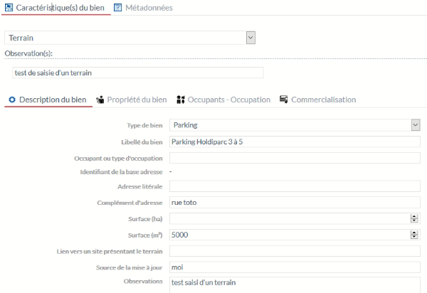

Particularité(s) à noter :
* l'attribut "Occupant ou type d'occupation" permet de spécifier un usage si l'onglet "Occupants - Occupation" ne peut être complété. Exemple d'un parking d'entreprise, on pourra indiquer ici Parking de ....
* L'attribut "Identifiant de la base Adresse" permettra de lier le bien à une adresse de la BAL (fonctionnalité à développer). Dans le cas contraire, la saisie d'une adresese libre est possible.
* l'attribut "Lien vers un site présentant le terrain " sera renommé "Lien vers un site présentant le bien"
* l'attribut "Surface (en ha)" sera supprimé

#### Etape 2.1.2 - L'onglet propriété permet d'indiquer les éléments concernant le propriétaire du terrain

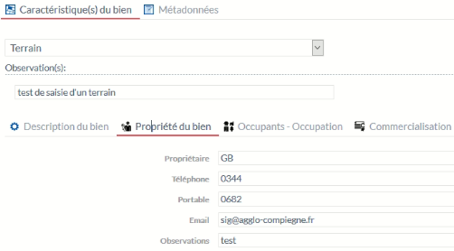

#### Etape 2.1.3 - L'onglet "Occupants - Occupation" permet d'ajouter un ou des établissements occupants le bien

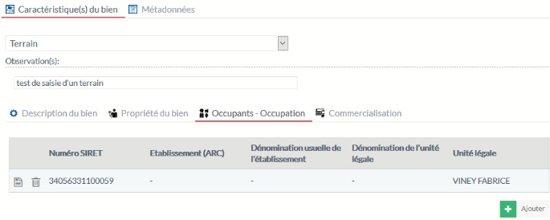

Particularité(s) à noter :
* même si le bien est un terrain, un établissement peut l'occuper sans avoir de bâtiment
* le bouton "AJOUTER" permet de sélectionner un établissement par son SIRET, nom de l'établissement ou de son unité légale
* 0 ou n établissements peuvent être ajoutés
* l'icône "fiche" à gauche permet d'accéder à la fiche de l'établissement
* l'icôbe "poubelle" permet de supprimer l'établissement de la liste

#### Etape 2.1.4 - L'onglet "Commercialisation" permet de rendre le bien disponible à la vente ou à la location

ATTENTION : par défaut un bien du patrimoine saisi n'est pas concerné par cette disponiblité si celle-ci n'est pas modifiée.

##### Etape 2.1.4.1 - Cas d'un bien non concerné par une disponibilité

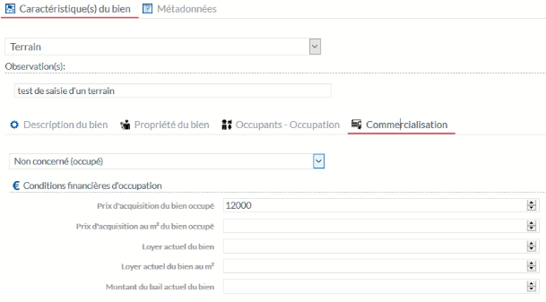

Particularité(s) à noter :
* lorsqu'un bien n'est pas mis en disponiblité, seules ces informations financières d'occupation actuelles sont accessibles

##### Etape 2.1.4.2 - Cas d'un bien concerné par une disponibilité de vente (vacant ou occupé)

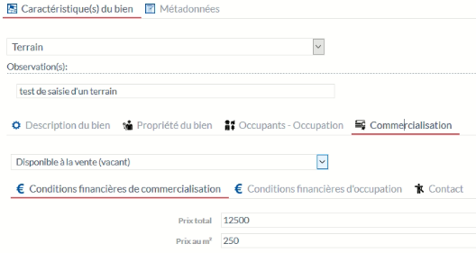

Particularité(s) à noter :
* l'onglet "Conditions financières d'occupation" est toujours disponibles
* 2 nouveaux onglets : "Conditions financières de commercialisation" et "Contact" sont accessibles

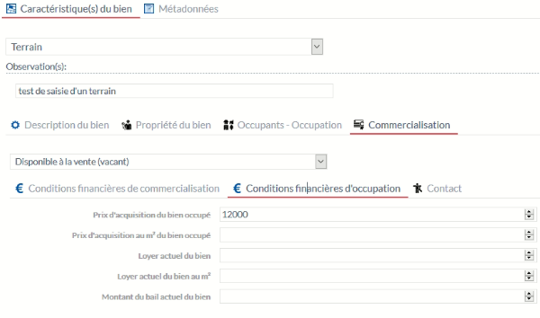

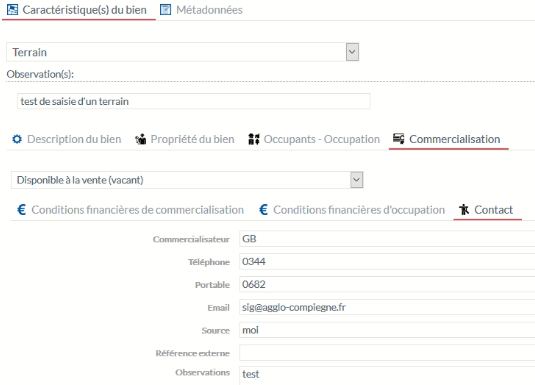

### Etape 2.2 - Si je saisi un "local (Bâtiment non divisé)", il s'agit ici d'un bien (local d'activité) qui correspondant aux bâtiments

#### Etape 2.2.1 - L'onglet "Bâtiment" permet de renseigner les éléments du bâtiment contenant le bien (non présent pour un terrain)

##### Etape 2.2.1.1 - L'onglet "Bâtiment" description (du bâtiment) permet d'indiquer les éléments descriptifs du bâtiment contenant le patrimoine du bien.

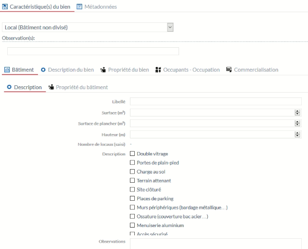

Particularité(s) à noter :
* Contraitement au terrain, un onglet supplémentaite est disponible permettant de décrire le bâtiment
* les éléments descriptifs du bâtiment seront modifiés pour se limiter aux éléments consitutant le bâtiment et non des éléments partoculier à des locaux.
* Plusieurs éléments descriptifs sont sélectionnables
* le nombre de locaux saisis correspond aux nombres de bien déclaré dans ce bâtiment. Dans ce cas présent, le nombre sera de 1. Ce calcul sera automatisé dans la base de données.

##### Etape 2.2.1.2 - L'onglet "Propriété" renseigne sur la propriété du bâtiment

Particularité(s) à noter :
* un fonctionnel permettra d'indiquer si la propriété est commune au bien (local) saisi, ce qui automatisera la saisie

#### Etape 2.2.2 - L'onglet description permet d'indiquer les éléments patrimoniaux du bien.

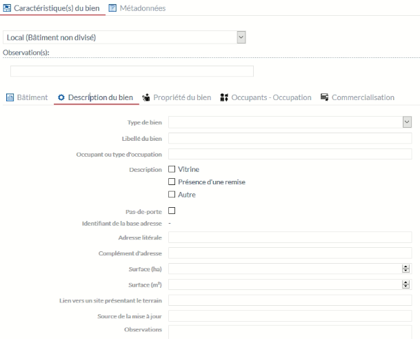

Particularité(s) à noter :
* 3 attributs supplémentaires par rapport à la saisi d'un terrain : `Type de bien`, `description` et `pas-de-porte`
* le type de bien permet de sélectionner dans une liste de valeur `Activité`, `Bureau` ou `Commerce`
* la partie description est à revoir comme pour les bâtiments pour une mise en cohérence
* l'information "pas-de-porte" est intégrée ici avec une valeur `false` par défaut et permettra de développer ce suivi sur les commerces de centre-ville
* l'attribut "Lien vers un site présentant le terrain " sera renommé "Lien vers un site présentant le bien"
* l'attribut "Surface (en ha)" sera supprimé

#### Etape 2.2.3 - Les onglets "Propriété du bien", "Occupants-Occupations" et "Commercialisation" 

Ces onglets sont identiques à la saisie d'un terrain donc pas de rappel ici, cf Etape 2.1.

### Etape 2.3 - Si je saisi un "local indépendant divisé", il s'agit ici d'un local bien identifié dans un bâtiment comprenant d'autres locaux bien identifié

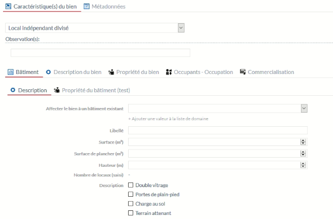

Ici, je peux soit affecter un bâtiment déjà saisi (dans la liste déroulante), ou créer un bâtiment en ajoutant une valeur dans la liste. Il faut ensuite enregistrer la fiche puis la rendre de nouveau éditable pour compléter les éléments descriptif du bâtiment. Ces éléments seront ensuite disponible pour un autre bien identifié dans le même bâtiment. Dans ce dernier cas, il faudra simplement sélectionner le nom du bâtiment dans la liste.

Particularité(s) à noter :
* les éléments descriptifs du bâtiment seront modifiés pour se limiter aux éléments consitutant le bâtiment et non des éléments particulier à des locaux.
* Plusieurs éléments descriptifs sont sélectionnables
* le nombre de locaux saisis correspond aux nombres de bien déclaré dans ce bâtiment. Dans ce cas présent, le nombre sera de 1. Ce calcul sera automatisé dans la base de données.

Tous les autres onglets sont identiques à la saisie d'un "local (Bâtiment non divisé)" donc pas de rappel ici, cf Etape 2.2.

### Etape 2.4 - Si je saisi un "local non identifié dans un bâtiment divisible", il s'agit ici d'un ensemble de locaux contenu dans un bâtiment sans pouvoir en saisir leurs géométries. Tous ces locaux seront donc rattachés à la géométrie du bâtiment.

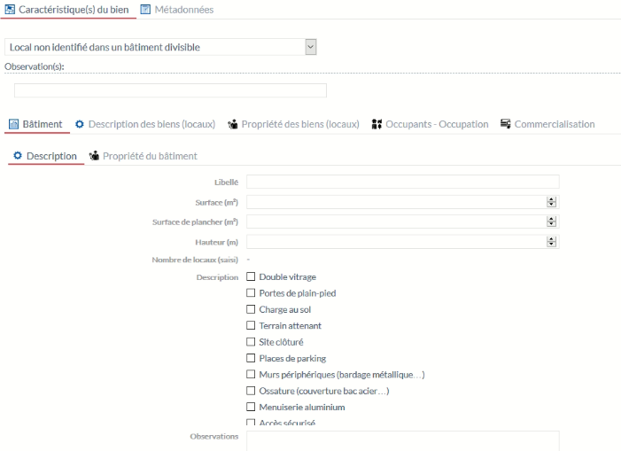

Particularité(s) à noter :
* tous les onglets sont identiques à la saise d'un autre type de local, sauf que la saisie peut-être multiple. La présentatation de certains onglets est donc sous forme de liste de valeurs possibles. Se reporter aux parties ci-après détaillant ce fonctionnement.

#### Etape 2.4.1 - Un préalable, je dois renseigner et enregistrer les données concernant le bâtiment (description et propriété) avant de pouvoir y affecter des locaux. Par défaut à l'enregistrement du bâtiment un local est créé. 

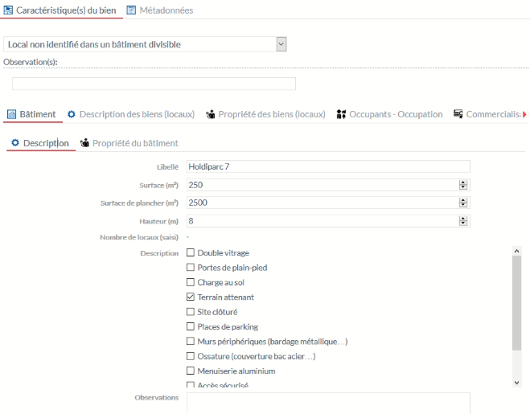

Particularité(s) à noter :
* Avant de pouvoir saisir des locaux, je dois sauvegarder la fiche. Un local par défaut sera créé. Il faut ré-éditer la fiche pour pouvoir modifier les informations du local et en ajouter d'autres.

#### Etape 2.4.2 - Modifier les informations d'un local existant

En cliquant sur l'icône `Fiche` à gauche de la liste présentée, ouvrez la fiche du local et modifiez la.

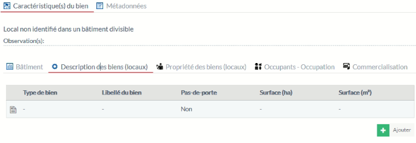

Particularité(s) à noter :
* A ce stade, toutes les informations à renseigner dans les onglets peuvent être effectués à partir de l'onglet "Description des biens (locaux)" à partir d'une fiche complémentaire. Ces informations seront répercuter par défaut dans le reste de la fiche du bien. Ce fonctionnel a été mis en place car il s'agit ici d'affecter plusieurs locaux (non géographique) à une même entité graphique représentant le bâtiment. Par conséquent tous les onglets (sauf "Bâtiment") présenteront leurs informations sous forme de liste avec la possibilité d'accéder à une fiche détaillant quant à elle le bien en question.

##### Etape 2.4.2.1 - Ouvrir la fiche du local et modifier ces informations

Cliquez sur l'icône `Fiche` à gauche de la liste présentée pour afficher la fiche du local ci-dessous. 

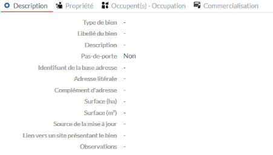

Particularité(s) à noter :
* Chaque onglet de cette fiche fonctionne comme les autres types de bien. Reportez-vous aux parties correspondantes pour le fonctionnement de chaque onglet.

##### Etape 2.4.2.2 - Accédez aux informations dans les différents onglets de la fiche du bien

Après l'enregistrement de cette fiche local (étape 2.4.2.1), toutes les informations sont répercutées dans chaque onglet de la fiche du bien comme ci-dessous. En cliquant sur l'icône `Fiche` à gauche de la liste présentée dans n'importe quel onglet, vous permet d'accéder à la fiche du local et de la modifier.

* Onglet "Description des biens (locaux)"

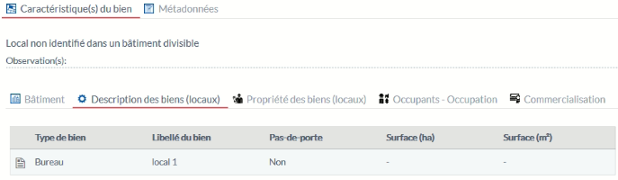

* Onglet "Propriété des biens (locaux)"

* Onglet "Occupants - Occupation"

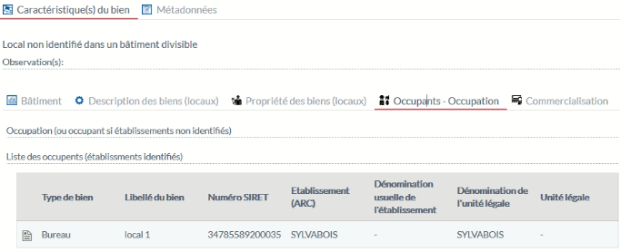

* Onglet "Commercialisation"

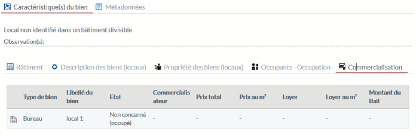

Particularité(s) à noter :
* pour ce dernier onglet, il reste à intégrer un onglet sur les conditons financières d'occupation actuelle

#### Etape 2.4.3 - Ajourer un local

Cliquez sur l'icône `AJOUTER` en bas à droite de la fiche du bien de l'onglet "Description des biens (locaux)".

##### Etape 2.4.3.1 - Saisir les informations du local

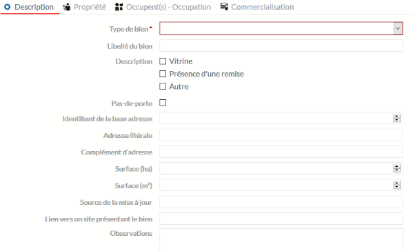

Renseignez les informations du local dans chaque onglet et sauvegardez.  

### Etape 3 : Les métadonnées

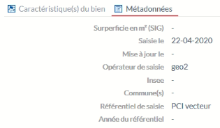

Pour tous biens saisis, un onglet "Métadonnée" est disponible au niveau supérieur de la fiche. Les informations du local doivent s'afficher en liste comme à l'étape 2.4.2.2.

### Etape 4: La médiathèque

* un troisième onglet au niveau des 2 onglets supérieurs de la fiche sera intégré pour gérer l'intégration de documents. Cet onglet sera nommé "Médiathèque"

